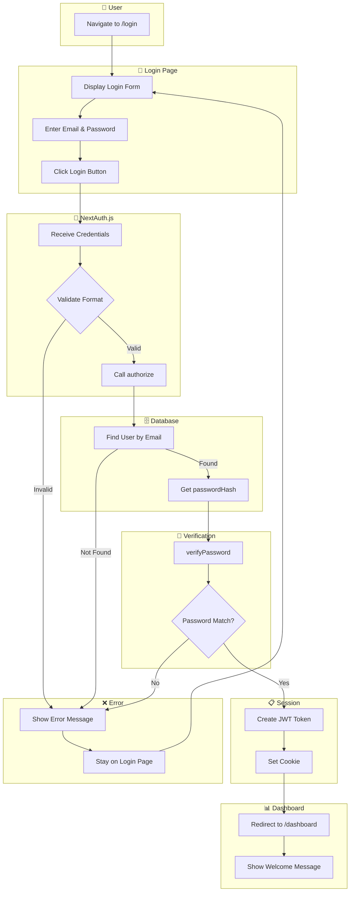
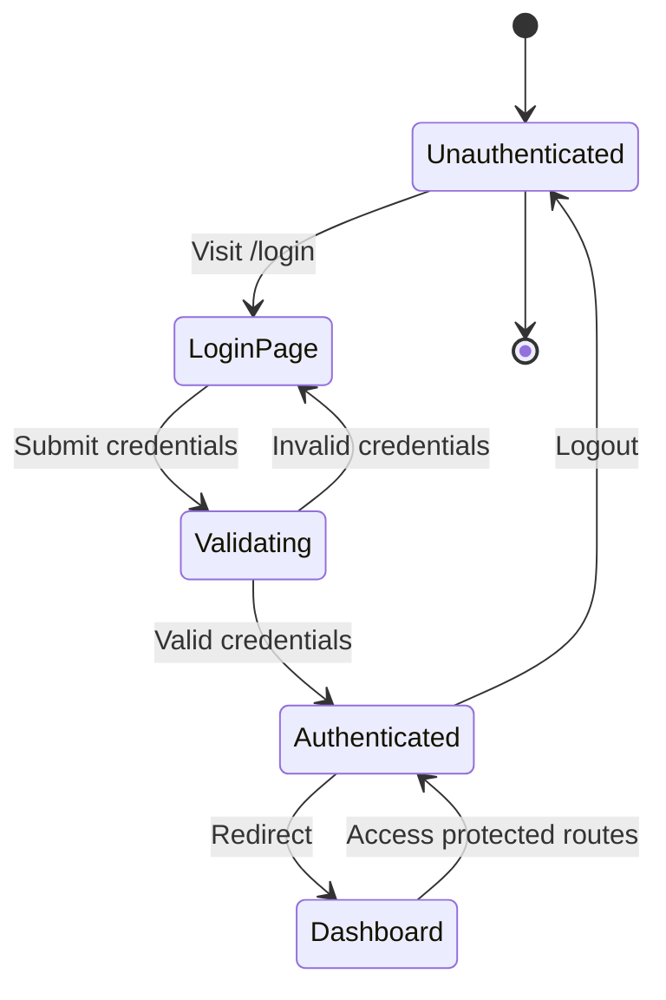
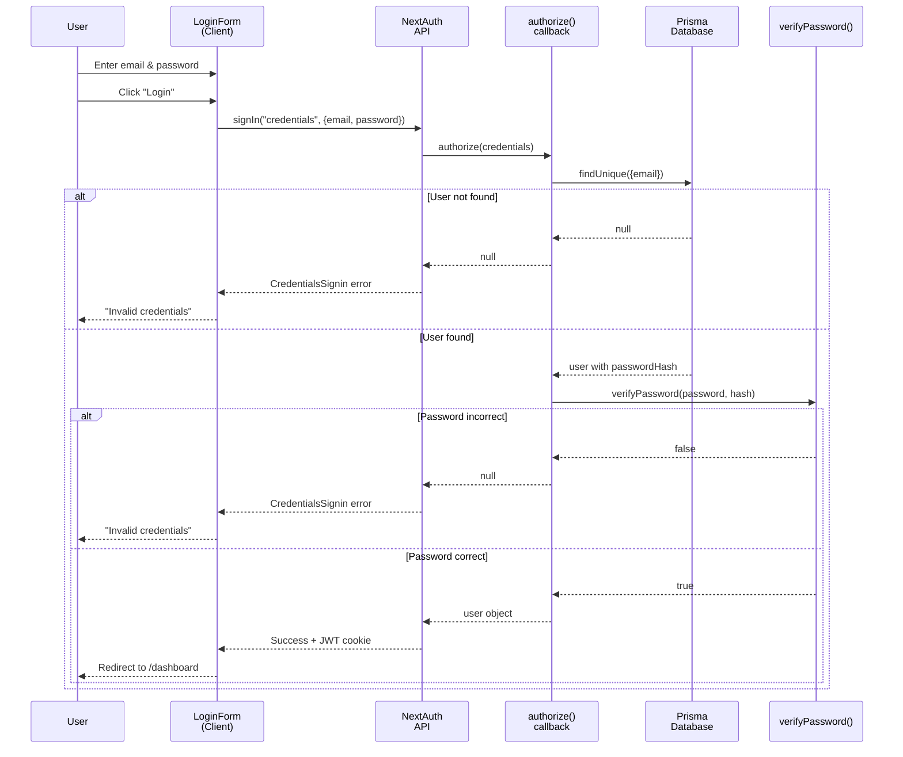
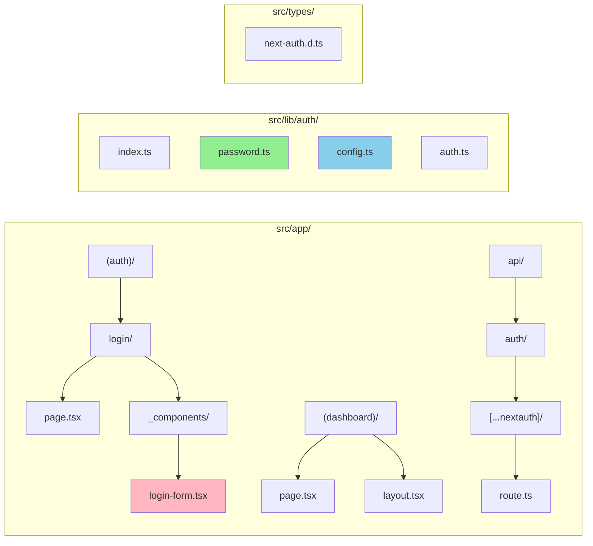

# Flow Overview — US-0.2.1 Login Flow

> Diagrams for human review / Sơ đồ để review

---

## Login Flow / Luồng Đăng nhập

---

## Authentication State Flow / Luồng Trạng thái Xác thực

---

## Component Interaction / Tương tác Component

---

## File Structure / Cấu trúc File

**Legend:**
- 🟢 Green: Existing file (unchanged)
- 🔵 Blue: New configuration
- 🔴 Pink: New UI component

---

*Created: 2026-02-05*
