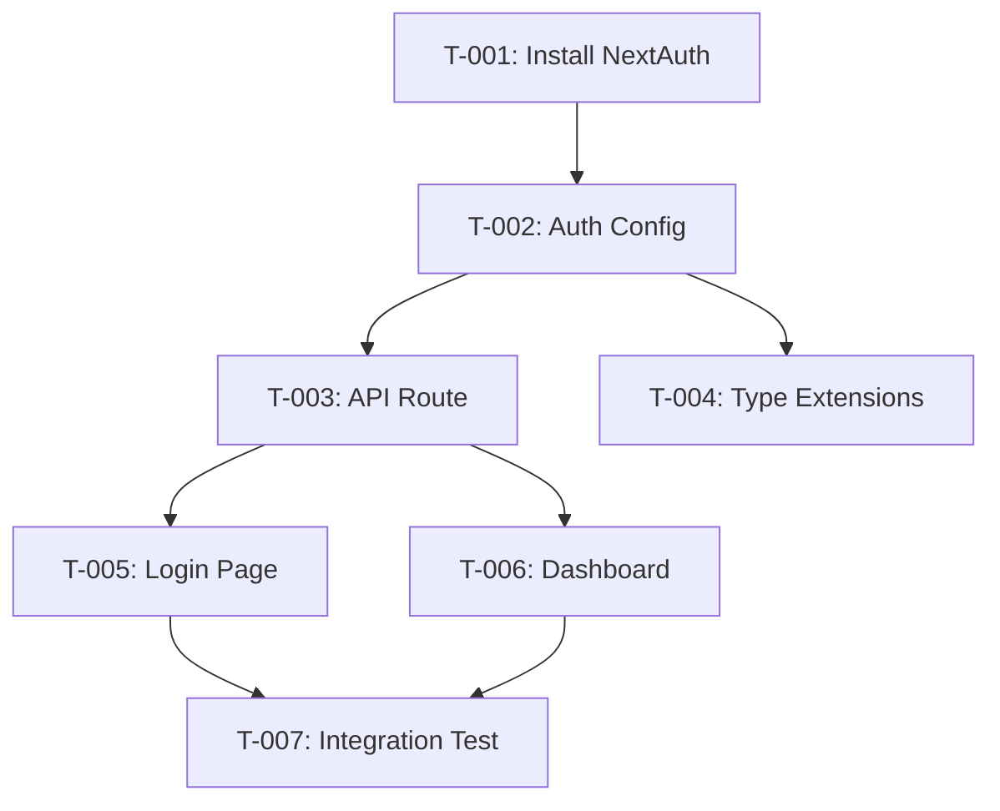

# Task Plan: Super Admin Seeded Login
# Kế hoạch Task: Đăng nhập Super Admin

> US-0.2.1 | Phase 2 Task Planning | Created: 2026-02-05

---

## 📋 TL;DR

| Aspect | Value |
|--------|-------|
| Feature | Super Admin Seeded Login |
| Total Tasks | 7 |
| Estimated Effort | ~4.5 hours |
| Affected Roots | sgs-cs-hepper |
| Dev Mode | standard |
| Spec Reference | [spec.md](../01_spec/spec.md) |

---

## 1. Task Overview / Tổng quan Task

| ID | Title | Root | Deps | Est | Status |
|----|-------|------|------|-----|--------|
| T-001 | Install NextAuth.js dependency | sgs-cs-hepper | - | S | ⬜ |
| T-002 | Create NextAuth configuration | sgs-cs-hepper | T-001 | M | ⬜ |
| T-003 | Create NextAuth API route | sgs-cs-hepper | T-002 | S | ⬜ |
| T-004 | Create NextAuth type extensions | sgs-cs-hepper | T-002 | S | ⬜ |
| T-005 | Create Login page and form | sgs-cs-hepper | T-003 | L | ⬜ |
| T-006 | Create Dashboard placeholder | sgs-cs-hepper | T-003 | M | ⬜ |
| T-007 | Integration testing & verification | sgs-cs-hepper | T-005, T-006 | M | ⬜ |

---

## 2. Dependency Graph / Đồ thị Phụ thuộc

---

## 3. Parallel Execution Notes / Ghi chú Thực thi Song song

| Group | Tasks | Reason |
|-------|-------|--------|
| A | T-003, T-004 | Same dependency (T-002), different files |
| B | T-005, T-006 | Same dependency (T-003), different folders |

**Sequential Constraints:**
- T-001 → T-002: Must install before configure
- T-002 → T-003: Config needed for API route
- T-005, T-006 → T-007: All features before integration test

---

## 4. Tasks by Root / Task theo Root

### Root: sgs-cs-hepper

---

#### T-001: Install NextAuth.js dependency

| Aspect | Detail |
|--------|--------|
| Root | `sgs-cs-hepper` |
| Dependencies | None |
| Estimate | S (15 min) |
| Requirements | FR-002, FR-003 |

**Description / Mô tả:**
- **EN:** Install next-auth package (v5 beta) and update package.json
- **VI:** Cài đặt package next-auth (v5 beta) và cập nhật package.json

**Files to Change / File Thay đổi:**
- Modify: `package.json`

**Done Criteria / Tiêu chí Hoàn thành:**
- [ ] `next-auth` package installed
- [ ] Package version is ^5.x (beta)
- [ ] No dependency conflicts

**Verification / Kiểm tra:**
- Run: `pnpm install`
- Check: `pnpm list next-auth`

---

#### T-002: Create NextAuth configuration

| Aspect | Detail |
|--------|--------|
| Root | `sgs-cs-hepper` |
| Dependencies | T-001 |
| Estimate | M (45 min) |
| Requirements | FR-002, FR-003, NFR-001 |

**Description / Mô tả:**
- **EN:** Create NextAuth configuration with Credentials provider. Configure JWT session strategy, callbacks for user data, and authorize function that verifies password against database.
- **VI:** Tạo cấu hình NextAuth với Credentials provider. Cấu hình JWT session strategy, callbacks cho user data, và hàm authorize xác thực password với database.

**Files to Change / File Thay đổi:**
- Create: `src/lib/auth/config.ts`
- Create: `src/lib/auth/auth.ts`
- Modify: `src/lib/auth/index.ts`

**Done Criteria / Tiêu chí Hoàn thành:**
- [ ] Credentials provider configured
- [ ] JWT strategy set
- [ ] authorize() queries user by email
- [ ] authorize() calls verifyPassword()
- [ ] JWT callback includes user id, email, name, role
- [ ] Session callback exposes user data

**Verification / Kiểm tra:**
- TypeScript compiles without errors
- Run: `pnpm build` (no type errors)

---

#### T-003: Create NextAuth API route

| Aspect | Detail |
|--------|--------|
| Root | `sgs-cs-hepper` |
| Dependencies | T-002 |
| Estimate | S (15 min) |
| Requirements | FR-002 |

**Description / Mô tả:**
- **EN:** Create the NextAuth.js API route handler at `/api/auth/[...nextauth]`
- **VI:** Tạo API route handler NextAuth.js tại `/api/auth/[...nextauth]`

**Files to Change / File Thay đổi:**
- Create: `src/app/api/auth/[...nextauth]/route.ts`

**Done Criteria / Tiêu chí Hoàn thành:**
- [ ] Route handler exports GET and POST
- [ ] Uses handlers from auth.ts
- [ ] Route accessible at /api/auth/*

**Verification / Kiểm tra:**
- Run dev server: `pnpm dev`
- Check: `/api/auth/providers` returns JSON

---

#### T-004: Create NextAuth type extensions

| Aspect | Detail |
|--------|--------|
| Root | `sgs-cs-hepper` |
| Dependencies | T-002 |
| Estimate | S (20 min) |
| Requirements | FR-003 |

**Description / Mô tả:**
- **EN:** Create TypeScript declaration file to extend NextAuth types with custom user properties (id, role)
- **VI:** Tạo file khai báo TypeScript để mở rộng NextAuth types với custom user properties (id, role)

**Files to Change / File Thay đổi:**
- Create: `src/types/next-auth.d.ts`

**Done Criteria / Tiêu chí Hoàn thành:**
- [ ] Session interface extended with id and role
- [ ] JWT interface extended with id and role
- [ ] User interface extended with role
- [ ] No TypeScript errors in auth files

**Verification / Kiểm tra:**
- Run: `pnpm build`
- Check: No type errors for session.user.role

---

#### T-005: Create Login page and form

| Aspect | Detail |
|--------|--------|
| Root | `sgs-cs-hepper` |
| Dependencies | T-003 |
| Estimate | L (90 min) |
| Requirements | FR-001, FR-005, NFR-002, NFR-003, NFR-004 |

**Description / Mô tả:**
- **EN:** Create login page at `/login` with Server Component wrapper and Client Component form. Implement form validation, loading state, error display, and signIn integration.
- **VI:** Tạo trang login tại `/login` với Server Component wrapper và Client Component form. Triển khai form validation, loading state, error display, và tích hợp signIn.

**Files to Change / File Thay đổi:**
- Create: `src/app/(auth)/login/page.tsx`
- Create: `src/app/(auth)/login/_components/login-form.tsx`
- Create: `src/app/(auth)/layout.tsx`
- Delete: `src/app/(auth)/.gitkeep`

**Done Criteria / Tiêu chí Hoàn thành:**
- [ ] Login page accessible at `/login`
- [ ] Email input with label
- [ ] Password input with label (masked)
- [ ] Login button
- [ ] Form centered and styled
- [ ] Loading state during submission
- [ ] Error message on invalid credentials
- [ ] Keyboard accessible
- [ ] Redirect to /dashboard on success

**Verification / Kiểm tra:**
- Navigate to `http://localhost:3000/login`
- Check: Form renders correctly
- Check: Submit with invalid credentials shows error
- Check: Loading spinner appears during submit

---

#### T-006: Create Dashboard placeholder

| Aspect | Detail |
|--------|--------|
| Root | `sgs-cs-hepper` |
| Dependencies | T-003 |
| Estimate | M (45 min) |
| Requirements | FR-004 |

**Description / Mô tả:**
- **EN:** Create dashboard placeholder page showing logged-in user info (name, role) and logout button. Uses Server Component with auth() to get session.
- **VI:** Tạo trang dashboard placeholder hiển thị thông tin user đã đăng nhập (name, role) và nút logout. Sử dụng Server Component với auth() để lấy session.

**Files to Change / File Thay đổi:**
- Create: `src/app/(dashboard)/page.tsx`
- Create: `src/app/(dashboard)/layout.tsx`
- Create: `src/app/(dashboard)/_components/logout-button.tsx`
- Delete: `src/app/(dashboard)/.gitkeep`

**Done Criteria / Tiêu chí Hoàn thành:**
- [ ] Dashboard page at `/dashboard`
- [ ] Shows welcome message with user name
- [ ] Shows user role
- [ ] Logout button visible
- [ ] Logout clears session
- [ ] Logout redirects to /login

**Verification / Kiểm tra:**
- Login as Super Admin
- Check: Dashboard shows "Welcome, Super Admin!"
- Check: Role shows "SUPER_ADMIN"
- Click logout: Redirected to /login

---

#### T-007: Integration testing & verification

| Aspect | Detail |
|--------|--------|
| Root | `sgs-cs-hepper` |
| Dependencies | T-005, T-006 |
| Estimate | M (45 min) |
| Requirements | All FRs, All NFRs |

**Description / Mô tả:**
- **EN:** Perform end-to-end verification of complete login flow. Test all acceptance criteria from spec manually. Verify edge cases.
- **VI:** Thực hiện kiểm tra end-to-end luồng đăng nhập hoàn chỉnh. Test tất cả acceptance criteria từ spec thủ công. Xác minh các edge cases.

**Files to Change / File Thay đổi:**
- None (verification only)

**Done Criteria / Tiêu chí Hoàn thành:**
- [ ] Valid Super Admin login works
- [ ] Invalid credentials show error
- [ ] Empty email shows error
- [ ] Empty password shows error
- [ ] Session persists on refresh
- [ ] Logout clears session
- [ ] Case-insensitive email works

**Verification / Kiểm tra:**
- Full login flow test with seeded Super Admin
- Test all edge cases from EC-001 to EC-006
- Check browser console for errors

---

## 5. Sync Points / Điểm Đồng bộ

> Not applicable - single root feature

---

## 6. Risk Assessment / Đánh giá Rủi ro

| Task | Risk | Mitigation |
|------|------|------------|
| T-001 | NextAuth v5 beta instability | Pin exact version |
| T-002 | Complex callback configuration | Follow official docs closely |
| T-005 | Form state management complexity | Use simple useState, no external libs |
| T-007 | Edge cases may reveal bugs | Test thoroughly, fix before marking done |

---

## 7. Test Plan / Kế hoạch Test

### 7.1 Test Strategy / Chiến lược Test

| Type | Coverage Target | Tools |
|------|-----------------|-------|
| Unit | 80% for auth utilities | Vitest |
| Integration | Key flows | Manual + Dev server |
| E2E | Happy path | Manual verification |

**Mocking Boundaries:**
- Database: Use real seeded data (not mocked)
- NextAuth: Test with real signIn flow

### 7.2 Test Cases by Task / Test Cases theo Task

| TC ID | Task | Test Description | Type | Expected Result |
|-------|------|------------------|------|-----------------|
| TC-001 | T-002 | authorize() returns user for valid credentials | Unit | User object with id, email, name, role |
| TC-002 | T-002 | authorize() returns null for invalid email | Unit | null |
| TC-003 | T-002 | authorize() returns null for wrong password | Unit | null |
| TC-004 | T-002 | authorize() handles missing passwordHash | Unit | null |
| TC-005 | T-005 | Login form renders all fields | Integration | Email, password, button visible |
| TC-006 | T-005 | Login form shows loading during submit | Integration | Button disabled, spinner shown |
| TC-007 | T-005 | Login form shows error for invalid credentials | Integration | Error message visible |
| TC-008 | T-005 | Login form validates empty email | Integration | "Email is required" shown |
| TC-009 | T-005 | Login form validates empty password | Integration | "Password is required" shown |
| TC-010 | T-005 | Successful login redirects to /dashboard | Integration | URL changes to /dashboard |
| TC-011 | T-006 | Dashboard shows user name | Integration | "Welcome, Super Admin!" |
| TC-012 | T-006 | Dashboard shows user role | Integration | "SUPER_ADMIN" visible |
| TC-013 | T-006 | Logout clears session and redirects | Integration | Redirect to /login |
| TC-014 | T-007 | Email case-insensitive (EC-002) | E2E | Login works with different case |
| TC-015 | T-007 | Session persists on page refresh | E2E | User stays logged in |

### 7.3 Edge Cases / Trường hợp Biên

| EC ID | Scenario | Test Approach |
|-------|----------|---------------|
| EC-001 | Email with spaces | Manual: enter " admin@test.com " |
| EC-002 | Email different case | Manual: enter "ADMIN@test.com" |
| EC-003 | Empty email | Manual: submit with empty email |
| EC-004 | Empty password | Manual: submit with empty password |
| EC-005 | User without passwordHash | DB: create user without hash, attempt login |
| EC-006 | Database error | Kill DB connection during login |

### 7.4 Test Data / Dữ liệu Test

**Fixtures:**
- Super Admin user (from seed.ts)
  - Email: from `SUPER_ADMIN_EMAIL` env
  - Password: from `SUPER_ADMIN_PASSWORD` env
  - Role: SUPER_ADMIN

**Invalid Test Data:**
- Email: `nonexistent@test.com`
- Password: `wrongpassword123`

---

## 8. Requirements Coverage / Độ phủ Yêu cầu

| Requirement | Tasks | Status |
|-------------|-------|--------|
| FR-001: Login Page | T-005 | ✅ |
| FR-002: Credential Validation | T-002, T-003 | ✅ |
| FR-003: Session Creation | T-002, T-004 | ✅ |
| FR-004: Login Redirect | T-005, T-006 | ✅ |
| FR-005: Error Display | T-005 | ✅ |
| NFR-001: Security | T-002 | ✅ |
| NFR-002: Performance | T-005 | ✅ |
| NFR-003: Accessibility | T-005 | ✅ |
| NFR-004: Compatibility | T-005 | ✅ |

**All 9 requirements covered by 7 tasks ✅**

---

*Created: 2026-02-05 | US-0.2.1 | Phase 2*
