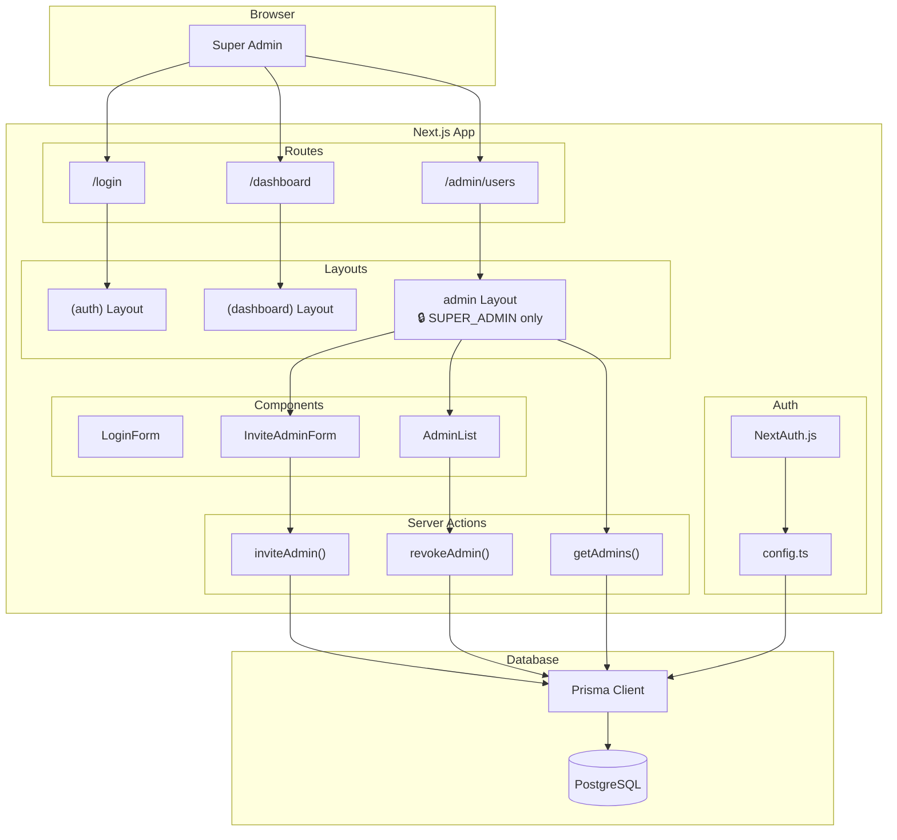
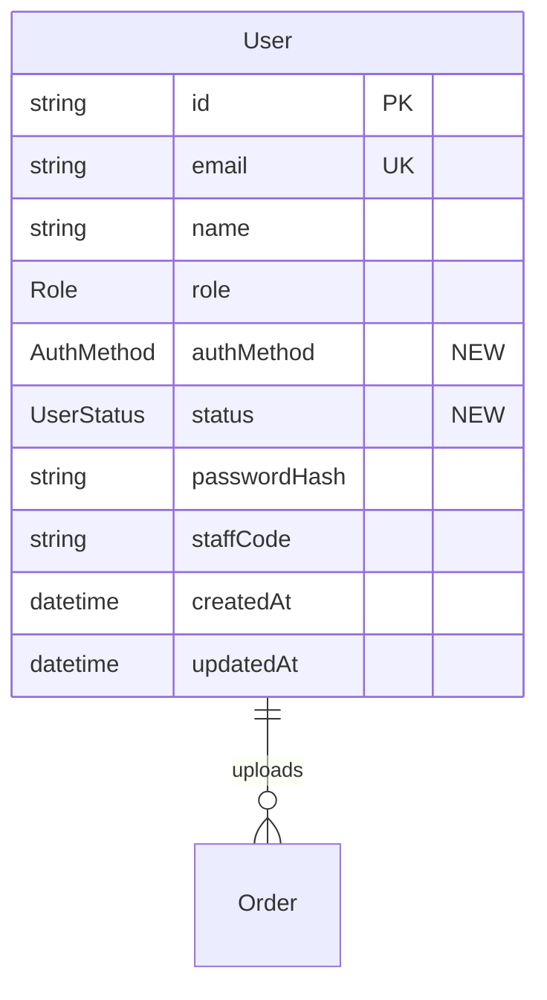
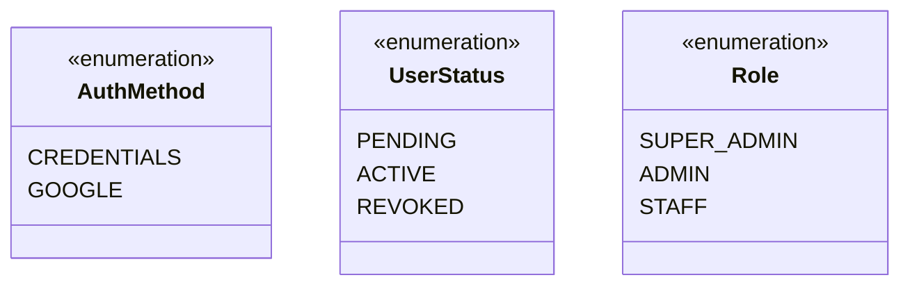

# Architecture: US-0.2.2
<!-- Super Admin Dashboard & Admin Invitation -->

---

## Component Architecture / Kiến trúc Component



---

## Database Schema Changes / Thay đổi Schema



### New Enums / Enum Mới



---

## File Structure / Cấu trúc File

```
src/
├── app/
│   ├── (auth)/
│   │   └── login/                    # Existing
│   ├── (dashboard)/
│   │   └── page.tsx                  # Existing
│   └── admin/                        # NEW
│       ├── layout.tsx                # Role protection
│       └── users/
│           └── page.tsx              # Admin management page
├── components/
│   ├── admin/                        # NEW
│   │   ├── invite-admin-form.tsx
│   │   ├── admin-list.tsx
│   │   └── admin-list-item.tsx
│   └── ui/                           # Existing (empty)
├── lib/
│   ├── actions/                      # NEW
│   │   └── admin.ts                  # Server Actions
│   ├── auth/
│   │   ├── config.ts                 # Update: check status
│   │   └── password.ts               # Existing
│   └── db/
│       └── index.ts                  # Existing
└── generated/
    └── prisma/                       # Prisma Client

prisma/
├── schema.prisma                     # UPDATE: new enums & fields
└── seed.ts                           # UPDATE: set status for seed user
```

---

## Request Flow / Luồng Request

```mermaid
flowchart LR
    subgraph Client
        A[Browser]
    end
    
    subgraph Server["Next.js Server"]
        B[Admin Layout]
        C[Users Page]
        D[Server Action]
    end
    
    subgraph DB
        E[(PostgreSQL)]
    end
    
    A -->|1. GET /admin/users| B
    B -->|2. Check session.role| B
    B -->|3. SUPER_ADMIN| C
    B -->|NOT SUPER_ADMIN| F[Redirect]
    C -->|4. getAdmins()| D
    D -->|5. SELECT| E
    E -->|6. Users[]| D
    D -->|7. Props| C
    C -->|8. HTML| A
    
    A -->|9. Form submit| D
    D -->|10. INSERT/UPDATE| E
    E -->|11. Result| D
    D -->|12. Revalidate| C
```

---

## Security Model / Mô hình Bảo mật

| Layer | Protection | Implementation |
|-------|------------|----------------|
| Route | Role-based access | `admin/layout.tsx` checks `session.user.role` |
| Action | Session validation | Server Actions verify session before DB ops |
| Data | Self-protection | Cannot revoke own account |
| Password | Hashing | bcrypt with 10 rounds |
| Email | Uniqueness | Database unique constraint |

