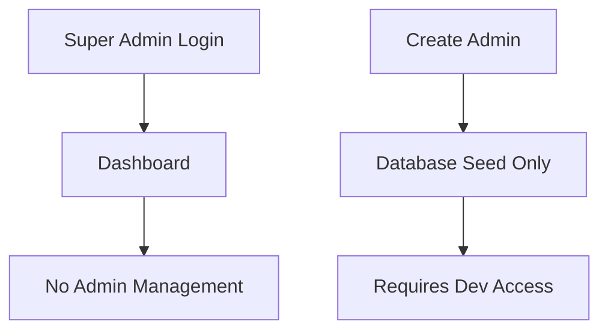
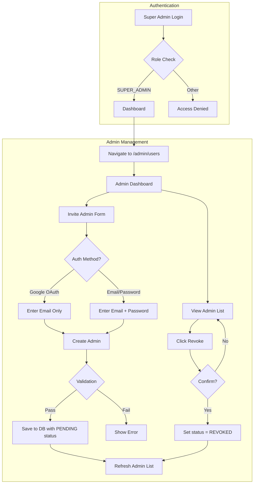
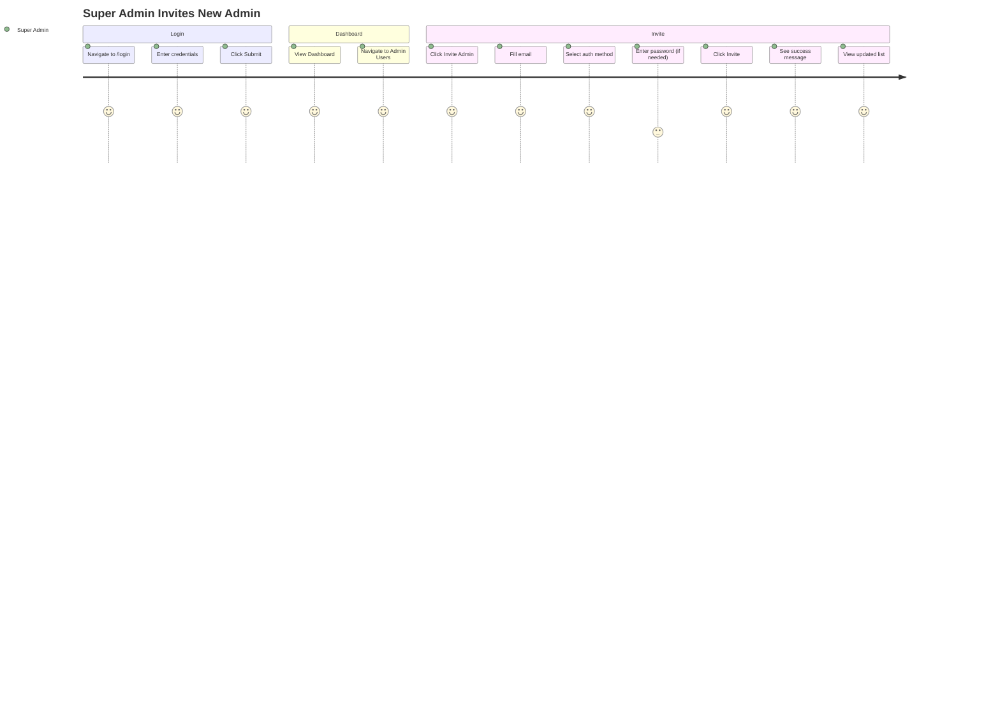

# Flow Overview / Tổng quan Luồng
<!-- US-0.2.2: Super Admin Dashboard & Admin Invitation -->

---

## Current Flow / Luồng Hiện tại

**Problem:** No UI for Super Admin to manage Admins.

---

## Proposed Flow / Luồng Đề xuất

---

## Changes Highlighted / Thay đổi Nổi bật

### Added / Thêm mới
- `/admin/users` page
- `InviteAdminForm` component
- `AdminList` component
- `inviteAdmin` Server Action
- `revokeAdmin` Server Action
- `getAdmins` Server Action
- Admin layout with role protection

### Modified / Chỉnh sửa
- `prisma/schema.prisma`: Add `AuthMethod`, `UserStatus` enums
- `User` model: Add `authMethod`, `status` fields

### Removed / Xóa bỏ
- None

---

## User Journey / Hành trình Người dùng

