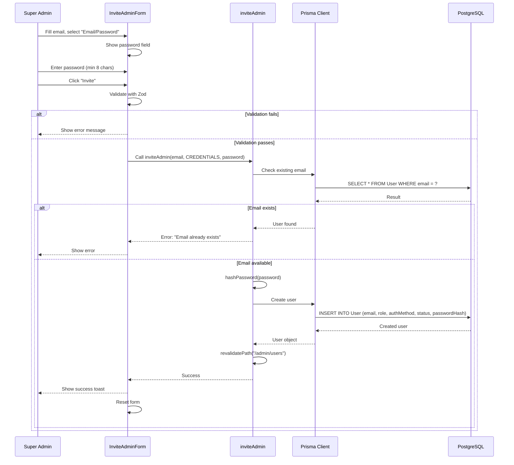
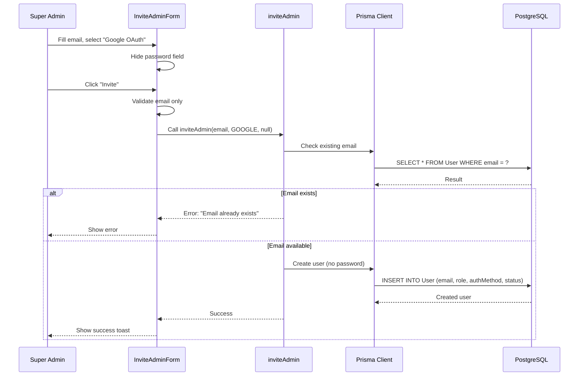
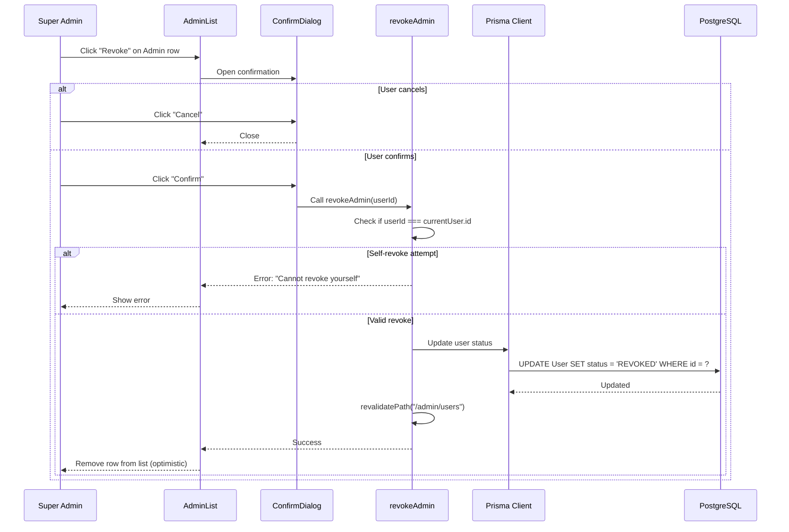

# Sequence: Invite Admin
<!-- US-0.2.2: Super Admin Dashboard & Admin Invitation -->

---

## Invite Admin with Email/Password

---

## Invite Admin with Google OAuth

---

## Revoke Admin

---

## Notes / Ghi chú

1. **Password hashing**: Uses bcrypt with 10 rounds (same as Super Admin)
2. **Validation**: Zod schema validates email format and password length
3. **Optimistic updates**: List updates immediately, reverts on error
4. **Revalidation**: `revalidatePath` ensures fresh data on next visit
5. **Self-protection**: Backend prevents Super Admin from revoking themselves

