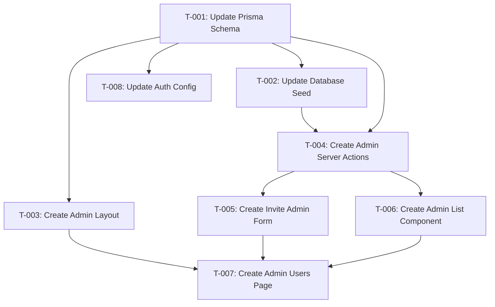

# Task Plan — Super Admin Dashboard & Admin Invitation
<!-- Template Version: 1.0 | Contract: v1.0 | Generated: 2026-02-05 -->
<!-- 🇻🇳 Vietnamese first, 🇬🇧 English follows — for easy scanning -->

---

## TL;DR

| Aspect | Value |
|--------|-------|
| Feature | Super Admin Dashboard & Admin Invitation |
| Total Tasks | 9 |
| Estimated Effort | 6-8 hours |
| Affected Roots | sgs-cs-hepper |
| Spec Reference | [spec.md](../01_spec/spec.md) |

---

## 1. Goal

🇻🇳 Xây dựng dashboard quản lý Admin cho Super Admin, bao gồm khả năng mời Admin mới với hai phương thức xác thực (Google OAuth hoặc Email/Password), hiển thị danh sách Admin, và thu hồi quyền truy cập.

🇬🇧 Build Admin management dashboard for Super Admin, including ability to invite new Admins with two auth methods (Google OAuth or Email/Password), display Admin list, and revoke access.

---

## 2. Task Overview

| ID | Title | Root | Type | Est. | Deps | Status |
|----|-------|------|------|------|------|--------|
| T-001 | Update Prisma Schema | sgs-cs-hepper | Modify | 30m | - | ✅ |
| T-002 | Update Database Seed | sgs-cs-hepper | Modify | 20m | T-001 | ✅ |
| T-003 | Create Admin Layout | sgs-cs-hepper | New | 30m | T-001 | ✅ |
| T-004 | Create Admin Server Actions | sgs-cs-hepper | New | 1h | T-001, T-002 | ✅ |
| T-005 | Create Invite Admin Form | sgs-cs-hepper | New | 1h | T-004 | ✅ |
| T-006 | Create Admin List Component | sgs-cs-hepper | New | 45m | T-004 | ✅ |
| T-007 | Create Admin Users Page | sgs-cs-hepper | New | 30m | T-003, T-005, T-006 | ✅ |
| T-008 | Update Auth Config | sgs-cs-hepper | Modify | 30m | T-001 | ✅ |
| T-009 | Add Admin Navigation to Dashboard | sgs-cs-hepper | Modify | 15m | T-007 | ✅ |

**Legend:**
- Type: `New` = Create new, `Modify` = Change existing
- Status: ⏳ Pending, 🔄 In Progress, ✅ Done, ❌ Blocked

---

## 3. Execution Flow



---

## 3.5 Parallel Execution Notes

### Parallel Groups

🇻🇳 Các tasks trong cùng group có thể chạy song song (khác file, không depend lẫn nhau).

🇬🇧 Tasks in the same group can run in parallel (different files, no inter-dependencies).

| Group | Tasks | Reason |
|-------|-------|--------|
| A | T-002, T-003, T-008 | All depend only on T-001, modify different files |
| B | T-005, T-006 | Both depend on T-004, create different components |

### Sequential Constraints

🇻🇳 Các tasks phải chạy tuần tự vì lý do kỹ thuật.

🇬🇧 Tasks that must run sequentially due to technical reasons.

| Sequence | Reason |
|----------|--------|
| T-001 → T-002 | Seed uses new schema enums |
| T-004 → T-005 | Form imports server actions |
| T-004 → T-006 | List imports server actions |
| T-005, T-006 → T-007 | Page composes both components |

---

## 4. Task Details

### T-001 — Update Prisma Schema

| Aspect | Detail |
|--------|--------|
| Root | sgs-cs-hepper |
| Type | Modify |
| Estimated | 30 min |
| Dependencies | None |
| FR Covered | FR-003, FR-004, FR-006 |

#### Description

🇻🇳 Thêm enums `AuthMethod` và `UserStatus` vào Prisma schema. Thêm fields `authMethod` và `status` vào model User. Chạy migration để cập nhật database.

🇬🇧 Add `AuthMethod` and `UserStatus` enums to Prisma schema. Add `authMethod` and `status` fields to User model. Run migration to update database.

#### Files

| Action | Path |
|--------|------|
| Modify | `prisma/schema.prisma` |

#### Implementation

🇻🇳 Thêm enums và fields vào schema, sau đó chạy `pnpm prisma migrate dev`.

🇬🇧 Add enums and fields to schema, then run `pnpm prisma migrate dev`.

```prisma
enum AuthMethod {
  CREDENTIALS
  GOOGLE
}

enum UserStatus {
  PENDING
  ACTIVE
  REVOKED
}

model User {
  // ... existing fields
  authMethod   AuthMethod  @default(CREDENTIALS)
  status       UserStatus  @default(ACTIVE)
}
```

#### Done Criteria

- [x] AuthMethod enum defined with CREDENTIALS, GOOGLE values
- [x] UserStatus enum defined with PENDING, ACTIVE, REVOKED values
- [x] User model has authMethod field with default CREDENTIALS
- [x] User model has status field with default ACTIVE
- [x] Migration created and applied successfully
- [x] Prisma client regenerated

#### Verification

```bash
pnpm prisma migrate dev --name add_auth_method_and_status
pnpm prisma generate
```

---

### T-002 — Update Database Seed

| Aspect | Detail |
|--------|--------|
| Root | sgs-cs-hepper |
| Type | Modify |
| Estimated | 20 min |
| Dependencies | T-001 |
| FR Covered | FR-004 |

#### Description

🇻🇳 Cập nhật file seed để Super Admin có status=ACTIVE và authMethod=CREDENTIALS.

🇬🇧 Update seed file so Super Admin has status=ACTIVE and authMethod=CREDENTIALS.

#### Files

| Action | Path |
|--------|------|
| Modify | `prisma/seed.ts` |

#### Implementation

🇻🇳 Thêm authMethod và status vào upsert của Super Admin.

🇬🇧 Add authMethod and status to Super Admin upsert.

```typescript
await prisma.user.upsert({
  where: { email: 'admin@sgs.com' },
  update: {},
  create: {
    email: 'admin@sgs.com',
    name: 'Super Admin',
    role: 'SUPER_ADMIN',
    authMethod: 'CREDENTIALS',
    status: 'ACTIVE',
    passwordHash: await hashPassword('adminpassword'),
  },
});
```

#### Done Criteria

- [x] Super Admin seed includes authMethod: CREDENTIALS
- [x] Super Admin seed includes status: ACTIVE
- [x] Seed runs successfully with `pnpm db:seed`

#### Verification

```bash
pnpm db:seed
```

---

### T-003 — Create Admin Layout

| Aspect | Detail |
|--------|--------|
| Root | sgs-cs-hepper |
| Type | New |
| Estimated | 30 min |
| Dependencies | T-001 |
| FR Covered | FR-001, NFR-003 |

#### Description

🇻🇳 Tạo layout cho routes `/admin/*` với kiểm tra quyền Super Admin. Chỉ users với role SUPER_ADMIN mới truy cập được. Redirect hoặc hiển thị "Access Denied" cho các roles khác.

🇬🇧 Create layout for `/admin/*` routes with Super Admin role check. Only users with role SUPER_ADMIN can access. Redirect or show "Access Denied" for other roles.

#### Files

| Action | Path |
|--------|------|
| Create | `src/app/admin/layout.tsx` |

#### Implementation

🇻🇳 Sử dụng server component để check session và role. Redirect nếu không phải Super Admin.

🇬🇧 Use server component to check session and role. Redirect if not Super Admin.

```typescript
import { auth } from '@/lib/auth';
import { redirect } from 'next/navigation';

export default async function AdminLayout({
  children,
}: {
  children: React.ReactNode;
}) {
  const session = await auth();
  
  if (!session) {
    redirect('/login');
  }
  
  if (session.user.role !== 'SUPER_ADMIN') {
    redirect('/dashboard'); // or show Access Denied
  }
  
  return <>{children}</>;
}
```

#### Done Criteria

- [x] Admin layout file created at `src/app/admin/layout.tsx`
- [x] Unauthenticated users redirected to `/login`
- [x] Non-SUPER_ADMIN users redirected to `/`
- [x] SUPER_ADMIN users can see children content

#### Verification

```bash
# Manual testing:
# 1. Login as Staff → Access /admin/users → Should redirect
# 2. Login as Super Admin → Access /admin/users → Should work
```

---

### T-004 — Create Admin Server Actions

| Aspect | Detail |
|--------|--------|
| Root | sgs-cs-hepper |
| Type | New |
| Estimated | 1 hour |
| Dependencies | T-001, T-002 |
| FR Covered | FR-004, FR-005, FR-006 |

#### Description

🇻🇳 Tạo Server Actions cho quản lý Admin: inviteAdmin, getAdmins, revokeAdmin. Bao gồm validation, password hashing, và error handling.

🇬🇧 Create Server Actions for Admin management: inviteAdmin, getAdmins, revokeAdmin. Include validation, password hashing, and error handling.

#### Files

| Action | Path |
|--------|------|
| Create | `src/lib/actions/admin.ts` |

#### Implementation

🇻🇳 Tạo 3 server actions với Zod validation và proper error handling.

🇬🇧 Create 3 server actions with Zod validation and proper error handling.

```typescript
'use server';

import { z } from 'zod';
import { prisma } from '@/lib/db';
import { hashPassword } from '@/lib/auth/password';
import { auth } from '@/lib/auth';
import { revalidatePath } from 'next/cache';

const inviteAdminSchema = z.object({
  email: z.string().email(),
  authMethod: z.enum(['CREDENTIALS', 'GOOGLE']),
  password: z.string().min(8).optional(),
}).refine(
  (data) => data.authMethod !== 'CREDENTIALS' || data.password,
  { message: 'Password required for credentials auth' }
);

export async function inviteAdmin(input: z.infer<typeof inviteAdminSchema>) {
  // Validate Super Admin session
  // Create user with PENDING status
  // Hash password if CREDENTIALS
  // revalidatePath('/admin/users')
}

export async function getAdmins() {
  // Return all users with role=ADMIN
}

export async function revokeAdmin(userId: string) {
  // Set status to REVOKED
  // Prevent self-revoke
  // revalidatePath('/admin/users')
}
```

#### Done Criteria

- [x] inviteAdmin action validates input with Zod
- [x] inviteAdmin creates user with role=ADMIN, status=PENDING
- [x] inviteAdmin hashes password for CREDENTIALS auth
- [x] inviteAdmin revalidates /admin/users path
- [x] getAdmins returns all ADMIN users sorted by createdAt desc
- [x] revokeAdmin sets status to REVOKED
- [x] revokeAdmin prevents self-revoke
- [x] All actions check for SUPER_ADMIN role

#### Verification

```bash
# Unit test or manual test via form
pnpm lint
```

---

### T-005 — Create Invite Admin Form

| Aspect | Detail |
|--------|--------|
| Root | sgs-cs-hepper |
| Type | New |
| Estimated | 1 hour |
| Dependencies | T-004 |
| FR Covered | FR-002, FR-003 |

#### Description

🇻🇳 Tạo form component để mời Admin mới. Bao gồm email input, auth method selector, và conditional password field. Hiển thị loading state và error/success messages.

🇬🇧 Create form component to invite new Admin. Include email input, auth method selector, and conditional password field. Show loading state and error/success messages.

#### Files

| Action | Path |
|--------|------|
| Create | `src/components/admin/invite-admin-form.tsx` |

#### Implementation

🇻🇳 Sử dụng useActionState hoặc form state pattern với client-side validation.

🇬🇧 Use useActionState or form state pattern with client-side validation.

```typescript
'use client';

import { useState } from 'react';
import { inviteAdmin } from '@/lib/actions/admin';

type AuthMethod = 'GOOGLE' | 'CREDENTIALS';

export function InviteAdminForm() {
  const [authMethod, setAuthMethod] = useState<AuthMethod>('GOOGLE');
  const [isPending, setIsPending] = useState(false);
  const [message, setMessage] = useState<{type: 'success' | 'error', text: string} | null>(null);
  
  // Form with email, auth method radio, conditional password
  // Submit handler calls inviteAdmin action
  // Show loading spinner during submission
  // Reset form on success
}
```

#### Done Criteria

- [x] Form component created with proper styling
- [x] Email input with validation
- [x] Auth method selector (Google OAuth / Email/Password)
- [x] Password field appears when Email/Password selected
- [x] Password field has min 8 char validation
- [x] Loading state during submission
- [x] Success message shown after invite
- [x] Error message shown on failure
- [x] Form resets after successful submission

#### Verification

```bash
pnpm lint
# Manual test: Fill form and submit
```

---

### T-006 — Create Admin List Component

| Aspect | Detail |
|--------|--------|
| Root | sgs-cs-hepper |
| Type | New |
| Estimated | 45 min |
| Dependencies | T-004 |
| FR Covered | FR-005, FR-006 |

#### Description

🇻🇳 Tạo component hiển thị danh sách Admin với email, name, status badge, auth method, created date, và nút Revoke. Bao gồm confirmation dialog cho revoke action.

🇬🇧 Create component displaying Admin list with email, name, status badge, auth method, created date, and Revoke button. Include confirmation dialog for revoke action.

#### Files

| Action | Path |
|--------|------|
| Create | `src/components/admin/admin-list.tsx` |

#### Implementation

🇻🇳 Tạo table component với status badges và revoke action. Sử dụng dialog cho confirmation.

🇬🇧 Create table component with status badges and revoke action. Use dialog for confirmation.

```typescript
import { getAdmins, revokeAdmin } from '@/lib/actions/admin';

type Admin = {
  id: string;
  email: string;
  name: string | null;
  status: 'PENDING' | 'ACTIVE' | 'REVOKED';
  authMethod: 'CREDENTIALS' | 'GOOGLE';
  createdAt: Date;
};

export async function AdminList() {
  const admins = await getAdmins();
  
  if (admins.length === 0) {
    return <EmptyState message="No admins invited yet" />;
  }
  
  return (
    <table>
      {/* Headers: Email, Name, Status, Auth Method, Created, Actions */}
      {/* Rows with status badge colors */}
      {/* Revoke button with confirmation dialog */}
    </table>
  );
}
```

#### Done Criteria

- [x] Admin list table displays all columns
- [x] Status shown with colored badge (PENDING=yellow, ACTIVE=green, REVOKED=red)
- [x] Auth method displayed (Google/Credentials)
- [x] Created date formatted properly
- [x] Revoke button visible for each row
- [x] Confirmation dialog before revoke
- [x] Empty state when no admins exist
- [x] List sorted by created date (newest first)

#### Verification

```bash
pnpm lint
# Manual test: Check list display and revoke flow
```

---

### T-007 — Create Admin Users Page

| Aspect | Detail |
|--------|--------|
| Root | sgs-cs-hepper |
| Type | New |
| Estimated | 30 min |
| Dependencies | T-003, T-005, T-006 |
| FR Covered | FR-001 |

#### Description

🇻🇳 Tạo page `/admin/users` kết hợp InviteAdminForm và AdminList components. Thêm page title và layout structure.

🇬🇧 Create `/admin/users` page combining InviteAdminForm and AdminList components. Add page title and layout structure.

#### Files

| Action | Path |
|--------|------|
| Create | `src/app/admin/users/page.tsx` |

#### Implementation

🇻🇳 Server component page compose các client components.

🇬🇧 Server component page composing client components.

```typescript
import { InviteAdminForm } from '@/components/admin/invite-admin-form';
import { AdminList } from '@/components/admin/admin-list';

export default function AdminUsersPage() {
  return (
    <div className="container mx-auto py-8">
      <h1 className="text-2xl font-bold mb-6">Admin Management</h1>
      
      <section className="mb-8">
        <h2 className="text-xl font-semibold mb-4">Invite New Admin</h2>
        <InviteAdminForm />
      </section>
      
      <section>
        <h2 className="text-xl font-semibold mb-4">Admin List</h2>
        <AdminList />
      </section>
    </div>
  );
}
```

#### Done Criteria

- [x] Page accessible at `/admin/users`
- [x] Page has proper title "Admin Management"
- [x] InviteAdminForm component rendered
- [x] AdminList component rendered
- [x] Proper spacing and layout

#### Verification

```bash
pnpm dev
# Navigate to /admin/users as Super Admin
```

---

### T-008 — Update Auth Config

| Aspect | Detail |
|--------|--------|
| Root | sgs-cs-hepper |
| Type | Modify |
| Estimated | 30 min |
| Dependencies | T-001 |
| FR Covered | FR-004, FR-006, NFR-003 |

#### Description

🇻🇳 Cập nhật auth config để kiểm tra user status khi đăng nhập. Chặn users với status REVOKED hoặc PENDING. Cập nhật status thành ACTIVE khi login thành công lần đầu.

🇬🇧 Update auth config to check user status on login. Block users with status REVOKED or PENDING. Update status to ACTIVE on first successful login.

#### Files

| Action | Path |
|--------|------|
| Modify | `src/lib/auth/config.ts` |

#### Implementation

🇻🇳 Thêm status check vào authorize function của Credentials provider. Return null nếu REVOKED. Cập nhật PENDING → ACTIVE sau login thành công.

🇬🇧 Add status check to authorize function in Credentials provider. Return null if REVOKED. Update PENDING → ACTIVE after successful login.

```typescript
// In Credentials provider authorize function:
async authorize(credentials) {
  const user = await prisma.user.findUnique({
    where: { email: credentials.email },
  });
  
  if (!user) return null;
  
  // Check if user is revoked
  if (user.status === 'REVOKED') {
    return null; // Block login
  }
  
  // Verify password...
  const isValid = await verifyPassword(credentials.password, user.passwordHash);
  if (!isValid) return null;
  
  // Update PENDING to ACTIVE on first login
  if (user.status === 'PENDING') {
    await prisma.user.update({
      where: { id: user.id },
      data: { status: 'ACTIVE' },
    });
  }
  
  return user;
}
```

#### Done Criteria

- [x] REVOKED users cannot login (return null)
- [x] PENDING users updated to ACTIVE on successful login
- [x] ACTIVE users login normally
- [x] Auth session includes user status if needed

#### Verification

```bash
pnpm lint
# Manual test:
# 1. Create PENDING admin → login → check status becomes ACTIVE
# 2. Revoke admin → try login → should fail
```

---

## 5. Cross-Root Integration Tasks

N/A - Single root project.

---

### T-009 — Add Admin Navigation to Dashboard

| Aspect | Detail |
|--------|--------|
| Root | sgs-cs-hepper |
| Type | Modify |
| Estimated | 15 min |
| Dependencies | T-007 |
| Added | Mid-Phase 3 (via /add-task) |

#### Description

🇻🇳 Cập nhật trang dashboard để thêm link điều hướng cho Super Admin truy cập trang quản lý admin user (`/admin/users`). Link chỉ hiển thị cho user có role `SUPER_ADMIN`.

🇬🇧 Update the dashboard page to add a navigation link for Super Admin to access the admin user management page (`/admin/users`). The link should only be visible to users with `SUPER_ADMIN` role.

#### Files

| Action | Path |
|--------|------|
| Modify | `src/app/dashboard/page.tsx` |

#### Done Criteria

- [x] Dashboard shows "Admin Users" link for SUPER_ADMIN role
- [x] Link navigates to `/admin/users`
- [x] Link is hidden for non-SUPER_ADMIN users

#### Verification

- Login as Super Admin → See "Admin Users" link → Click → Navigate to `/admin/users`
- Login as non-Super Admin → Don't see the link

---

## 6. Requirements Coverage

| Requirement | Tasks | Status |
|-------------|-------|--------|
| FR-001 (Dashboard Access) | T-003, T-007 | ✅ |
| FR-002 (Invite Form) | T-005 | ✅ |
| FR-003 (Conditional Password) | T-001, T-005 | ✅ |
| FR-004 (Create Admin Record) | T-001, T-002, T-004, T-008 | ✅ |
| FR-005 (Admin List Display) | T-004, T-006 | ✅ |
| FR-006 (Revoke Admin) | T-001, T-004, T-006, T-008 | ✅ |
| NFR-001 (Response Time) | All tasks | ✅ |
| NFR-002 (Password Hashing) | T-004 | ✅ |
| NFR-003 (Route Protection) | T-003, T-008 | ✅ |
| NFR-004 (Data Integrity) | T-001 | ✅ |

---

## 7. Test Plan

### 7.1 Test Strategy

🇻🇳 Sử dụng unit tests cho business logic (server actions), integration tests cho flows, và manual testing cho UI.

🇬🇧 Use unit tests for business logic (server actions), integration tests for flows, and manual testing for UI.

| Type | Scope | Coverage Target |
|------|-------|-----------------|
| Unit | Server Actions (inviteAdmin, getAdmins, revokeAdmin) | 80% |
| Integration | Auth flow with status check | Key paths |
| Manual | UI components, forms, dialogs | All features |

### 7.2 Test Cases by Task

| TC ID | Task | Test Description | Type | Expected Result |
|-------|------|------------------|------|-----------------|
| TC-001 | T-001 | Schema migration runs successfully | Integration | Migration applied, no errors |
| TC-002 | T-001 | User model has new fields | Unit | authMethod, status fields exist |
| TC-003 | T-002 | Seed creates Super Admin with correct status | Integration | status=ACTIVE, authMethod=CREDENTIALS |
| TC-004 | T-003 | Unauthenticated user redirected | Integration | Redirect to /login |
| TC-005 | T-003 | Non-Super Admin user blocked | Integration | Redirect to /dashboard |
| TC-006 | T-003 | Super Admin can access | Integration | Page renders |
| TC-007 | T-004 | inviteAdmin creates ADMIN user | Unit | User created with role=ADMIN |
| TC-008 | T-004 | inviteAdmin sets PENDING status | Unit | status=PENDING |
| TC-009 | T-004 | inviteAdmin hashes password | Unit | passwordHash is bcrypt hash |
| TC-010 | T-004 | inviteAdmin rejects duplicate email | Unit | Error returned |
| TC-011 | T-004 | getAdmins returns only ADMINs | Unit | No SUPER_ADMIN or STAFF in result |
| TC-012 | T-004 | revokeAdmin sets REVOKED status | Unit | status changed to REVOKED |
| TC-013 | T-004 | revokeAdmin prevents self-revoke | Unit | Error returned |
| TC-014 | T-005 | Form shows password when CREDENTIALS selected | Manual | Password field visible |
| TC-015 | T-005 | Form hides password when GOOGLE selected | Manual | Password field hidden |
| TC-016 | T-005 | Form validates email format | Manual | Error on invalid email |
| TC-017 | T-005 | Form validates password min length | Manual | Error when < 8 chars |
| TC-018 | T-005 | Form shows loading state | Manual | Spinner/disabled during submit |
| TC-019 | T-006 | Empty list shows empty state | Manual | "No admins invited yet" message |
| TC-020 | T-006 | Status badges display correctly | Manual | PENDING=yellow, ACTIVE=green, REVOKED=red |
| TC-021 | T-006 | Revoke shows confirmation dialog | Manual | Dialog appears with Cancel/Confirm |
| TC-022 | T-007 | Page renders with all components | Integration | Form and list visible |
| TC-023 | T-008 | REVOKED user cannot login | Integration | Login returns null |
| TC-024 | T-008 | PENDING user becomes ACTIVE after login | Integration | status updated to ACTIVE |

### 7.3 Edge Cases & Error Scenarios

🇻🇳 Liệt kê các trường hợp biên và kịch bản lỗi cần test.

🇬🇧 List edge cases and error scenarios to test.

| TC ID | Scenario | Input | Expected Behavior |
|-------|----------|-------|-------------------|
| TC-E01 | Duplicate email | existing@email.com | "Email already exists" error |
| TC-E02 | Invalid email format | not-an-email | Validation error displayed |
| TC-E03 | Short password | 1234567 (7 chars) | "Minimum 8 characters" error |
| TC-E04 | Self-revoke attempt | Current Super Admin ID | "Cannot revoke your own account" error |
| TC-E05 | Empty admin list | No ADMINs exist | Empty state message shown |
| TC-E06 | Session expired | Action called without session | Redirect to login |

### 7.4 Test Data Requirements

🇻🇳 Dữ liệu test cần chuẩn bị trước.

🇬🇧 Test data to prepare in advance.

```typescript
// Test fixtures
const testSuperAdmin = {
  email: 'admin@sgs.com',
  role: 'SUPER_ADMIN',
  status: 'ACTIVE',
  authMethod: 'CREDENTIALS',
};

const testInviteInput = {
  email: 'newadmin@test.com',
  authMethod: 'CREDENTIALS',
  password: 'testpassword123',
};

const testGoogleAdmin = {
  email: 'googleadmin@gmail.com',
  authMethod: 'GOOGLE',
};
```

---

## 8. Risk per Task

| Task | Risk | Mitigation |
|------|------|------------|
| T-001 | Migration may fail on existing data | Test on dev DB first; have rollback SQL ready |
| T-004 | Race condition on duplicate email | Database unique constraint handles this |
| T-005 | Form state complexity | Use established patterns; test thoroughly |
| T-008 | Breaking existing auth flow | Test with existing users after changes |

---

## 9. Rollback Plan

| Task | Rollback Action |
|------|-----------------|
| T-001 | `pnpm prisma migrate rollback` |
| T-002 | Revert seed.ts changes |
| T-003 | Delete `src/app/admin/layout.tsx` |
| T-004 | Delete `src/lib/actions/admin.ts` |
| T-005 | Delete `src/components/admin/invite-admin-form.tsx` |
| T-006 | Delete `src/components/admin/admin-list.tsx` |
| T-007 | Delete `src/app/admin/users/page.tsx` |
| T-008 | Revert `src/lib/auth/config.ts` changes |

---

## 10. Environment Requirements

🇻🇳 Không cần biến môi trường mới. Các biến hiện có đã đủ.

🇬🇧 No new environment variables needed. Existing variables are sufficient.

```env
# Already configured
DATABASE_URL=...
NEXTAUTH_SECRET=...
```

---

## 11. Open Questions

🇻🇳
- Không có câu hỏi mở nào.

🇬🇧
- No open questions.

---

## Approval

| Role | Name | Status | Date |
|------|------|--------|------|
| Author | Copilot | ✅ Done | 2026-02-05 |
| Reviewer | User | ✅ Approved | 2026-02-05 |

---

## Next Step

🇻🇳 Sau khi phê duyệt, tiến hành **Phase 3: Implementation**.

🇬🇧 After approval, proceed to **Phase 3: Implementation**.

Reply: `approved` or `revise: <feedback>`
