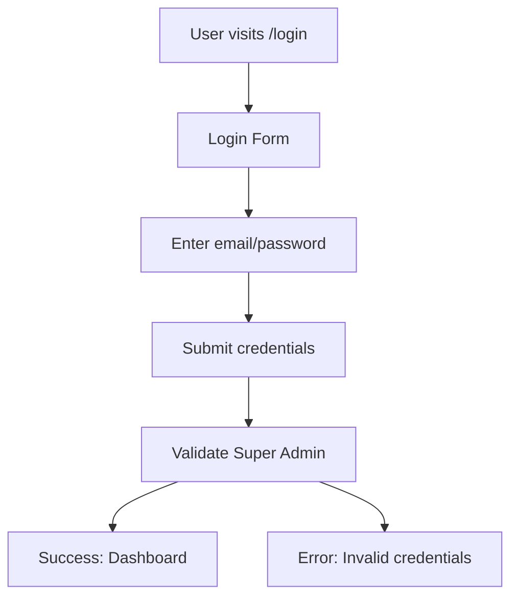
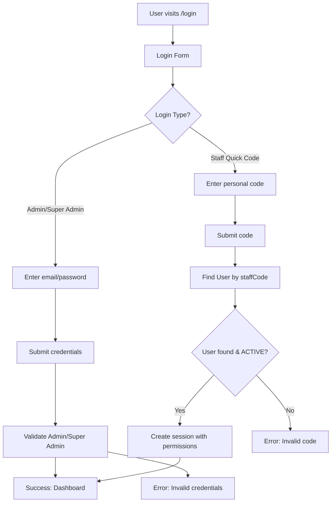
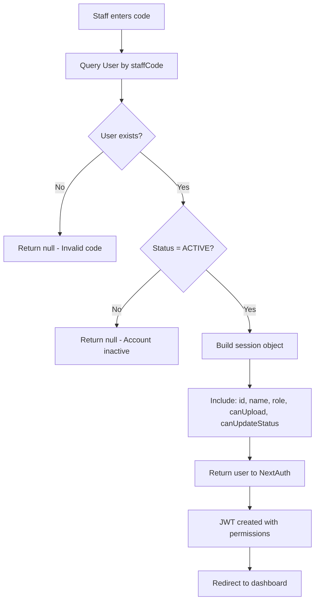

# Flow Overview / Tổng quan Luồng (REVISED)

## Current Flow / Luồng Hiện tại

## Proposed Flow / Luồng Đề xuất

## Staff Code Authentication Detail / Chi tiết Xác thực Mã Nhân viên

## Changes Highlighted / Thay đổi Nổi bật

- **Added:** Login type selection (Admin vs Staff Quick Code)
- **Added:** Per-user staff code authentication
- **Added:** Permission fields in session (canUpload, canUpdateStatus)
- **Modified:** Login form to support both authentication methods
- **Schema:** staffCode now unique per user, new permission fields
