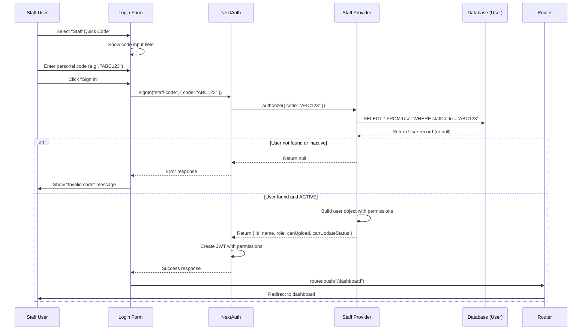

# Sequence: Staff Code Login (REVISED - Per-User)

## Notes / Ghi chú

- **Per-User Code:** Each staff has unique code in User.staffCode
- **Individual Session:** Session tracks specific user, not anonymous
- **Permissions in JWT:** canUpload, canUpdateStatus included for access control
- **Status Check:** Only ACTIVE users can login (PENDING/REVOKED blocked)
- **Traceable:** All actions can be attributed to specific staff user
