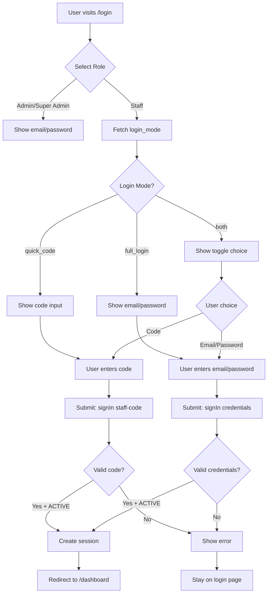

# Specification — Staff Code Login (Per-User with Permissions)
<!-- Version: 1.0 | Contract: v1.0 | Created: 2026-02-06 -->
<!-- 🇻🇳 Vietnamese first, 🇬🇧 English follows -->

---

## TL;DR

| Aspect | Value |
|--------|-------|
| Feature | Staff Code Login (Per-User) |
| Phase 0 Analysis | [Solution Design](../00_analysis/solution-design.md) |
| Status | Draft |
| Functional Requirements | 8 |
| Non-Functional Requirements | 4 |
| Affected Roots | sgs-cs-helper |

---

## 1. Overview

🇻🇳 Tính năng này cho phép nhân viên đăng nhập nhanh bằng mã cá nhân (staff code). Mỗi nhân viên có mã riêng duy nhất do Admin/Super Admin tạo. Hệ thống kiểm tra quyền truy cập của từng nhân viên (upload đơn hàng, cập nhật trạng thái) và quản lý chế độ đăng nhập toàn hệ thống (quick code, full login, hoặc cả hai).

🇬🇧 This feature allows staff members to login quickly using their personal code (staff code). Each staff member has a unique code generated by Admin/Super Admin. The system verifies individual staff permissions (upload orders, update status) and manages system-wide login mode configuration (quick code, full login, or both).

### Reference

- **Phase 0 Analysis:** [solution-design.md](../00_analysis/solution-design.md)
- **User Story:** US-0.2.5
- **Related Stories:** US-0.2.7 (Staff Management), US-0.2.8 (Login Mode Config)

---

## 2. Goals & Non-Goals

### Goals

🇻🇳
1. **Đăng nhập nhanh:** Nhân viên có thể đăng nhập bằng mã cá nhân (không cần email/password)
2. **Kiểm soát quyền:** Mỗi nhân viên có quyền riêng (canUpload, canUpdateStatus)
3. **Quản lý linh hoạt:** Admin/Super Admin quản lý nhân viên và cấu hình chế độ login
4. **Bảo mật:** Mã unique, session cá nhân, không ẩn danh

🇬🇧
1. **Quick login:** Staff can login with personal code (no email/password needed)
2. **Permission control:** Each staff has individual permissions (canUpload, canUpdateStatus)
3. **Flexible management:** Admin/Super Admin manage staff and login mode configuration
4. **Security:** Unique codes, individual sessions, not anonymous

### Non-Goals

🇻🇳
1. ❌ Tạo staff code tự động cho user hiện tại (đã có trong cơ sở dữ liệu)
2. ❌ Tích hợp SSO/OAuth cho staff (chỉ Admin/Super Admin)
3. ❌ Quản lý multi-factor authentication (MFA)
4. ❌ Tự động khóa tài khoản sau nhiều lần đăng nhập sai

🇬🇧
1. ❌ Auto-generate staff codes for existing users (already in database)
2. ❌ SSO/OAuth integration for staff (only Admin/Super Admin)
3. ❌ Multi-factor authentication (MFA) management
4. ❌ Auto-lock accounts after failed login attempts

---

## 3. User Stories

### US-0.2.5: Staff Code Login (Per-User)

🇻🇳 Là nhân viên, tôi muốn đăng nhập bằng mã cá nhân để truy cập nhanh hệ thống. Mỗi nhân viên có mã riêng được Admin/Super Admin cấp.

🇬🇧 As a Staff member, I want to login with my personal code so that I can quickly access the system. Each staff has their own unique code assigned by Admin/Super Admin.

### US-0.2.7: Staff User Management (Related)

🇻🇳 Là Admin/Super Admin, tôi muốn tạo và quản lý nhân viên để kiểm soát ai có quyền truy cập và họ có thể làm gì.

🇬🇧 As Admin/Super Admin, I want to create and manage staff users so that I can control who has access and what they can do.

### US-0.2.8: Login Mode Configuration (Related)

🇻🇳 Là Admin/Super Admin, tôi muốn cấu hình chế độ đăng nhập toàn hệ thống để kiểm soát nhân viên dùng quick code hay phải đăng nhập đầy đủ.

🇬🇧 As Admin/Super Admin, I want to configure system-wide login mode so that I can control whether staff use quick code or must use full login.

---

## 4. Requirements Matrix

| ID | Title | Priority | Type | Roots |
|----|-------|----------|------|-------|
| FR-001 | Staff Code Authentication | Must | Functional | sgs-cs-helper |
| FR-002 | Permission Fields | Must | Functional | sgs-cs-helper |
| FR-003 | Login Form with Code Input | Must | Functional | sgs-cs-helper |
| FR-004 | Session with Permissions | Must | Functional | sgs-cs-helper |
| FR-005 | Login Mode Configuration | Must | Functional | sgs-cs-helper |
| FR-006 | Dynamic Login UI | Must | Functional | sgs-cs-helper |
| FR-007 | Code Uniqueness Constraint | Must | Functional | sgs-cs-helper |
| FR-008 | User Status Validation | Must | Functional | sgs-cs-helper |
| NFR-001 | Authentication Performance | Must | Performance | sgs-cs-helper |
| NFR-002 | Code Security | Must | Security | sgs-cs-helper |
| NFR-003 | Session Security | Must | Security | sgs-cs-helper |
| NFR-004 | Type Safety | Should | Maintainability | sgs-cs-helper |

---

## 5. Functional Requirements

### FR-001: Staff Code Authentication

| Aspect | Detail |
|--------|--------|
| Priority | Must |
| Affected Roots | sgs-cs-helper |

#### Description

🇻🇳 Hệ thống phải xác thực nhân viên bằng staff code. Khi nhân viên nhập mã, hệ thống query User table (WHERE staffCode = <code> AND role = STAFF), kiểm tra trạng thái, và tạo session nếu hợp lệ.

🇬🇧 The system must authenticate staff using staff code. When staff enters code, the system queries User table (WHERE staffCode = <code> AND role = STAFF), verifies status, and creates session if valid.

#### Acceptance Criteria

- [ ] AC1: NextAuth credentials provider "staff-code" exists in auth config
- [ ] AC2: Provider accepts `{ code: string }` as input
- [ ] AC3: Provider queries User table: `WHERE staffCode = ? AND role = 'STAFF'`
- [ ] AC4: Provider verifies user status is ACTIVE
- [ ] AC5: Valid code returns user object with id, role, permissions
- [ ] AC6: Invalid code returns null (shows "Invalid code" error)
- [ ] AC7: User with PENDING/REVOKED status returns null with appropriate message

---

### FR-002: Permission Fields

| Aspect | Detail |
|--------|--------|
| Priority | Must |
| Affected Roots | sgs-cs-helper |

#### Description

🇻🇳 User model phải có hai trường boolean để kiểm soát quyền: `canUpload` (upload file Excel) và `canUpdateStatus` (đánh dấu đơn hàng hoàn thành). Giá trị mặc định là `true` cho cả hai.

🇬🇧 User model must have two boolean fields to control permissions: `canUpload` (upload Excel files) and `canUpdateStatus` (mark orders as done). Default value is `true` for both.

#### Acceptance Criteria

- [ ] AC1: Prisma schema has `canUpload Boolean @default(true)`
- [ ] AC2: Prisma schema has `canUpdateStatus Boolean @default(true)`
- [ ] AC3: Migration created and applied successfully
- [ ] AC4: Existing users get default values (true) after migration
- [ ] AC5: TypeScript types regenerated from schema
- [ ] AC6: Seed script updated to set permissions for test users

---

### FR-003: Login Form with Code Input

| Aspect | Detail |
|--------|--------|
| Priority | Must |
| Affected Roots | sgs-cs-helper |

#### Description

🇻🇳 Form đăng nhập phải hỗ trợ nhập mã nhân viên. UI hiển thị radio buttons để chọn role (Admin/Super Admin vs Staff), và hiển thị input phù hợp (email/password hoặc code) dựa trên login_mode config.

🇬🇧 Login form must support staff code input. UI shows radio buttons to select role (Admin/Super Admin vs Staff), and displays appropriate input (email/password or code) based on login_mode config.

#### Acceptance Criteria

- [ ] AC1: Radio button group for role selection: "Admin/Super Admin" | "Staff"
- [ ] AC2: When "Admin/Super Admin" selected: Show email/password fields always
- [ ] AC3: When "Staff" selected + login_mode = "quick_code": Show code input only
- [ ] AC4: When "Staff" selected + login_mode = "full_login": Show email/password only
- [ ] AC5: When "Staff" selected + login_mode = "both": Show toggle to choose code OR email/password
- [ ] AC6: Code input: Text field, placeholder "Enter your code", 6-8 chars
- [ ] AC7: Form validation: Code required if code input shown
- [ ] AC8: Error messages display clearly below input

---

### FR-004: Session with Permissions

| Aspect | Detail |
|--------|--------|
| Priority | Must |
| Affected Roots | sgs-cs-helper |

#### Description

🇻🇳 JWT session phải chứa permissions của user (canUpload, canUpdateStatus) để middleware và server actions có thể kiểm tra quyền. TypeScript types cho session phải được extend.

🇬🇧 JWT session must contain user permissions (canUpload, canUpdateStatus) so middleware and server actions can verify access. TypeScript types for session must be extended.

#### Acceptance Criteria

- [ ] AC1: NextAuth callbacks (jwt) include canUpload, canUpdateStatus
- [ ] AC2: NextAuth callbacks (session) expose permissions to client
- [ ] AC3: Type definition in `src/types/next-auth.d.ts` extends Session with permissions
- [ ] AC4: `useSession()` hook returns typed session with permissions
- [ ] AC5: Server-side `auth()` returns session with permissions
- [ ] AC6: Middleware can access session.user.canUpload and canUpdateStatus

---

### FR-005: Login Mode Configuration

| Aspect | Detail |
|--------|--------|
| Priority | Must |
| Affected Roots | sgs-cs-helper |

#### Description

🇻🇳 Config table phải lưu cấu hình `login_mode` với giá trị: `quick_code`, `full_login`, hoặc `both`. Giá trị mặc định là `quick_code`. Admin/Super Admin có thể thay đổi qua settings page.

🇬🇧 Config table must store `login_mode` setting with values: `quick_code`, `full_login`, or `both`. Default value is `quick_code`. Admin/Super Admin can change via settings page.

#### Acceptance Criteria

- [ ] AC1: Config table has key `login_mode` with default value `quick_code`
- [ ] AC2: Seed script creates this config entry
- [ ] AC3: Server action `getLoginMode()` retrieves config value
- [ ] AC4: Server action `updateLoginMode(mode)` updates config (Admin/Super Admin only)
- [ ] AC5: Login form calls `getLoginMode()` on mount to determine UI
- [ ] AC6: Config change takes effect immediately (no restart needed)

---

### FR-006: Dynamic Login UI

| Aspect | Detail |
|--------|--------|
| Priority | Must |
| Affected Roots | sgs-cs-helper |

#### Description

🇻🇳 Giao diện đăng nhập phải thay đổi động dựa trên login_mode config. Khi mode thay đổi, form tự động cập nhật để hiển thị input phù hợp.

🇬🇧 Login UI must adapt dynamically based on login_mode config. When mode changes, form automatically updates to show appropriate inputs.

#### Acceptance Criteria

- [ ] AC1: Form fetches login_mode on component mount
- [ ] AC2: `quick_code` mode: Only code input for staff
- [ ] AC3: `full_login` mode: Only email/password for staff
- [ ] AC4: `both` mode: Toggle button to choose between code and email/password
- [ ] AC5: UI state updates immediately when mode changes (no page refresh)
- [ ] AC6: Loading state shown while fetching login_mode

---

### FR-007: Code Uniqueness Constraint

| Aspect | Detail |
|--------|--------|
| Priority | Must |
| Affected Roots | sgs-cs-helper |

#### Description

🇻🇳 Staff code phải unique trong User table. Schema constraint đảm bảo không có mã trùng lặp. Khi tạo user mới, hệ thống kiểm tra code đã tồn tại hay chưa.

🇬🇧 Staff code must be unique in User table. Schema constraint ensures no duplicate codes. When creating new user, system checks if code already exists.

#### Acceptance Criteria

- [ ] AC1: Prisma schema: `staffCode String? @unique`
- [ ] AC2: Database index created on staffCode column
- [ ] AC3: Attempt to create user with duplicate code fails with clear error
- [ ] AC4: Error message: "Staff code already exists"
- [ ] AC5: Code generator retries if collision detected (rare edge case)

---

### FR-008: User Status Validation

| Aspect | Detail |
|--------|--------|
| Priority | Must |
| Affected Roots | sgs-cs-helper |

#### Description

🇻🇳 Chỉ user với status = ACTIVE mới có thể đăng nhập. User với PENDING hoặc REVOKED không được phép truy cập hệ thống.

🇬🇧 Only users with status = ACTIVE can login. Users with PENDING or REVOKED status are not allowed to access the system.

#### Acceptance Criteria

- [ ] AC1: Auth provider checks `user.status === 'ACTIVE'`
- [ ] AC2: PENDING status: Return null with message "Account pending approval"
- [ ] AC3: REVOKED status: Return null with message "Account deactivated"
- [ ] AC4: Error messages are user-friendly and translated (EN/VI)

---

## 6. Non-Functional Requirements

### NFR-001: Authentication Performance

| Aspect | Detail |
|--------|--------|
| Category | Performance |
| Metric | < 500ms for 95% of auth requests |
| Target | 95th percentile |

#### Description

🇻🇳 Quá trình xác thực (từ khi nhập mã đến khi tạo session) phải nhanh để trải nghiệm người dùng mượt mà. Database query phải được optimize.

🇬🇧 Authentication process (from code input to session creation) must be fast for smooth user experience. Database queries must be optimized.

**Acceptance:**
- [ ] AC1: staffCode indexed in database
- [ ] AC2: Auth response time < 500ms (95th percentile)
- [ ] AC3: No N+1 queries in auth flow

---

### NFR-002: Code Security

| Aspect | Detail |
|--------|--------|
| Category | Security |
| Metric | Unique, unguessable codes |

#### Description

🇻🇳 Staff code phải đủ phức tạp để không thể đoán. Sử dụng crypto-safe random generator. Code length tối thiểu 6 ký tự.

🇬🇧 Staff codes must be complex enough to prevent guessing. Use crypto-safe random generator. Minimum code length is 6 characters.

**Acceptance:**
- [ ] AC1: Code generated using `crypto.randomBytes()`
- [ ] AC2: Code format: 6-8 alphanumeric characters
- [ ] AC3: No sequential patterns (e.g., 123456)
- [ ] AC4: No profanity filter needed (alphanumeric only)

---

### NFR-003: Session Security

| Aspect | Detail |
|--------|--------|
| Category | Security |
| Metric | JWT signed & httpOnly cookie |

#### Description

🇻🇳 Session token phải được bảo mật bằng JWT signature và lưu trong httpOnly cookie để tránh XSS attacks.

🇬🇧 Session token must be secured with JWT signature and stored in httpOnly cookie to prevent XSS attacks.

**Acceptance:**
- [ ] AC1: NextAuth JWT strategy with secret
- [ ] AC2: Cookie: httpOnly, secure (production), sameSite
- [ ] AC3: Session expires after 30 days (configurable)
- [ ] AC4: Refresh token rotation (NextAuth default)

---

### NFR-004: Type Safety

| Aspect | Detail |
|--------|--------|
| Category | Maintainability |
| Metric | Full TypeScript coverage |

#### Description

🇻🇳 Tất cả types liên quan đến session, user, permissions phải được định nghĩa trong TypeScript. Không có `any` types.

🇬🇧 All types related to session, user, permissions must be defined in TypeScript. No `any` types.

**Acceptance:**
- [ ] AC1: Session type extends DefaultSession with permissions
- [ ] AC2: User type includes canUpload, canUpdateStatus
- [ ] AC3: No TypeScript errors in auth flow
- [ ] AC4: IDE autocomplete works for session.user.canUpload

---

## 7. User Flow

### Staff Login Flow

| Step | Action | System Response | Next Step |
|------|--------|-----------------|-----------|
| 1 | User visits /login | Show login form with role selection | 2 |
| 2 | User selects "Staff" | Fetch login_mode config | 3 |
| 3 | System shows code input (if quick_code) | Display code input field | 4 |
| 4 | User enters staff code | Validate format (client) | 5 |
| 5 | User clicks "Login" | Call signIn("staff-code", { code }) | 6 |
| 6 | NextAuth queries User table | Find user by staffCode + STAFF role | 7 or Error |
| 7 | User found & ACTIVE | Create JWT session with permissions | Redirect to /dashboard |
| Error | Invalid code / status | Show error message | Stay on login page |

### Flow Diagram



---

## 8. Data Models

### Prisma Schema Changes

```prisma
model User {
  id              String   @id @default(cuid())
  email           String?  @unique
  name            String?
  role            Role     @default(STAFF)
  authMethod      AuthMethod @default(PASSWORD)
  passwordHash    String?
  status          UserStatus @default(PENDING)
  
  // UPDATED: Add @unique constraint
  staffCode       String?  @unique
  
  // NEW: Permission fields
  canUpload       Boolean  @default(true)
  canUpdateStatus Boolean  @default(true)
  
  createdAt       DateTime @default(now())
  updatedAt       DateTime @updatedAt
  
  @@index([staffCode])
}

model Config {
  id    String @id @default(cuid())
  key   String @unique
  value String
  
  @@index([key])
}

enum Role {
  SUPER_ADMIN
  ADMIN
  STAFF
}

enum UserStatus {
  ACTIVE
  PENDING
  REVOKED
}

enum AuthMethod {
  PASSWORD
  GOOGLE_OAUTH
  STAFF_CODE
}
```

### TypeScript Session Type

```typescript
// src/types/next-auth.d.ts
import { DefaultSession } from "next-auth";

declare module "next-auth" {
  interface Session {
    user: {
      id: string;
      email?: string;
      name?: string;
      role: "SUPER_ADMIN" | "ADMIN" | "STAFF";
      status: "ACTIVE" | "PENDING" | "REVOKED";
      // NEW: Permissions
      canUpload: boolean;
      canUpdateStatus: boolean;
    } & DefaultSession["user"];
  }

  interface User {
    id: string;
    email?: string;
    name?: string;
    role: "SUPER_ADMIN" | "ADMIN" | "STAFF";
    status: "ACTIVE" | "PENDING" | "REVOKED";
    staffCode?: string;
    canUpload: boolean;
    canUpdateStatus: boolean;
  }
}

declare module "next-auth/jwt" {
  interface JWT {
    id: string;
    role: string;
    status: string;
    canUpload: boolean;
    canUpdateStatus: boolean;
  }
}
```

---

## 9. API Contracts

### Server Actions

#### getLoginMode()

```typescript
// src/lib/actions/config.ts
export async function getLoginMode(): Promise<
  "quick_code" | "full_login" | "both"
> {
  const config = await prisma.config.findUnique({
    where: { key: "login_mode" }
  });
  return (config?.value as any) || "quick_code";
}
```

#### updateLoginMode()

```typescript
export async function updateLoginMode(
  mode: "quick_code" | "full_login" | "both"
): Promise<{ success: boolean; error?: string }> {
  // Check user role: Admin or Super Admin only
  const session = await auth();
  if (!session || !["ADMIN", "SUPER_ADMIN"].includes(session.user.role)) {
    return { success: false, error: "Unauthorized" };
  }

  await prisma.config.upsert({
    where: { key: "login_mode" },
    update: { value: mode },
    create: { key: "login_mode", value: mode }
  });

  return { success: true };
}
```

### NextAuth Provider

```typescript
// src/lib/auth/config.ts
export const authConfig = {
  providers: [
    // Existing: Credentials for Super Admin
    Credentials({
      id: "credentials",
      name: "Credentials",
      credentials: {
        email: { label: "Email", type: "email" },
        password: { label: "Password", type: "password" }
      },
      async authorize(credentials) {
        // Super Admin auth logic (existing)
      }
    }),
    
    // NEW: Staff Code Provider
    Credentials({
      id: "staff-code",
      name: "Staff Code",
      credentials: {
        code: { label: "Code", type: "text" }
      },
      async authorize(credentials) {
        if (!credentials?.code) return null;

        const user = await prisma.user.findUnique({
          where: { 
            staffCode: credentials.code,
            role: "STAFF"
          }
        });

        if (!user) return null;
        if (user.status !== "ACTIVE") return null;

        return {
          id: user.id,
          email: user.email,
          name: user.name,
          role: user.role,
          status: user.status,
          canUpload: user.canUpload,
          canUpdateStatus: user.canUpdateStatus
        };
      }
    })
  ],
  
  callbacks: {
    async jwt({ token, user }) {
      if (user) {
        token.id = user.id;
        token.role = user.role;
        token.status = user.status;
        token.canUpload = user.canUpload;
        token.canUpdateStatus = user.canUpdateStatus;
      }
      return token;
    },
    
    async session({ session, token }) {
      if (session.user) {
        session.user.id = token.id as string;
        session.user.role = token.role as any;
        session.user.status = token.status as any;
        session.user.canUpload = token.canUpload as boolean;
        session.user.canUpdateStatus = token.canUpdateStatus as boolean;
      }
      return session;
    }
  }
};
```

---

## 10. Edge Cases

| ID | Scenario | Expected Behavior | Priority |
|----|----------|-------------------|----------|
| EC-001 | Code exists but wrong role | Return null, show "Invalid code" | Must |
| EC-002 | Code case sensitivity | Case-insensitive match | Must |
| EC-003 | Login mode changes mid-session | User stays logged in, config applies to next login | Should |
| EC-004 | Simultaneous code generation | Retry if duplicate detected | Must |
| EC-005 | User deactivated while logged in | Session remains valid until expiry | Should |

### EC-001: Code Exists but Wrong Role

🇻🇳
**Khi:** User nhập staff code nhưng user có role ADMIN hoặc SUPER_ADMIN  
**Thì:** Auth provider return null (code không tìm thấy)  
**Lý do:** Staff code chỉ dùng cho role STAFF

🇬🇧
**When:** User enters staff code but user has ADMIN or SUPER_ADMIN role  
**Then:** Auth provider returns null (code not found)  
**Rationale:** Staff codes are only for STAFF role

### EC-002: Code Case Sensitivity

🇻🇳
**Khi:** User nhập "ABC123" nhưng database lưu "abc123"  
**Thì:** Normalize code về lowercase trước khi query  
**Lý do:** Tránh lỗi do case mismatch

🇬🇧
**When:** User enters "ABC123" but database stores "abc123"  
**Then:** Normalize code to lowercase before query  
**Rationale:** Avoid errors due to case mismatch

### EC-003: Login Mode Changes Mid-Session

🇻🇳
**Khi:** Admin thay đổi login_mode từ "quick_code" sang "full_login" khi staff đang login  
**Thì:** Staff đang login không bị đăng xuất, config mới chỉ áp dụng cho lần đăng nhập tiếp theo  
**Lý do:** Không gián đoạn workflow hiện tại

🇬🇧
**When:** Admin changes login_mode from "quick_code" to "full_login" while staff is logged in  
**Then:** Logged-in staff are not logged out, new config applies to next login only  
**Rationale:** Don't disrupt current workflow

### EC-004: Simultaneous Code Generation

🇻🇳
**Khi:** Hai admin tạo staff user cùng lúc, code generator tạo ra mã trùng (rất hiếm)  
**Thì:** Generator retry lại với mã mới  
**Lý do:** Đảm bảo uniqueness constraint

🇬🇧
**When:** Two admins create staff users simultaneously, code generator produces duplicate (very rare)  
**Then:** Generator retries with new code  
**Rationale:** Ensure uniqueness constraint

### EC-005: User Deactivated While Logged In

🇻🇳
**Khi:** Admin revoke staff user khi user đang login  
**Thì:** Session vẫn valid đến khi hết hạn (30 ngày), nhưng không thể renew  
**Lý do:** NextAuth không hỗ trợ immediate revocation, cần implement token blacklist riêng (out of scope)

🇬🇧
**When:** Admin revokes staff user while user is logged in  
**Then:** Session remains valid until expiry (30 days), but cannot be renewed  
**Rationale:** NextAuth doesn't support immediate revocation, need separate token blacklist (out of scope)

---

## 11. Error Handling

| Error Condition | User Message (EN/VI) | System Action |
|-----------------|----------------------|---------------|
| Invalid code | "Invalid code. Please check and try again." / "Mã không hợp lệ. Vui lòng kiểm tra lại." | Log warning, return 401 |
| Code not found | "Invalid code. Please check and try again." / "Mã không hợp lệ. Vui lòng kiểm tra lại." | Log info, return 401 |
| User PENDING | "Account pending approval." / "Tài khoản đang chờ phê duyệt." | Log info, return 403 |
| User REVOKED | "Account deactivated. Contact admin." / "Tài khoản bị vô hiệu hóa. Liên hệ admin." | Log info, return 403 |
| Database error | "Something went wrong. Please try again." / "Đã xảy ra lỗi. Vui lòng thử lại." | Log error, return 500 |
| Login mode fetch error | "Unable to load login settings." / "Không thể tải cấu hình đăng nhập." | Log error, fallback to quick_code |

---

## 12. Cross-Root Impact

| Root | Changes | Sync Required |
|------|---------|---------------|
| sgs-cs-helper | Schema, Auth, UI | No (single root) |

### Integration Points

🇻🇳 Đây là feature single-root (chỉ trong sgs-cs-helper). Không có cross-root dependencies. Tất cả thay đổi nằm trong một workspace root.

🇬🇧 This is a single-root feature (only in sgs-cs-helper). No cross-root dependencies. All changes are within one workspace root.

---

## 13. Dependencies

| Dependency | Type | Status | Purpose |
|------------|------|--------|---------|
| `next-auth` | Package | Existing | Authentication framework |
| `@prisma/client` | Package | Existing | Database ORM |
| `crypto` | Node.js built-in | Existing | Random code generation |
| `zod` | Package | Existing | Runtime validation |

---

## 14. Risks & Assumptions

### Risks

| Risk | Impact | Mitigation |
|------|--------|------------|
| Code collision on generation | Low | Use crypto-safe random with retry logic |
| Users share codes | Medium | Education + audit logs (future) |
| Session hijacking | High | httpOnly cookies + JWT signature |
| Mass code brute-force | Medium | Rate limiting (future enhancement) |

### Assumptions

| # | Assumption | Validated |
|---|------------|-----------|
| 1 | Staff codes are 6-8 chars alphanumeric | Yes (from Phase 0) |
| 2 | Default permissions: canUpload=true, canUpdateStatus=true | Yes |
| 3 | Login mode default is "quick_code" | Yes |
| 4 | NextAuth v5 supports multiple Credentials providers | Yes (verified in docs) |
| 5 | Session expiry is 30 days | Yes (NextAuth default) |

---

## 15. Open Questions

| # | Question | Status | Answer |
|---|----------|--------|--------|
| 1 | Should staff codes expire? | Resolved | No - codes are permanent until admin changes |
| 2 | Should we log failed login attempts? | Resolved | Yes - use NextAuth events (future enhancement) |
| 3 | Should code input be masked? | Resolved | No - codes are meant to be visible for sharing |

---

## 16. Notes

🇻🇳
- Migration cần chạy TRƯỚC khi deploy code mới (để thêm canUpload, canUpdateStatus)
- Staff code generator utility (cho US-0.2.7) sẽ được implement trong phase tiếp theo
- Login mode config page (cho US-0.2.8) nằm ngoài scope của US-0.2.5

🇬🇧
- Migration must run BEFORE deploying new code (to add canUpload, canUpdateStatus)
- Staff code generator utility (for US-0.2.7) will be implemented in next phase
- Login mode config page (for US-0.2.8) is out of scope for US-0.2.5

**Security Note:**
- Staff codes are NOT passwords - they're shared identifiers for quick access
- Real authentication still happens via NextAuth with proper session management
- For sensitive operations, consider requiring full login even for staff

**Performance Note:**
- staffCode index is critical for fast auth lookups
- Consider adding composite index on (staffCode, role, status) if auth queries are slow

---

## Approval

| Role | Name | Status | Date |
|------|------|--------|------|
| Spec Author | GitHub Copilot | ✅ Done | 2026-02-06 |
| Tech Reviewer | ... | ⏳ Pending | ... |
| Product Owner | ... | ⏳ Pending | ... |

---

## Next Step

🇻🇳 Sau khi phê duyệt, tiến hành **Phase 2: Task Planning**.

🇬🇧 After approval, proceed to **Phase 2: Task Planning**.

**Reply:** `approved` or `revise: <feedback>`
