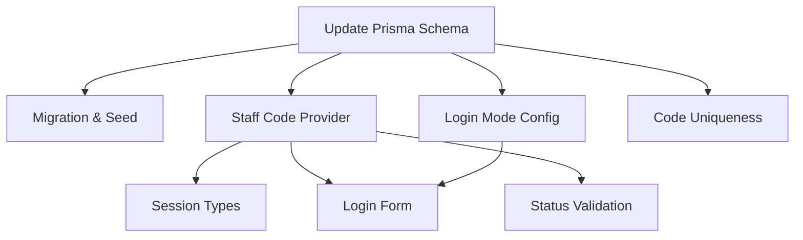

# Task Plan: Staff Code Login (Per-User with Permissions)
# Kế hoạch Task: Đăng nhập bằng mã cá nhân (Staff)

## 📋 TL;DR

| Aspect | Value |
|--------|-------|
| Feature | Staff Code Login (Per-User) |
| Total Tasks | 8 |
| Estimated Effort | 8-12 hours |
| Affected Roots | sgs-cs-helper |
| Spec Reference | [spec.md](../01_spec/spec.md) |

---

## Task Overview / Tổng quan Task

| ID | Title | Root | Deps | Est | Status |
|----|-------|------|------|-----|--------|
| T-001 | Update Prisma Schema for Staff Code & Permissions | sgs-cs-helper | - | S | ⬜ |
| T-002 | Create Migration & Seed Script for Permissions | sgs-cs-helper | T-001 | S | ⬜ |
| T-003 | Add Staff Code Credentials Provider to NextAuth | sgs-cs-helper | T-001 | M | ⬜ |
| T-004 | Extend Session Types with Permissions | sgs-cs-helper | T-003 | S | ⬜ |
| T-005 | Implement Login Mode Config in Config Table | sgs-cs-helper | T-001 | S | ⬜ |
| T-006 | Update Login Form for Dynamic Role & Mode | sgs-cs-helper | T-003,T-005 | M | ⬜ |
| T-007 | Enforce Staff Code Uniqueness & Error Handling | sgs-cs-helper | T-001 | S | ⬜ |
| T-008 | User Status Validation in Auth Provider | sgs-cs-helper | T-003 | S | ⬜ |

---

## Dependency Graph / Đồ thị Phụ thuộc



---

## Tasks by Root / Task theo Root

### Root: sgs-cs-helper

#### T-001: Update Prisma Schema for Staff Code & Permissions

| Aspect | Detail |
|--------|--------|
| Root | sgs-cs-helper |
| Dependencies | None |
| Estimate | S (30 min) |
| Requirements | FR-002, FR-007 |

**Description / Mô tả:**
- **EN:** Add @unique to staffCode, add canUpload and canUpdateStatus fields to User model in schema.prisma
- **VI:** Thêm @unique cho staffCode, thêm trường canUpload và canUpdateStatus vào User model trong schema.prisma

**Files to Change / File Thay đổi:**
- Modify: prisma/schema.prisma

**Done Criteria / Tiêu chí Hoàn thành:**
- [ ] staffCode is unique in schema
- [ ] canUpload and canUpdateStatus fields exist

**Verification / Kiểm tra:**
- Run: `pnpm db:generate` and check generated types
- Inspect schema.prisma

---

#### T-002: Create Migration & Seed Script for Permissions

| Aspect | Detail |
|--------|--------|
| Root | sgs-cs-helper |
| Dependencies | T-001 |
| Estimate | S (30 min) |
| Requirements | FR-002, FR-007 |

**Description / Mô tả:**
- **EN:** Create migration for new fields, update seed.ts to set permissions for test users
- **VI:** Tạo migration cho các trường mới, cập nhật seed.ts để set quyền cho user test

**Files to Change / File Thay đổi:**
- Create: prisma/migrations/*
- Modify: prisma/seed.ts

**Done Criteria / Tiêu chí Hoàn thành:**
- [ ] Migration applies successfully
- [ ] Seed script sets canUpload/canUpdateStatus

**Verification / Kiểm tra:**
- Run: `pnpm db:migrate` and `pnpm db:seed`
- Check database values

---

#### T-003: Add Staff Code Credentials Provider to NextAuth

| Aspect | Detail |
|--------|--------|
| Root | sgs-cs-helper |
| Dependencies | T-001 |
| Estimate | M (1h) |
| Requirements | FR-001, FR-008 |

**Description / Mô tả:**
- **EN:** Add Credentials provider for staff code to NextAuth config, query User by staffCode and role
- **VI:** Thêm provider Credentials cho staff code vào NextAuth config, query User theo staffCode và role

**Files to Change / File Thay đổi:**
- Modify: src/lib/auth/config.ts

**Done Criteria / Tiêu chí Hoàn thành:**
- [ ] Provider exists and works
- [ ] Queries User by staffCode and role

**Verification / Kiểm tra:**
- Test login with valid/invalid code
- Check session created

---

#### T-004: Extend Session Types with Permissions

| Aspect | Detail |
|--------|--------|
| Root | sgs-cs-helper |
| Dependencies | T-003 |
| Estimate | S (30 min) |
| Requirements | FR-004 |

**Description / Mô tả:**
- **EN:** Extend NextAuth session and JWT types to include canUpload, canUpdateStatus
- **VI:** Mở rộng type session và JWT của NextAuth để bao gồm canUpload, canUpdateStatus

**Files to Change / File Thay đổi:**
- Modify: src/types/next-auth.d.ts
- Modify: src/lib/auth/config.ts

**Done Criteria / Tiêu chí Hoàn thành:**
- [ ] Session includes permissions
- [ ] TypeScript types updated

**Verification / Kiểm tra:**
- Check IDE autocomplete
- Test session values

---

#### T-005: Implement Login Mode Config in Config Table

| Aspect | Detail |
|--------|--------|
| Root | sgs-cs-helper |
| Dependencies | T-001 |
| Estimate | S (30 min) |
| Requirements | FR-005 |

**Description / Mô tả:**
- **EN:** Add login_mode config to Config table, create server actions to get/set mode
- **VI:** Thêm cấu hình login_mode vào bảng Config, tạo server actions để lấy/cập nhật mode

**Files to Change / File Thay đổi:**
- Modify: prisma/schema.prisma
- Modify: src/lib/actions/config.ts
- Modify: prisma/seed.ts

**Done Criteria / Tiêu chí Hoàn thành:**
- [ ] Config table has login_mode
- [ ] Server actions get/set mode

**Verification / Kiểm tra:**
- Run: `pnpm db:seed`
- Test getLoginMode/updateLoginMode

---

#### T-006: Update Login Form for Dynamic Role & Mode

| Aspect | Detail |
|--------|--------|
| Root | sgs-cs-helper |
| Dependencies | T-003,T-005 |
| Estimate | M (1h) |
| Requirements | FR-003, FR-006, FR-005 |

**Description / Mô tả:**
- **EN:** Update login form to support role selection, dynamic input based on login_mode
- **VI:** Cập nhật form đăng nhập để chọn role, input động dựa trên login_mode

**Files to Change / File Thay đổi:**
- Modify: src/app/(auth)/login/_components/login-form.tsx
- Modify: src/app/(auth)/login/page.tsx

**Done Criteria / Tiêu chí Hoàn thành:**
- [ ] Form supports role selection
- [ ] Input adapts to login_mode

**Verification / Kiểm tra:**
- Test UI for all modes
- Test validation and error messages

---

#### T-007: Enforce Staff Code Uniqueness & Error Handling

| Aspect | Detail |
|--------|--------|
| Root | sgs-cs-helper |
| Dependencies | T-001 |
| Estimate | S (30 min) |
| Requirements | FR-007 |

**Description / Mô tả:**
- **EN:** Ensure staffCode uniqueness in database, handle duplicate errors gracefully
- **VI:** Đảm bảo staffCode unique trong database, xử lý lỗi trùng mã rõ ràng

**Files to Change / File Thay đổi:**
- Modify: prisma/schema.prisma
- Modify: src/lib/auth/staff-code.ts

**Done Criteria / Tiêu chí Hoàn thành:**
- [ ] Duplicate code creation fails with clear error
- [ ] Error message shown to admin

**Verification / Kiểm tra:**
- Try creating duplicate code
- Check error handling

---

#### T-008: User Status Validation in Auth Provider

| Aspect | Detail |
|--------|--------|
| Root | sgs-cs-helper |
| Dependencies | T-003 |
| Estimate | S (30 min) |
| Requirements | FR-008 |

**Description / Mô tả:**
- **EN:** Auth provider checks user status, only allows ACTIVE users to login
- **VI:** Auth provider kiểm tra status user, chỉ cho phép user ACTIVE đăng nhập

**Files to Change / File Thay đổi:**
- Modify: src/lib/auth/config.ts

**Done Criteria / Tiêu chí Hoàn thành:**
- [ ] PENDING/REVOKED users cannot login
- [ ] Error messages shown

**Verification / Kiểm tra:**
- Test login with PENDING/REVOKED users
- Check error messages

---

## Risk Assessment / Đánh giá Rủi ro

| Task | Risk | Mitigation |
|------|------|------------|
| T-003 | Auth logic error | Add unit tests for provider |
| T-006 | UI logic error | Test all login modes thoroughly |
| T-007 | DB constraint error | Add integration test for uniqueness |

---

## Requirements Coverage / Độ phủ Yêu cầu

| Requirement | Tasks |
|-------------|-------|
| FR-001 | T-003, T-008 |
| FR-002 | T-001, T-002 |
| FR-003 | T-006 |
| FR-004 | T-004 |
| FR-005 | T-005, T-006 |
| FR-006 | T-006 |
| FR-007 | T-001, T-007 |
| FR-008 | T-008 |

---

## Test Plan / Kế hoạch Test

### 7.1 Test Strategy
- Unit tests for provider logic, session extension, and code generator
- Integration tests for login flow and UI
- Manual tests for error handling and edge cases
- Coverage target: 90%+ for core logic

### 7.2 Test Cases by Task

| TC ID | Task | Test Description | Type | Expected Result |
|-------|------|------------------|------|-----------------|
| TC-001 | T-001 | staffCode is unique in schema | Unit | Prisma validates uniqueness |
| TC-002 | T-002 | Migration applies, seed sets permissions | Integration | DB values correct |
| TC-003 | T-003 | Provider returns user for valid code | Unit | Session created |
| TC-004 | T-003 | Provider returns null for invalid code | Unit | Error shown |
| TC-005 | T-004 | Session includes permissions | Unit | Session.user.canUpload exists |
| TC-006 | T-005 | getLoginMode returns config value | Unit | Correct mode returned |
| TC-007 | T-006 | Login form adapts to mode | Integration | UI changes as expected |
| TC-008 | T-007 | Duplicate code creation fails | Integration | Error message shown |
| TC-009 | T-008 | PENDING/REVOKED users cannot login | Unit | Error message shown |

### 7.3 Edge Cases
- Empty/null code input
- Invalid code format
- Duplicate code generation
- User status changes mid-session
- Login mode changes while logged in

### 7.4 Test Data
- Fixtures: test users with all statuses
- Mock: login_mode config values
- Setup: DB migration and seed before tests
- Teardown: Clean up test users after

---

## ⏸️ Phase 2 Complete / Hoàn thành Phase 2

### Summary / Tóm tắt
| Aspect | Value |
|--------|-------|
| Dev Mode | standard |
| Total Tasks | 8 |
| By Root | sgs-cs-helper: 8 |
| Estimated Effort | 8-12 hours |
| Sync Points | N/A |
| Test Plan | Included ✅ |
| Test Cases | 9 |

### Task List / Danh sách Task
| ID | Title | Root | Est | Test Cases |
|----|-------|------|-----|------------|
| T-001 | Update Prisma Schema | sgs-cs-helper | S | TC-001 |
| T-002 | Migration & Seed | sgs-cs-helper | S | TC-002 |
| T-003 | Staff Code Provider | sgs-cs-helper | M | TC-003, TC-004 |
| T-004 | Session Types | sgs-cs-helper | S | TC-005 |
| T-005 | Login Mode Config | sgs-cs-helper | S | TC-006 |
| T-006 | Login Form | sgs-cs-helper | M | TC-007 |
| T-007 | Code Uniqueness | sgs-cs-helper | S | TC-008 |
| T-008 | Status Validation | sgs-cs-helper | S | TC-009 |

### Requirements Coverage / Độ phủ Yêu cầu
- FR-001 → T-003, T-008 ✅
- FR-002 → T-001, T-002 ✅
- FR-003 → T-006 ✅
- FR-004 → T-004 ✅
- FR-005 → T-005, T-006 ✅
- FR-006 → T-006 ✅
- FR-007 → T-001, T-007 ✅
- FR-008 → T-008 ✅
- All requirements covered ✅

### Artifacts Created / Artifact Đã tạo
- [Task Plan](./02_tasks/tasks.md)

---

**⏸️ STOP: Awaiting Review / Chờ Review**

Please review the task plan.
Vui lòng review kế hoạch task.

**👉 RECOMMENDED: Run task plan review first / KHUYẾN NGHỊ: Chạy task plan review trước**
```
/task-plan-review
```

**Or if you want to manually review and approve / Hoặc nếu muốn tự review và duyệt:**
Say `approved` then run `/phase-3-impl T-001`
