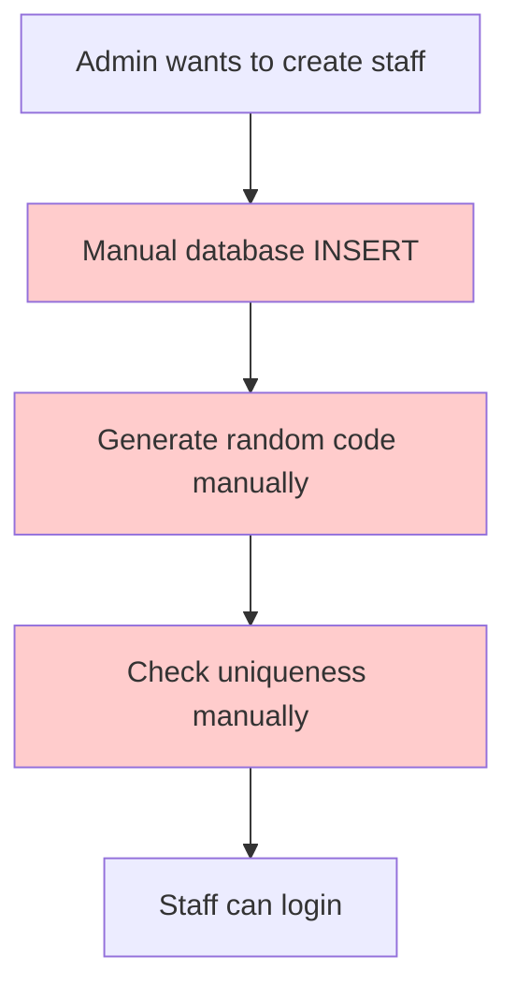
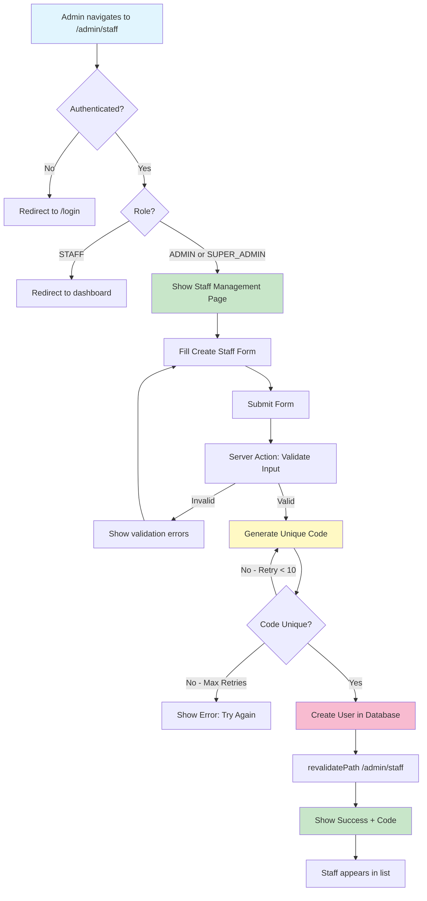
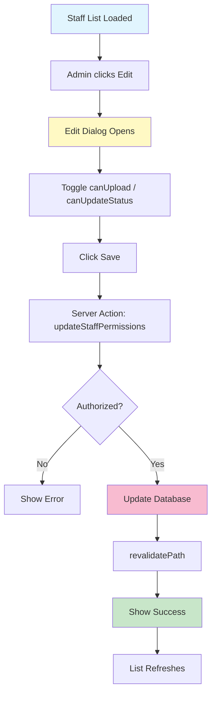
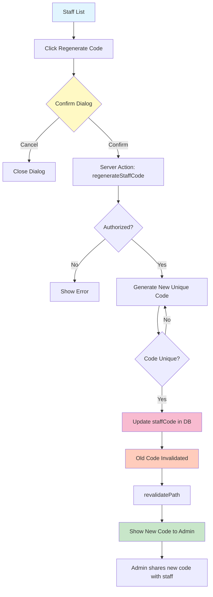

# Flow Overview — Staff User Management

## Current Flow / Luồng Hiện tại

**Problems with current flow:**
- ❌ No UI - must use database directly
- ❌ Manual code generation - error prone
- ❌ No permission management UI
- ❌ Can't view staff list easily

---

## Proposed Flow / Luồng Đề xuất

### Create Staff Flow

### Edit Permissions Flow

### Regenerate Code Flow

---

## Changes Highlighted / Thay đổi Nổi bật

### Added / Thêm mới
- ✅ `/admin/staff` route với UI đầy đủ
- ✅ Auto code generation với uniqueness check
- ✅ Permission management UI (canUpload, canUpdateStatus)
- ✅ Staff list with all details
- ✅ Edit và Regenerate Code workflows
- ✅ Server Actions với auth/validation
- ✅ Extended Admin Layout cho ADMIN role

### Modified / Sửa đổi
- ⚠️ Admin Layout: Now allows ADMIN + SUPER_ADMIN (was SUPER_ADMIN only)

### Removed / Loại bỏ
- None

---

**Key Improvements:**
1. **Self-service UI** — No more manual database edits
2. **Automatic code generation** — No human error
3. **Built-in uniqueness** — Retry logic handles collisions
4. **Permission management** — Toggle permissions easily
5. **Security** — Codes only visible at creation/regeneration
