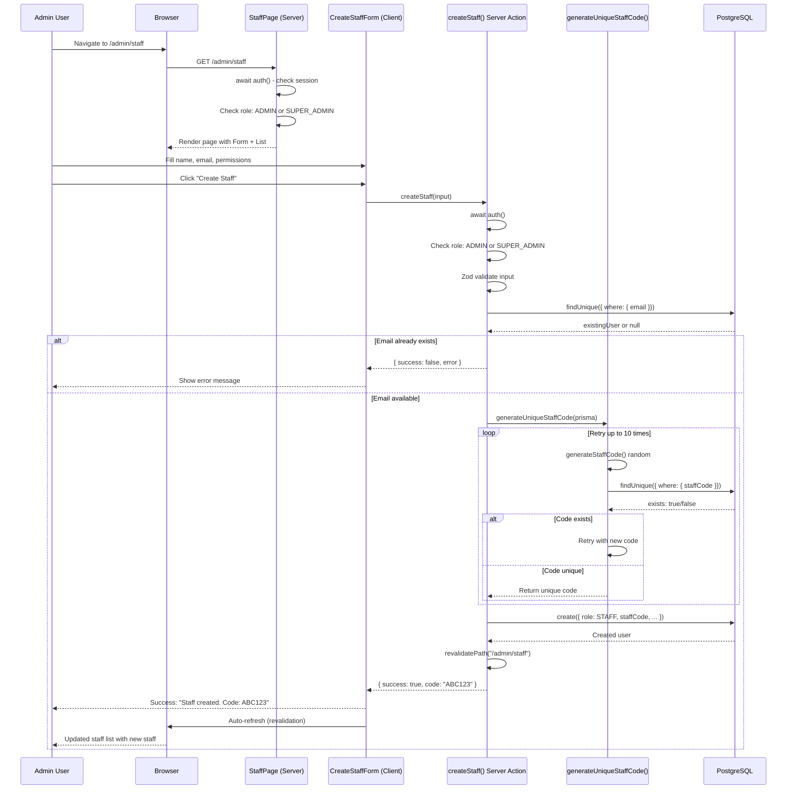
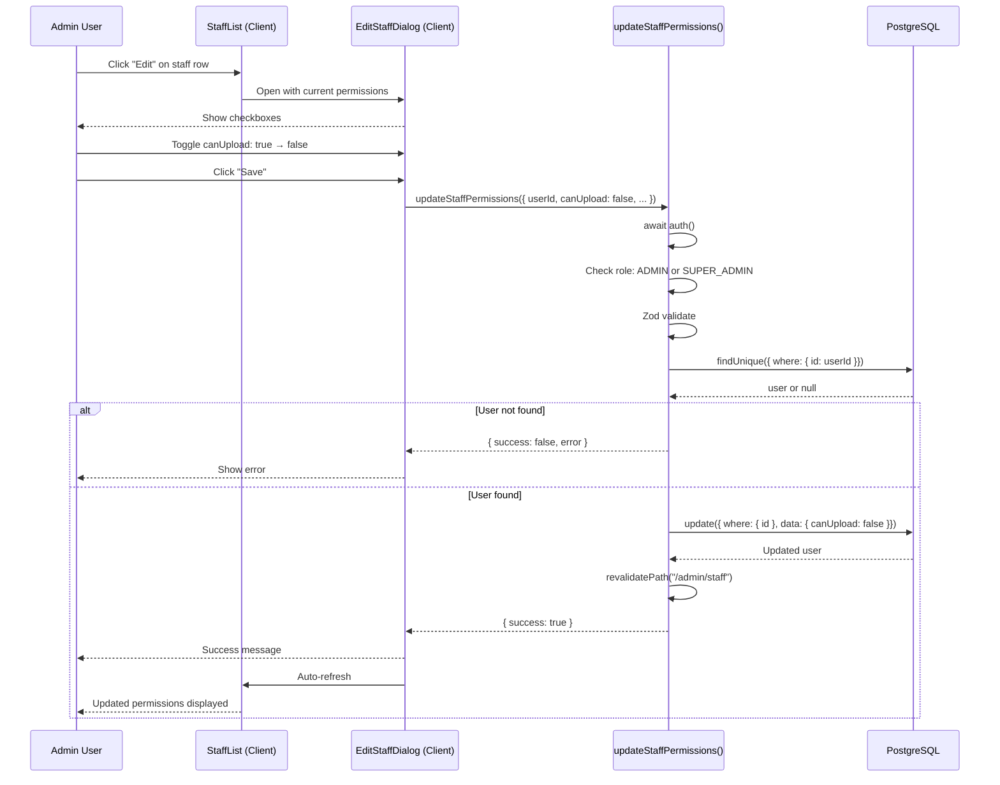
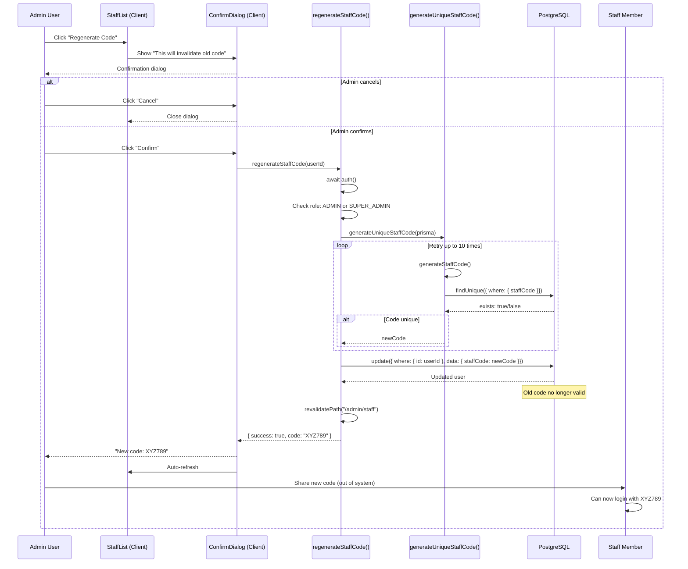

# Sequence Diagram — Staff User Management

## Create Staff Sequence



## Edit Permissions Sequence



## Regenerate Code Sequence



---

## Notes / Ghi chú

### Authentication Pattern
All Server Actions follow this pattern:
1. `await auth()` — Get session
2. Check `session?.user?.role`
3. Allow if ADMIN or SUPER_ADMIN
4. Reject if STAFF or unauthenticated

### Code Generation Pattern
1. Generate random 6-char alphanumeric
2. Check database for uniqueness
3. If collision, retry (max 10 attempts)
4. If 10 failures, return error
5. Success probability: >99.9999%

### Revalidation Pattern
All mutations end with:
```typescript
revalidatePath("/admin/staff")
```
This triggers Next.js to:
- Invalidate cache
- Re-fetch data
- Re-render components
- Display updated state

### Error Handling
All Server Actions return:
```typescript
{ success: true, data?: T } | { success: false, error: string }
```
Client components check `success` and display:
- Success: Show confirmation
- Failure: Show error message
