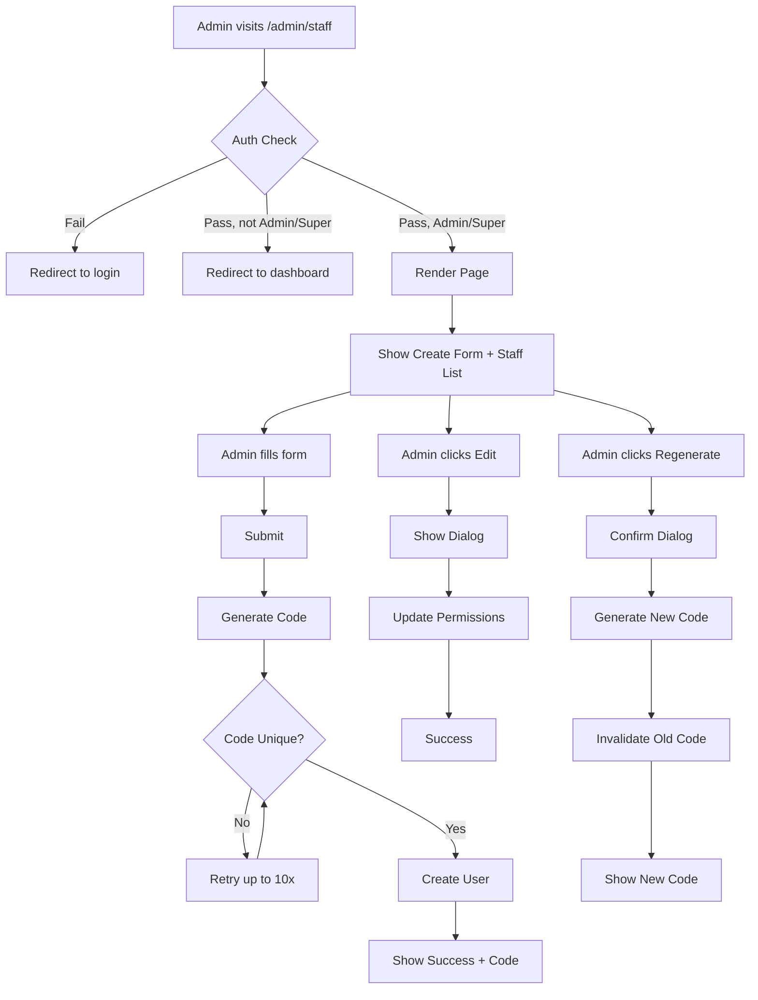

# Specification — Staff User Management
# Đặc tả — Quản lý Nhân viên
<!-- Template Version: 1.0 | Contract: v1.0 | Created: 2026-02-06 -->
<!-- 🇻🇳 Vietnamese first, 🇬🇧 English follows — for easy scanning -->

---

## 📋 TL;DR

| Aspect | Value |
|--------|-------|
| Feature | Staff User Management |
| User Story | US-0.2.7 |
| Phase 0 Analysis | [solution-design.md](../00_analysis/solution-design.md) |
| Status | Draft |
| Functional Requirements | 8 |
| Non-Functional Requirements | 5 |
| Affected Roots | sgs-cs-helper |
| Complexity | Medium |

---

## 1. Overview / Tổng quan

### 1.1 Summary / Tóm tắt

🇻🇳
Xây dựng hệ thống quản lý nhân viên cho phép Admin và Super Admin tạo, xem, chỉnh sửa quyền, và quản lý mã đăng nhập của nhân viên. Hệ thống tự động tạo mã unique 6 ký tự alphanumeric cho mỗi nhân viên, cho phép họ đăng nhập mà không cần email/password.

Spec này định nghĩa các yêu cầu chi tiết để triển khai trang `/admin/staff` và các Server Actions liên quan, theo pattern đã proven từ Admin Management (US-0.2.2).

🇬🇧
Build a staff management system allowing Admin and Super Admin to create, view, edit permissions, and manage login codes for staff users. The system auto-generates unique 6-character alphanumeric codes for each staff member, allowing them to login without email/password.

This spec defines the detailed requirements to implement the `/admin/staff` page and related Server Actions, following the proven pattern from Admin Management (US-0.2.2).

### 1.2 Scope / Phạm vi

**In Scope / Trong phạm vi:**

🇻🇳
- Trang quản lý nhân viên tại `/admin/staff`
- Form tạo nhân viên mới (tên, email tùy chọn, quyền)
- Tự động tạo mã nhân viên unique 6 ký tự [A-Z0-9]
- Danh sách tất cả nhân viên với mã và quyền
- Chỉnh sửa quyền nhân viên (canUpload, canUpdateStatus)
- Thay đổi trạng thái nhân viên (ACTIVE/PENDING/REVOKED)
- Tạo lại mã nhân viên (invalidate mã cũ)
- Cả Admin và Super Admin đều truy cập được

🇬🇧
- Staff management page at `/admin/staff`
- Create staff form (name, optional email, permissions)
- Auto-generate unique 6-char [A-Z0-9] staff codes
- List all staff with codes and permissions
- Edit staff permissions (canUpload, canUpdateStatus)
- Change staff status (ACTIVE/PENDING/REVOKED)
- Regenerate staff code (invalidate old code)
- Both Admin and Super Admin access

**Out of Scope / Ngoài phạm vi:**

🇻🇳
Tự đăng ký nhân viên (chỉ Admin/Super Admin tạo được)
Quản lý mật khẩu cho nhân viên (chỉ dùng mã đăng nhập)
Lịch sử thay đổi quyền (audit trail)
Email tự động gửi cho nhân viên
Nhân viên tự chỉnh sửa profile

🇬🇧
Staff self-registration (only Admin/Super Admin can create)
Password management for staff (code-only login)
Permission change history (audit trail)
Automated email notifications to staff
Staff self-editing profile

---

## 2. Goals & Non-Goals

### Goals / Mục tiêu

🇻🇳
1. **Staff Creation UI:** Form tạo nhân viên mới với validation
2. **Auto-Code Generation:** Hệ thống tự tạo mã unique, không manual input
3. **Permission Management:** Set canUpload và canUpdateStatus cho từng user
4. **Staff List View:** Hiển thị tất cả nhân viên với chi tiết đầy đủ
5. **Edit Capabilities:** Sửa quyền và trạng thái sau khi tạo
6. **Code Regeneration:** Tạo lại mã khi cần (security)
7. **Dual Role Access:** Admin và Super Admin đều quản lý được

🇬🇧
1. **Staff Creation UI:** Create staff form with validation
2. **Auto-Code Generation:** System generates unique codes, no manual input
3. **Permission Management:** Set canUpload and canUpdateStatus per user
4. **Staff List View:** Display all staff with full details
5. **Edit Capabilities:** Modify permissions and status after creation
6. **Code Regeneration:** Regenerate codes when needed (security)
7. **Dual Role Access:** Both Admin and Super Admin can manage

### Non-Goals / Không nằm trong phạm vi

🇻🇳
1. Nhân viên tự đăng ký tài khoản
2. Nhân viên có mật khẩu riêng
3. Import/export nhân viên hàng loạt
4. Theo dõi lịch sử thay đổi quyền
5. Gửi email tự động cho nhân viên
6. Nhân viên chỉnh sửa thông tin cá nhân

🇬🇧
1. Staff self-registration
2. Staff password authentication
3. Bulk import/export of staff
4. Permission change audit trail
5. Automated staff email notifications
6. Staff self-service profile editing

---

## 3. User Stories

### US-0.2.7: Staff User Management

🇻🇳
Là **Admin hoặc Super Admin**, tôi muốn **tạo và quản lý nhân viên với mã đăng nhập unique**, để **nhân viên có thể login và thực hiện công việc với quyền phù hợp**.

🇬🇧
As an **Admin or Super Admin**, I want **to create and manage staff users with unique login codes**, so that **staff can login and perform their work with appropriate permissions**.

---

## 4. Requirements Matrix / Ma trận Yêu cầu

| ID | Title | Priority | Type | Covered By AC |
|----|-------|----------|------|---------------|
| FR-001 | Staff Management Page | Must | Functional | AC1 |
| FR-002 | Create Staff Form | Must | Functional | AC2, AC3 |
| FR-003 | Auto-Generate Staff Codes | Must | Functional | AC3, AC4 |
| FR-004 | Set Staff Permissions | Must | Functional | AC5 |
| FR-005 | Staff List Display | Must | Functional | AC6 |
| FR-006 | Edit Staff Permissions | Must | Functional | AC7 |
| FR-007 | Manage Staff Status | Must | Functional | AC8 |
| FR-008 | Regenerate Staff Code | Must | Functional | AC9 |
| NFR-001 | Role-Based Access Control | Must | Security | AC1, AC10 |
| NFR-002 | Performance | Should | Performance | - |
| NFR-003 | Uniqueness Enforcement | Must | Data Integrity | AC4 |
| NFR-004 | Code Security | Must | Security | AC3, AC9 |
| NFR-005 | Usability | Should | UX | - |

---

## 5. Functional Requirements / Yêu cầu Chức năng

### FR-001: Staff Management Page

| Aspect | Detail |
|--------|--------|
| Priority | Must |
| Affected Roots | sgs-cs-helper |
| Route | /admin/staff |

#### Description / Mô tả

🇻🇳
Trang quản lý nhân viên tại `/admin/staff` chỉ cho phép Admin và Super Admin truy cập. Trang này chứa form tạo nhân viên mới và danh sách tất cả nhân viên hiện có.

Trang sử dụng Admin Layout hiện có (đã extend để cho phép cả ADMIN và SUPER_ADMIN role). Staff users bị từ chối truy cập và redirect về dashboard.

🇬🇧
Staff management page at `/admin/staff` only allows Admin and Super Admin access. Page contains form to create new staff and list of all existing staff.

Page uses existing Admin Layout (extended to allow both ADMIN and SUPER_ADMIN roles). Staff users are denied access and redirected to dashboard.

#### Acceptance Criteria / Tiêu chí Nghiệm thu

- [ ] **AC1.1:** Route `/admin/staff` exists and renders page
- [ ] **AC1.2:** Admin Layout checks session.user.role
- [ ] **AC1.3:** ADMIN role users can access page
- [ ] **AC1.4:** SUPER_ADMIN role users can access page
- [ ] **AC1.5:** STAFF role users are redirected to `/dashboard`
- [ ] **AC1.6:** Unauthenticated users are redirected to `/auth/login`
- [ ] **AC1.7:** Page title displays "Staff Management"

---

### FR-002: Create Staff Form

| Aspect | Detail |
|--------|--------|
| Priority | Must |
| Affected Roots | sgs-cs-helper |
| Component | CreateStaffForm (client) |

#### Description / Mô tả

🇻🇳
Form tạo nhân viên mới với các trường: tên (required), email (optional), canUpload (checkbox), canUpdateStatus (checkbox). Form validate input trước khi submit, gọi Server Action để tạo user với mã auto-generated.

Sau khi tạo thành công, form hiển thị mã đã tạo để Admin có thể ghi lại và cung cấp cho nhân viên.

🇬🇧
Create staff form with fields: name (required), email (optional), canUpload (checkbox), canUpdateStatus (checkbox). Form validates input before submission, calls Server Action to create user with auto-generated code.

After successful creation, form displays the generated code so Admin can record and provide to staff member.

#### Acceptance Criteria / Tiêu chí Nghiệm thu

- [ ] **AC2.1:** Form has "Name" text input field (required)
- [ ] **AC2.2:** Form has "Email" email input field (optional)
- [ ] **AC2.3:** Form has "Can Upload" checkbox (default: checked)
- [ ] **AC2.4:** Form has "Can Update Status" checkbox (default: checked)
- [ ] **AC2.5:** Form has "Create Staff" submit button
- [ ] **AC2.6:** Name field shows error if empty on submit
- [ ] **AC2.7:** Email field shows error if invalid format
- [ ] **AC2.8:** Form disables during submission (loading state)
- [ ] **AC2.9:** Success message displays generated code after creation
- [ ] **AC2.10:** Form resets to empty state after successful creation

---

### FR-003: Auto-Generate Staff Codes

| Aspect | Detail |
|--------|--------|
| Priority | Must |
| Affected Roots | sgs-cs-helper |
| Component | generateUniqueStaffCode() utility |

#### Description / Mô tả

🇻🇳
Hệ thống tự động tạo mã nhân viên unique 6 ký tự chỉ chứa chữ cái in hoa và số [A-Z0-9]. Không cho phép admin nhập mã thủ công. Mã được lưu uppercase trong database và login case-insensitive.

Thuật toán retry lên đến 10 lần nếu collision xảy ra. Với 36^6 = 2.1B combinations, xác suất collision cực thấp.

🇬🇧
System auto-generates unique 6-character staff codes containing only uppercase letters and numbers [A-Z0-9]. No manual code input allowed. Codes stored uppercase in database and login is case-insensitive.

Algorithm retries up to 10 times if collision occurs. With 36^6 = 2.1B combinations, collision probability extremely low.

#### Acceptance Criteria / Tiêu chí Nghiệm thu

- [ ] **AC3.1:** Generated code is exactly 6 characters long
- [ ] **AC3.2:** Code contains only A-Z and 0-9 characters
- [ ] **AC3.3:** Code is stored in UPPERCASE in database
- [ ] **AC3.4:** Each generated code is unique (database constraint)
- [ ] **AC3.5:** No manual code input field exists in form
- [ ] **AC3.6:** Code is auto-generated on form submission
- [ ] **AC3.7:** Generated code is displayed to admin after creation

---

### FR-004: Set Staff Permissions

| Aspect | Detail |
|--------|--------|
| Priority | Must |
| Affected Roots | sgs-cs-helper |
| Database Fields | canUpload, canUpdateStatus |

#### Description / Mô tả

🇻🇳
Admin set quyền cho nhân viên khi tạo: canUpload (cho phép upload Excel) và canUpdateStatus (cho phép đánh dấu đơn hàng hoàn thành). Cả hai quyền default là true.

Quyền có thể chỉnh sửa sau khi tạo thông qua Edit Staff Dialog.

🇬🇧
Admin sets staff permissions during creation: canUpload (allow Excel upload) and canUpdateStatus (allow marking orders complete). Both permissions default to true.

Permissions can be edited after creation via Edit Staff Dialog.

#### Acceptance Criteria / Tiêu chí Nghiệm thu

- [ ] **AC5.1:** canUpload checkbox defaults to checked (true)
- [ ] **AC5.2:** canUpdateStatus checkbox defaults to checked (true)
- [ ] **AC5.3:** Unchecking canUpload creates staff with canUpload=false
- [ ] **AC5.4:** Unchecking canUpdateStatus creates staff with canUpdateStatus=false
- [ ] **AC5.5:** Created staff has permissions matching form selections
- [ ] **AC5.6:** Permissions are stored in database User table

---

### FR-005: Staff List Display

| Aspect | Detail |
|--------|--------|
| Priority | Must |
| Affected Roots | sgs-cs-helper |
| Component | StaffList (client) |

#### Description / Mô tả

🇻🇳
Danh sách hiển thị tất cả nhân viên (role = STAFF) với các cột: Tên, Email, Mã nhân viên, canUpload, canUpdateStatus, Status, Actions. Danh sách sắp xếp theo ngày tạo (mới nhất trước).

Mỗi hàng có buttons: Edit (quyền), Regenerate Code, Change Status.

🇬🇧
List displays all staff users (role = STAFF) with columns: Name, Email, Staff Code, canUpload, canUpdateStatus, Status, Actions. List sorted by creation date (newest first).

Each row has buttons: Edit (permissions), Regenerate Code, Change Status.

#### Acceptance Criteria / Tiêu chí Nghiệm thu

- [ ] **AC6.1:** Table displays all users with role = "STAFF"
- [ ] **AC6.2:** Table has column: Name (string)
- [ ] **AC6.3:** Table has column: Email (string or "-" if null)
- [ ] **AC6.4:** Table has column: Staff Code (6-char uppercase)
- [ ] **AC6.5:** Table has column: Can Upload (Yes/No badge)
- [ ] **AC6.6:** Table has column: Can Update Status (Yes/No badge)
- [ ] **AC6.7:** Table has column: Status (ACTIVE/PENDING/REVOKED badge)
- [ ] **AC6.8:** Table has column: Actions (Edit, Regenerate, Status buttons)
- [ ] **AC6.9:** List is sorted by createdAt DESC (newest first)
- [ ] **AC6.10:** Empty state shows "No staff users yet" if none exist

---

### FR-006: Edit Staff Permissions

| Aspect | Detail |
|--------|--------|
| Priority | Must |
| Affected Roots | sgs-cs-helper |
| Component | EditStaffDialog (client) |

#### Description / Mô tả

🇻🇳
Dialog chỉnh sửa quyền nhân viên với 2 checkboxes: canUpload và canUpdateStatus. Khi submit, gọi Server Action để update database và revalidate path.

Chỉ quyền được chỉnh sửa, không thể đổi tên hoặc email (nếu cần đổi thì xóa và tạo mới).

🇬🇧
Dialog to edit staff permissions with 2 checkboxes: canUpload and canUpdateStatus. On submit, calls Server Action to update database and revalidate path.

Only permissions are editable, cannot change name or email (if needed, delete and recreate).

#### Acceptance Criteria / Tiêu chí Nghiệm thu

- [ ] **AC7.1:** "Edit" button opens Edit Staff Dialog
- [ ] **AC7.2:** Dialog shows current canUpload state (checked/unchecked)
- [ ] **AC7.3:** Dialog shows current canUpdateStatus state (checked/unchecked)
- [ ] **AC7.4:** Dialog has "Save" button
- [ ] **AC7.5:** Clicking Save calls updateStaffPermissions() Server Action
- [ ] **AC7.6:** Updated permissions are reflected in database immediately
- [ ] **AC7.7:** Success message displayed after save
- [ ] **AC7.8:** Staff list refreshes to show updated permissions
- [ ] **AC7.9:** Dialog closes after successful save

---

### FR-007: Manage Staff Status

| Aspect | Detail |
|--------|--------|
| Priority | Must |
| Affected Roots | sgs-cs-helper |
| Statuses | ACTIVE, PENDING, REVOKED |

#### Description / Mô tả

🇻🇳
Admin thay đổi trạng thái nhân viên:
- **ACTIVE:** Nhân viên có thể login và làm việc
- **PENDING:** Nhân viên không thể login (chờ duyệt)
- **REVOKED:** Nhân viên không thể login (bị thu hồi quyền)

Status change gọi Server Action, cập nhật database, và revalidate.

🇬🇧
Admin changes staff status:
- **ACTIVE:** Staff can login and work
- **PENDING:** Staff cannot login (awaiting approval)
- **REVOKED:** Staff cannot login (access removed)

Status change calls Server Action, updates database, and revalidates.

#### Acceptance Criteria / Tiêu chí Nghiệm thu

- [ ] **AC8.1:** Status dropdown/button shows current status
- [ ] **AC8.2:** Dropdown has options: ACTIVE, PENDING, REVOKED
- [ ] **AC8.3:** Selecting status calls updateStaffStatus() Server Action
- [ ] **AC8.4:** Status update reflected in database immediately
- [ ] **AC8.5:** Staff with status=ACTIVE can login
- [ ] **AC8.6:** Staff with status=PENDING cannot login
- [ ] **AC8.7:** Staff with status=REVOKED cannot login
- [ ] **AC8.8:** Status badge in list updates after change
- [ ] **AC8.9:** Confirmation dialog shown before REVOKED status

---

### FR-008: Regenerate Staff Code

| Aspect | Detail |
|--------|--------|
| Priority | Must |
| Affected Roots | sgs-cs-helper |
| Action | regenerateStaffCode() |

#### Description / Mô tả

🇻🇳
Admin tạo lại mã nhân viên khi cần (mã bị lộ, quên mã, security). Khi regenerate:
1. Hiển thị confirmation dialog cảnh báo mã cũ sẽ invalid
2. Tạo mã mới unique 6 ký tự
3. Update database, mã cũ ngay lập tức không còn hoạt động
4. Hiển thị mã mới cho admin

🇬🇧
Admin regenerates staff code when needed (code compromised, forgotten, security). When regenerating:
1. Show confirmation dialog warning old code will be invalid
2. Generate new unique 6-char code
3. Update database, old code immediately stops working
4. Display new code to admin

#### Acceptance Criteria / Tiêu chí Nghiệm thu

- [ ] **AC9.1:** "Regenerate Code" button exists for each staff
- [ ] **AC9.2:** Clicking button shows confirmation dialog
- [ ] **AC9.3:** Confirmation warns: "Old code will become invalid"
- [ ] **AC9.4:** Confirming calls regenerateStaffCode() Server Action
- [ ] **AC9.5:** New unique 6-char code is generated
- [ ] **AC9.6:** Database updates staffCode to new value
- [ ] **AC9.7:** Old code cannot be used to login anymore
- [ ] **AC9.8:** New code displayed to admin in success message
- [ ] **AC9.9:** Staff list refreshes to show new code

---

## 6. Non-Functional Requirements / Yêu cầu Phi Chức năng

### NFR-001: Role-Based Access Control

| Aspect | Detail |
|--------|--------|
| Category | Security |
| Priority | Must |
| Metric | 100% authorization checks pass |

#### Description / Mô tả

🇻🇳
Tất cả routes và Server Actions phải kiểm tra role trước khi thực thi. Chỉ ADMIN và SUPER_ADMIN được phép truy cập trang và thực hiện operations. STAFF users bị từ chối.

Authentication check ở cả client (Layout) và server (Server Actions) để đảm bảo security layers.

🇬🇧
All routes and Server Actions must check role before execution. Only ADMIN and SUPER_ADMIN allowed to access page and perform operations. STAFF users denied.

Authentication checks at both client (Layout) and server (Server Actions) to ensure security layers.

#### Acceptance Criteria / Tiêu chí Nghiệm thu

- [ ] Admin Layout checks session.user.role before rendering
- [ ] All Server Actions call `await auth()` first
- [ ] All Server Actions verify role is ADMIN or SUPER_ADMIN
- [ ] Unauthorized requests return error status
- [ ] No client-side only security (always verify server-side)

---

### NFR-002: Performance

| Aspect | Detail |
|--------|--------|
| Category | Performance |
| Priority | Should |
| Metric | Page load < 1s, Actions < 500ms |

#### Description / Mô tả

🇻🇳
Trang `/admin/staff` load trong < 1 giây. Server Actions (create, update, regenerate) hoàn thành trong < 500ms trong điều kiện bình thường.

Database queries optimize với indexes trên staffCode (unique constraint) và role (filter).

🇬🇧
Page `/admin/staff` loads in < 1 second. Server Actions (create, update, regenerate) complete in < 500ms under normal conditions.

Database queries optimized with indexes on staffCode (unique constraint) and role (filter).

#### Acceptance Criteria / Tiêu chí Nghiệm thu

- [ ] Initial page load completes in < 1 second
- [ ] createStaff() completes in < 500ms (including code generation)
- [ ] updateStaffPermissions() completes in < 300ms
- [ ] regenerateStaffCode() completes in < 500ms
- [ ] Staff list with 100 users renders in < 1 second

---

### NFR-003: Uniqueness Enforcement

| Aspect | Detail |
|--------|--------|
| Category | Data Integrity |
| Priority | Must |
| Metric | 0 duplicate codes allowed |

#### Description / Mô tả

🇻🇳
Staff codes phải unique 100%. Database constraint `@unique` trên staffCode field đảm bảo không có duplicate. Code generation retry logic xử lý collision.

Trong trường hợp edge case (10 retries fail), trả về error message rõ ràng.

🇬🇧
Staff codes must be 100% unique. Database constraint `@unique` on staffCode field ensures no duplicates. Code generation retry logic handles collisions.

In edge case (10 retries fail), return clear error message.

#### Acceptance Criteria / Tiêu chí Nghiệm thu

- [ ] Database has UNIQUE constraint on User.staffCode
- [ ] generateUniqueStaffCode() checks existing codes before returning
- [ ] Retry up to 10 times if collision occurs
- [ ] If 10 retries fail, return clear error: "Unable to generate unique code, please try again"
- [ ] No duplicate codes exist in database

---

### NFR-004: Code Security

| Aspect | Detail |
|--------|--------|
| Category | Security |
| Priority | Must |
| Metric | All codes auto-generated, case-insensitive login |

#### Description / Mô tả

🇻🇳
Mã nhân viên luôn được hệ thống tạo tự động, không cho phép admin nhập manual để tránh weak/predictable codes.

Mã lưu uppercase trong database nhưng login accept cả lowercase để dễ dàng cho nhân viên gõ.

Khi regenerate, mã cũ ngay lập tức invalid để tránh sharing codes.

🇬🇧
Staff codes always system-generated, no manual admin input to prevent weak/predictable codes.

Codes stored uppercase in database but login accepts lowercase for ease of staff typing.

When regenerated, old code immediately invalid to prevent code sharing.

#### Acceptance Criteria / Tiêu chí Nghiệm thu

- [ ] No manual code input field in create form
- [ ] Codes generated with cryptographically random algorithm
- [ ] Login converts input to uppercase before lookup
- [ ] Regeneration immediately updates staffCode field
- [ ] Old code cannot login after regeneration

---

### NFR-005: Usability

| Aspect | Detail |
|--------|--------|
| Category | User Experience |
| Priority | Should |
| Metric | Intuitive UI, clear error messages |

#### Description / Mô tả

🇻🇳
UI dễ sử dụng với form validation rõ ràng, error messages hữu ích, và confirmation dialogs cho destructive actions (regenerate code, revoke status).

Tất cả actions có loading states để user biết đang xử lý.

🇬🇧
Intuitive UI with clear form validation, helpful error messages, and confirmation dialogs for destructive actions (regenerate code, revoke status).

All actions have loading states so user knows processing is happening.

#### Acceptance Criteria / Tiêu chí Nghiệm thu

- [ ] Form validation shows specific errors (e.g., "Name is required")
- [ ] Loading spinners display during Server Action execution
- [ ] Success messages show after successful operations
- [ ] Confirmation dialogs for destructive actions (regenerate, revoke)
- [ ] Generated code displayed clearly after creation/regeneration

---

## 7. User Flow / Luồng Người dùng

### Flow 1: Create Staff User / Tạo Nhân viên

| Step | Actor | Action | System Response |
|------|-------|--------|-----------------|
| 1 | Admin | Navigate to /admin/staff | Layout checks role, renders page |
| 2 | Admin | Fill form: name, email (optional), permissions | Form validates input |
| 3 | Admin | Click "Create Staff" | Form calls createStaff() Server Action |
| 4 | System | - | Check auth, generate unique code (retry if collision) |
| 5 | System | - | Create user in database with role=STAFF |
| 6 | System | - | revalidatePath("/admin/staff") |
| 7 | System | - | Return { success: true, code: "ABC123" } |
| 8 | UI | - | Display success: "Staff created! Code: ABC123" |
| 9 | UI | - | Reset form, refresh staff list |

### Flow 2: Edit Staff Permissions / Sửa Quyền

| Step | Actor | Action | System Response |
|------|-------|--------|-----------------|
| 1 | Admin | Click "Edit" button on staff row | Open EditStaffDialog with current values |
| 2 | Admin | Toggle canUpload or canUpdateStatus | UI updates checkbox states |
| 3 | Admin | Click "Save" | Dialog calls updateStaffPermissions() |
| 4 | System | - | Check auth, validate input |
| 5 | System | - | Update user permissions in database |
| 6 | System | - | revalidatePath("/admin/staff") |
| 7 | System | - | Return { success: true } |
| 8 | UI | - | Close dialog, show success message |
| 9 | UI | - | Refresh staff list with updated permissions |

### Flow 3: Regenerate Staff Code / Tạo lại Mã

| Step | Actor | Action | System Response |
|------|-------|--------|-----------------|
| 1 | Admin | Click "Regenerate Code" button | Show confirmation dialog |
| 2 | Dialog | - | "Old code will become invalid. Continue?" |
| 3 | Admin | Click "Confirm" | Call regenerateStaffCode() Server Action |
| 4 | System | - | Check auth, generate new unique code |
| 5 | System | - | Update user.staffCode in database |
| 6 | System | - | revalidatePath("/admin/staff") |
| 7 | System | - | Return { success: true, code: "XYZ789" } |
| 8 | UI | - | Show success: "New code: XYZ789" |
| 9 | UI | - | Refresh staff list with new code |

### Flow Diagram / Sơ đồ Luồng



---

## 8. Data Models / Mô hình Dữ liệu

### User Model (Existing)

```typescript
// From prisma/schema.prisma (US-0.2.5)
model User {
  id        String   @id @default(cuid())
  name      String
  email     String?  @unique  // Optional for staff
  role      Role     @default(STAFF)
  status    Status   @default(ACTIVE)
  
  // Staff-specific fields
  staffCode        String?  @unique  // 6-char alphanumeric
  canUpload        Boolean  @default(false)
  canUpdateStatus  Boolean  @default(false)
  
  createdAt DateTime @default(now())
  updatedAt DateTime @updatedAt
}

enum Role {
  STAFF
  ADMIN
  SUPER_ADMIN
}

enum Status {
  ACTIVE
  PENDING
  REVOKED
}
```

**No database migration needed** — Schema from US-0.2.5 is sufficient.

---

## 9. API Contracts / Hợp đồng API

### Server Action: createStaff

```typescript
// src/lib/actions/staff.ts

import { z } from "zod";

const createStaffSchema = z.object({
  name: z.string().min(1, "Name is required"),
  email: z.string().email("Invalid email").optional().or(z.literal("")),
  canUpload: z.boolean().default(true),
  canUpdateStatus: z.boolean().default(true),
});

type CreateStaffInput = z.infer<typeof createStaffSchema>;

interface CreateStaffResponse {
  success: boolean;
  code?: string;        // Generated staff code (on success)
  error?: string;       // Error message (on failure)
}

async function createStaff(input: CreateStaffInput): Promise<CreateStaffResponse>;
```

**Behavior:**
1. Check auth → return error if not ADMIN/SUPER_ADMIN
2. Validate input with Zod
3. Generate unique staff code (retry up to 10x)
4. Create user: `role=STAFF`, `status=ACTIVE`, with staffCode and permissions
5. `revalidatePath("/admin/staff")`
6. Return `{ success: true, code }`

**Errors:**
- Auth failed: `{ success: false, error: "Unauthorized" }`
- Code generation failed: `{ success: false, error: "Unable to generate unique code" }`
- Database error: `{ success: false, error: "Failed to create staff" }`

---

### Server Action: getStaff

```typescript
interface GetStaffResponse {
  success: boolean;
  data?: StaffUser[];
  error?: string;
}

interface StaffUser {
  id: string;
  name: string;
  email: string | null;
  staffCode: string;
  canUpload: boolean;
  canUpdateStatus: boolean;
  status: Status;
  createdAt: Date;
}

async function getStaff(): Promise<GetStaffResponse>;
```

**Behavior:**
1. Check auth → return error if not ADMIN/SUPER_ADMIN
2. Query: `prisma.user.findMany({ where: { role: "STAFF" }, orderBy: { createdAt: "desc" } })`
3. Return `{ success: true, data }`

---

### Server Action: updateStaffPermissions

```typescript
const updatePermissionsSchema = z.object({
  userId: z.string(),
  canUpload: z.boolean(),
  canUpdateStatus: z.boolean(),
});

type UpdatePermissionsInput = z.infer<typeof updatePermissionsSchema>;

interface UpdatePermissionsResponse {
  success: boolean;
  error?: string;
}

async function updateStaffPermissions(input: UpdatePermissionsInput): Promise<UpdatePermissionsResponse>;
```

**Behavior:**
1. Check auth
2. Validate input
3. Update: `prisma.user.update({ where: { id }, data: { canUpload, canUpdateStatus } })`
4. `revalidatePath("/admin/staff")`
5. Return `{ success: true }`

---

### Server Action: updateStaffStatus

```typescript
const updateStatusSchema = z.object({
  userId: z.string(),
  status: z.enum(["ACTIVE", "PENDING", "REVOKED"]),
});

type UpdateStatusInput = z.infer<typeof updateStatusSchema>;

interface UpdateStatusResponse {
  success: boolean;
  error?: string;
}

async function updateStaffStatus(input: UpdateStatusInput): Promise<UpdateStatusResponse>;
```

---

### Server Action: regenerateStaffCode

```typescript
interface RegenerateCodeInput {
  userId: string;
}

interface RegenerateCodeResponse {
  success: boolean;
  code?: string;
  error?: string;
}

async function regenerateStaffCode(input: RegenerateCodeInput): Promise<RegenerateCodeResponse>;
```

**Behavior:**
1. Check auth
2. Generate new unique code
3. Update: `prisma.user.update({ where: { id }, data: { staffCode: newCode } })`
4. `revalidatePath("/admin/staff")`
5. Return `{ success: true, code: newCode }`

---

## 10. Edge Cases / Trường hợp Biên

| ID | Scenario | Expected Behavior |
|----|----------|-------------------|
| EC-001 | Code collision after 10 retries | Return error: "Unable to generate code, try again" |
| EC-002 | Create staff with invalid email | Form shows: "Invalid email format" |
| EC-003 | Create staff with empty name | Form shows: "Name is required" |
| EC-004 | Staff tries to access /admin/staff | Redirect to /dashboard with no access |
| EC-005 | Unauthenticated user visits page | Redirect to /auth/login |
| EC-006 | Edit non-existent staff | Return error: "Staff user not found" |
| EC-007 | Regenerate for non-existent user | Return error: "Staff user not found" |
| EC-008 | Network error during creation | Show error: "Failed to create staff, please try again" |
| EC-009 | Database down | Show error: "Service unavailable, try again later" |
| EC-010 | Staff with email already exists | Database handles via @unique constraint, show error |

### EC-001: Code Collision Handling

🇻🇳
**Khi:** Generate code retry 10 lần vẫn collision  
**Thì:** Return `{ success: false, error: "Unable to generate unique code" }`  
**Lý do:** Cực kỳ hiếm (xác suất < 0.000001%), nhưng cần handle gracefully

🇬🇧
**When:** Code generation retries 10 times, still collision  
**Then:** Return `{ success: false, error: "Unable to generate unique code" }`  
**Rationale:** Extremely rare (probability < 0.000001%), but must handle gracefully

---

## 11. Error Handling / Xử lý Lỗi

| Error Condition | User Message | System Action |
|-----------------|--------------|---------------|
| Unauthorized access | "Access denied" | Redirect to dashboard |
| Invalid form input | "Please check your input" | Show field-specific errors |
| Code generation failure | "Unable to generate code, try again" | Log error, return to user |
| Database error | "Something went wrong, try again" | Log error with context |
| Network timeout | "Request timeout, try again" | Retry prompt |
| Staff not found | "Staff user not found" | Return error |
| Duplicate email | "Email already exists" | Form shows error on email field |

---

## 12. Cross-Root Impact / Ảnh hưởng Đa Root

### Root: sgs-cs-helper

| Aspect | Detail |
|--------|--------|
| Changes | New route, components, Server Actions |
| Sync Type | N/A (single root) |
| Build Required | Yes (Next.js build) |

**Components Added:**
- `src/app/admin/staff/page.tsx` (Server Component)
- `src/components/admin/create-staff-form.tsx` (Client Component)
- `src/components/admin/staff-list.tsx` (Client Component)
- `src/components/admin/edit-staff-dialog.tsx` (Client Component)
- `src/lib/actions/staff.ts` (Server Actions)
- `src/lib/utils/staff-code.ts` (Utility)

**Components Modified:**
- `src/app/admin/layout.tsx` (extend role check)

**No other roots affected.**

---

## 13. Dependencies / Phụ thuộc

| Dependency | Type | Status | Notes |
|------------|------|--------|-------|
| US-0.2.2 (Admin Dashboard) | Feature | ✅ DONE | Pattern source |
| US-0.2.5 (Staff Code Login) | Feature | ✅ DONE | Database schema |
| NextAuth.js | Package | ✅ Existing | Authentication |
| Prisma | Package | ✅ Existing | Database ORM |
| Zod | Package | ✅ Existing | Validation |
| React | Package | ✅ Existing | UI framework |
| Next.js 16 | Package | ✅ Existing | App framework |

**All dependencies satisfied** — No new packages needed.

---

## 14. Risks & Mitigations / Rủi ro & Giảm thiểu

| Risk | Impact | Likelihood | Mitigation |
|------|--------|------------|------------|
| Admin Layout change breaks /admin/users | High | Low | Test /admin/users after extending role check |
| Code collision exhausts retries | Medium | Very Low | 10 retries + 36^6 combinations = safe |
| Performance with thousands of staff | Medium | Low | Database indexed on staffCode, paginate later if needed |
| Admin forgets generated code | Low | Medium | Display code prominently, suggest screenshot |
| Staff code security visibility | Medium | Medium | Only show at creation/regeneration, no list export |

### Mitigation Details

**Risk 1: Admin Layout Change**
- **Plan:** Before deploying, manually test `/admin/users` page
- **Validation:** Verify SUPER_ADMIN can still access and manage admins
- **Rollback:** Git revert if broken

**Risk 2: Code Collision**
- **Current:** 36^6 = 2,176,782,336 combinations
- **With 10,000 staff:** Collision probability < 0.002%
- **With 10 retries:** Success probability > 99.9999%
- **If fails:** Clear error message, admin retries

---

## 15. Open Questions / Câu hỏi Mở

| # | Question | Status | Answer |
|---|----------|--------|--------|
| 1 | Should we track who created each staff user? | Resolved | Not in MVP, can add later |
| 2 | Should we log permission changes? | Resolved | Not in MVP, audit trail future feature |
| 3 | Should staff codes expire? | Resolved | No expiration in MVP |
| 4 | Should we email staff their codes? | Resolved | No automated emails in MVP |
| 5 | Should we support bulk CSV import? | Resolved | Out of scope for MVP |

**All questions resolved** — No blockers for implementation.

---

## 16. Notes / Ghi chú

### Implementation Notes

🇻🇳
1. **Pattern Consistency:** Follow exact pattern from `/admin/users` để đảm bảo codebase nhất quán
2. **Testing Strategy:** Manual testing form, code generation, permissions trước khi deploy
3. **Database:** No migration needed, schema sẵn sàng từ US-0.2.5
4. **Security:** Double-check role validation ở cả client layout và server actions

🇬🇧
1. **Pattern Consistency:** Follow exact pattern from `/admin/users` to ensure codebase consistency
2. **Testing Strategy:** Manual testing of form, code generation, permissions before deploy
3. **Database:** No migration needed, schema ready from US-0.2.5
4. **Security:** Double-check role validation in both client layout and server actions

### Future Enhancements (Out of MVP Scope)

- Bulk import staff from CSV
- Email notifications to staff
- Audit trail for permission changes
- Staff code expiration/rotation policy
- Staff self-service profile editing
- Advanced filters on staff list

---

## 17. Approval / Phê duyệt

| Role | Name | Status | Date |
|------|------|--------|------|
| Spec Author | GitHub Copilot | ✅ Done | 2026-02-06 |
| Tech Reviewer | - | ⏳ Pending | - |
| Product Owner | - | ⏳ Pending | - |

---

## ⏸️ Phase 1 Complete / Hoàn thành Phase 1

### Summary / Tóm tắt

| Aspect | Value |
|--------|-------|
| Functional Requirements | 8 (FR-001 to FR-008) |
| Non-Functional Requirements | 5 (NFR-001 to NFR-005) |
| Affected Roots | sgs-cs-helper only |
| Edge Cases Identified | 10 |
| Dependencies | All satisfied ✅ |
| Risks | All mitigated ✅ |

### Artifacts Created / Artifact Đã tạo

- ✅ [Specification](./spec.md) (this document)

### Requirements Summary / Tóm tắt Yêu cầu

| ID | Title | Priority | ACs |
|----|-------|----------|-----|
| FR-001 | Staff Management Page | Must | 7 |
| FR-002 | Create Staff Form | Must | 10 |
| FR-003 | Auto-Generate Staff Codes | Must | 7 |
| FR-004 | Set Staff Permissions | Must | 6 |
| FR-005 | Staff List Display | Must | 10 |
| FR-006 | Edit Staff Permissions | Must | 9 |
| FR-007 | Manage Staff Status | Must | 9 |
| FR-008 | Regenerate Staff Code | Must | 9 |

**Total Acceptance Criteria:** 67

---

**⏸️ STOP: Awaiting Review / Chờ Review**

Please review the specification.  
Vui lòng review đặc tả.

**👉 RECOMMENDED: Run spec review first / KHUYẾN NGHỊ: Chạy spec review trước**

```
/spec-review
```

**Or if you want to manually review and approve / Hoặc nếu muốn tự review và duyệt:**

Say `approved` then run `/phase-2-tasks`

---

**⚠️ DO NOT use generic commands like `go`, `approved` alone.**

Use explicit prompts:
- `/spec-review` (recommended)
- `/phase-2-tasks` (after approval)

---

**Created:** 2026-02-06  
**Last Updated:** 2026-02-06  
**Version:** 1.0
