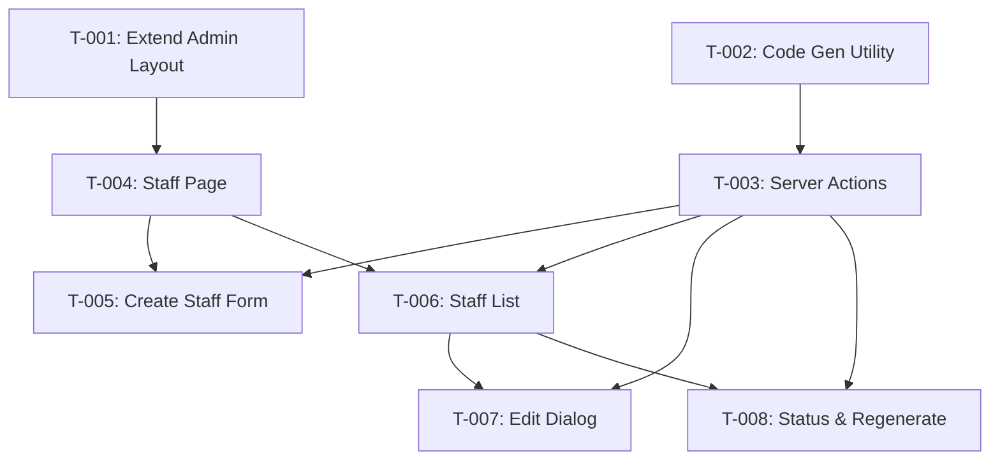

# Task Plan — Staff User Management
# Kế hoạch Task — Quản lý Nhân viên
<!-- Template Version: 1.0 | Contract: v1.0 | Created: 2026-02-06 -->
<!-- 🇻🇳 Vietnamese first, 🇬🇧 English follows — for easy scanning -->

---

## 📋 TL;DR

| Aspect | Value |
|--------|-------|
| Feature | Staff User Management |
| User Story | US-0.2.7 |
| Dev Mode | Standard |
| Total Tasks | 8 |
| Estimated Effort | 10-12 hours |
| Affected Roots | sgs-cs-helper |
| Spec Reference | [spec.md](../01_spec/spec.md) |

---

## 1. Task Overview / Tổng quan Task

| ID | Title | Root | Deps | Est | Status |
|----|-------|------|------|-----|--------|
| T-001 | Extend Admin Layout for ADMIN role | sgs-cs-helper | - | S | ⬜ |
| T-002 | Create Staff Code Generation Utility | sgs-cs-helper | - | S | ⬜ |
| T-003 | Create Staff Server Actions | sgs-cs-helper | T-002 | M | ⬜ |
| T-004 | Create Staff Management Page | sgs-cs-helper | T-001 | S | ⬜ |
| T-005 | Create Staff Form Component | sgs-cs-helper | T-003 | M | ⬜ |
| T-006 | Create Staff List Component | sgs-cs-helper | T-003 | M | ⬜ |
| T-007 | Create Edit Staff Dialog | sgs-cs-helper | T-003, T-006 | M | ⬜ |
| T-008 | Add Status Change & Code Regeneration | sgs-cs-helper | T-003, T-006 | M | ⬜ |

**Legend:** S = Small (<1h), M = Medium (1-2h), L = Large (2-4h)

---

## 2. Dependency Graph / Đồ thị Phụ thuộc



---

## 3. Parallel Execution Notes / Ghi chú Thực thi Song song

### 3.1 Parallel Groups

| Group | Tasks | Reason |
|-------|-------|--------|
| A | T-001, T-002 | No dependencies, different files |
| B | T-005, T-006 | Same dependencies (T-003, T-004), different files |
| C | T-007, T-008 | Same dependencies (T-003, T-006), different files |

### 3.2 Sequential Constraints

| Sequence | Reason |
|----------|--------|
| T-002 → T-003 | T-003 imports from T-002 utility |
| T-001 → T-004 | T-004 relies on updated layout |
| T-003 → T-005, T-006 | Components call Server Actions |
| T-006 → T-007, T-008 | Dialogs embedded in list component |

### 3.3 Recommended Execution Order

```
Phase 1: T-001, T-002 (parallel)
Phase 2: T-003
Phase 3: T-004
Phase 4: T-005, T-006 (parallel)
Phase 5: T-007, T-008 (parallel)
```

---

## 4. Tasks by Root / Task theo Root

### Root: sgs-cs-helper

---

#### T-001: Extend Admin Layout for ADMIN Role

| Aspect | Detail |
|--------|--------|
| Root | sgs-cs-helper |
| Dependencies | None |
| Estimate | S (30 min) |
| Requirements | FR-001, NFR-001 |

**Description / Mô tả:**
- **EN:** Modify the existing Admin Layout to allow both ADMIN and SUPER_ADMIN roles to access `/admin/*` routes. Currently only SUPER_ADMIN is allowed.
- **VI:** Sửa Admin Layout hiện tại để cho phép cả ADMIN và SUPER_ADMIN role truy cập `/admin/*` routes. Hiện tại chỉ SUPER_ADMIN được phép.

**Files to Change / File Thay đổi:**
- Modify: `src/app/admin/layout.tsx`

**Implementation Details:**
```typescript
// Before
if (session.user.role !== "SUPER_ADMIN") {
  redirect("/dashboard");
}

// After
if (!["ADMIN", "SUPER_ADMIN"].includes(session.user.role)) {
  redirect("/dashboard");
}
```

**Done Criteria / Tiêu chí Hoàn thành:**
- [ ] Admin Layout checks for ADMIN or SUPER_ADMIN role
- [ ] ADMIN role users can access `/admin/*` routes
- [ ] SUPER_ADMIN role users can still access `/admin/*` routes
- [ ] STAFF role users are redirected to `/dashboard`
- [ ] Existing `/admin/users` page still works for SUPER_ADMIN

**Verification / Kiểm tra:**
- Login as ADMIN user → Navigate to `/admin` → Should load successfully
- Login as SUPER_ADMIN user → Navigate to `/admin` → Should load successfully
- Login as STAFF user → Navigate to `/admin` → Should redirect to `/dashboard`
- Test `/admin/users` page still works (SUPER_ADMIN only, handled by Server Actions)

---

#### T-002: Create Staff Code Generation Utility

| Aspect | Detail |
|--------|--------|
| Root | sgs-cs-helper |
| Dependencies | None |
| Estimate | S (45 min) |
| Requirements | FR-003, NFR-003, NFR-004 |

**Description / Mô tả:**
- **EN:** Create utility functions to generate unique 6-character alphanumeric staff codes [A-Z0-9]. Includes collision detection and retry logic (max 10 attempts).
- **VI:** Tạo utility functions để generate mã nhân viên unique 6 ký tự alphanumeric [A-Z0-9]. Bao gồm collision detection và retry logic (tối đa 10 lần).

**Files to Change / File Thay đổi:**
- Create: `src/lib/utils/staff-code.ts`

**Implementation Details:**
```typescript
// src/lib/utils/staff-code.ts

/**
 * Generate a random 6-character alphanumeric staff code
 */
export function generateStaffCode(): string {
  const chars = 'ABCDEFGHIJKLMNOPQRSTUVWXYZ0123456789';
  let code = '';
  for (let i = 0; i < 6; i++) {
    code += chars.charAt(Math.floor(Math.random() * chars.length));
  }
  return code;
}

/**
 * Generate a unique staff code with collision detection
 * Retries up to 10 times if collision occurs
 */
export async function generateUniqueStaffCode(
  prisma: PrismaClient
): Promise<string> {
  const MAX_ATTEMPTS = 10;
  
  for (let attempt = 0; attempt < MAX_ATTEMPTS; attempt++) {
    const code = generateStaffCode();
    
    const existingUser = await prisma.user.findUnique({
      where: { staffCode: code },
      select: { id: true },
    });
    
    if (!existingUser) {
      return code;
    }
    
    console.warn(`Staff code collision: ${code}, attempt ${attempt + 1}/${MAX_ATTEMPTS}`);
  }
  
  throw new Error('Unable to generate unique staff code after 10 attempts');
}
```

**Done Criteria / Tiêu chí Hoàn thành:**
- [ ] `generateStaffCode()` returns 6-char string
- [ ] Generated code contains only A-Z and 0-9
- [ ] Generated code is UPPERCASE
- [ ] `generateUniqueStaffCode()` checks database for existing codes
- [ ] Retry logic works up to 10 times
- [ ] Throws error after 10 failed attempts

**Verification / Kiểm tra:**
- Unit test: `generateStaffCode()` returns valid format
- Unit test: `generateUniqueStaffCode()` returns unique code
- Manual: Generate multiple codes, verify format

---

#### T-003: Create Staff Server Actions

| Aspect | Detail |
|--------|--------|
| Root | sgs-cs-helper |
| Dependencies | T-002 |
| Estimate | M (1.5 hours) |
| Requirements | FR-002, FR-003, FR-004, FR-005, FR-006, FR-007, FR-008, NFR-001 |

**Description / Mô tả:**
- **EN:** Create Server Actions for staff CRUD operations: createStaff, getStaff, updateStaffPermissions, updateStaffStatus, regenerateStaffCode. All actions include auth check and Zod validation.
- **VI:** Tạo Server Actions cho các operations CRUD nhân viên: createStaff, getStaff, updateStaffPermissions, updateStaffStatus, regenerateStaffCode. Tất cả actions bao gồm auth check và Zod validation.

**Files to Change / File Thay đổi:**
- Create: `src/lib/actions/staff.ts`

**Implementation Details:**
```typescript
// src/lib/actions/staff.ts
"use server";

import { auth } from "@/lib/auth";
import { prisma } from "@/lib/db/prisma";
import { generateUniqueStaffCode } from "@/lib/utils/staff-code";
import { revalidatePath } from "next/cache";
import { z } from "zod";

// Zod schemas
const createStaffSchema = z.object({
  name: z.string().min(1, "Name is required"),
  email: z.string().email("Invalid email").optional().or(z.literal("")),
  canUpload: z.boolean().default(true),
  canUpdateStatus: z.boolean().default(true),
});

// Auth helper
async function requireAdminRole() {
  const session = await auth();
  if (!session?.user || !["ADMIN", "SUPER_ADMIN"].includes(session.user.role)) {
    throw new Error("Unauthorized");
  }
  return session;
}

// Actions: createStaff, getStaff, updateStaffPermissions, 
//          updateStaffStatus, regenerateStaffCode
```

**Done Criteria / Tiêu chí Hoàn thành:**
- [ ] `createStaff()` creates user with role=STAFF and auto-generated code
- [ ] `getStaff()` returns all users with role=STAFF, sorted by createdAt DESC
- [ ] `updateStaffPermissions()` updates canUpload and canUpdateStatus
- [ ] `updateStaffStatus()` updates user status
- [ ] `regenerateStaffCode()` generates new code and updates user
- [ ] All actions check for ADMIN or SUPER_ADMIN role
- [ ] All actions use Zod validation
- [ ] All actions call `revalidatePath("/admin/staff")`
- [ ] All actions return `{ success: boolean, error?: string, data?: any }`

**Verification / Kiểm tra:**
- Test createStaff with valid/invalid data
- Test getStaff returns correct data
- Test updateStaffPermissions changes permissions
- Test updateStaffStatus changes status
- Test regenerateStaffCode generates new code
- Test unauthorized access returns error

---

#### T-004: Create Staff Management Page

| Aspect | Detail |
|--------|--------|
| Root | sgs-cs-helper |
| Dependencies | T-001 |
| Estimate | S (30 min) |
| Requirements | FR-001 |

**Description / Mô tả:**
- **EN:** Create the Staff Management page at `/admin/staff`. Page is a Server Component that renders the form and list components.
- **VI:** Tạo trang Staff Management tại `/admin/staff`. Trang là Server Component render form và list components.

**Files to Change / File Thay đổi:**
- Create: `src/app/admin/staff/page.tsx`

**Implementation Details:**
```typescript
// src/app/admin/staff/page.tsx
import { CreateStaffForm } from "@/components/admin/create-staff-form";
import { StaffList } from "@/components/admin/staff-list";
import { getStaff } from "@/lib/actions/staff";

export default async function StaffManagementPage() {
  const result = await getStaff();
  const staff = result.success ? result.data : [];

  return (
    <div className="container mx-auto py-6">
      <h1 className="text-2xl font-bold mb-6">Staff Management</h1>
      
      <div className="mb-8">
        <h2 className="text-lg font-semibold mb-4">Create New Staff</h2>
        <CreateStaffForm />
      </div>
      
      <div>
        <h2 className="text-lg font-semibold mb-4">Staff Users</h2>
        <StaffList initialData={staff} />
      </div>
    </div>
  );
}
```

**Done Criteria / Tiêu chí Hoàn thành:**
- [ ] Route `/admin/staff` exists and renders page
- [ ] Page displays "Staff Management" title
- [ ] Page contains placeholder for CreateStaffForm
- [ ] Page contains placeholder for StaffList
- [ ] Page is accessible by ADMIN and SUPER_ADMIN roles

**Verification / Kiểm tra:**
- Navigate to `/admin/staff` → Page loads
- Check page title displays "Staff Management"
- Verify layout protection works (test with different roles)

---

#### T-005: Create Staff Form Component

| Aspect | Detail |
|--------|--------|
| Root | sgs-cs-helper |
| Dependencies | T-003, T-004 |
| Estimate | M (1.5 hours) |
| Requirements | FR-002, FR-003, FR-004 |

**Description / Mô tả:**
- **EN:** Create client component for the Create Staff form. Includes name, email (optional), canUpload, canUpdateStatus fields. Displays generated code on success.
- **VI:** Tạo client component cho form Create Staff. Bao gồm name, email (optional), canUpload, canUpdateStatus fields. Hiển thị mã đã tạo khi thành công.

**Files to Change / File Thay đổi:**
- Create: `src/components/admin/create-staff-form.tsx`

**Implementation Details:**
```typescript
// src/components/admin/create-staff-form.tsx
"use client";

import { useState, useTransition } from "react";
import { createStaff } from "@/lib/actions/staff";

export function CreateStaffForm() {
  const [isPending, startTransition] = useTransition();
  const [name, setName] = useState("");
  const [email, setEmail] = useState("");
  const [canUpload, setCanUpload] = useState(true);
  const [canUpdateStatus, setCanUpdateStatus] = useState(true);
  const [result, setResult] = useState<{ success: boolean; code?: string; error?: string } | null>(null);

  const handleSubmit = (e: React.FormEvent) => {
    e.preventDefault();
    startTransition(async () => {
      const res = await createStaff({ name, email: email || undefined, canUpload, canUpdateStatus });
      setResult(res);
      if (res.success) {
        // Reset form
        setName("");
        setEmail("");
        setCanUpload(true);
        setCanUpdateStatus(true);
      }
    });
  };

  return (
    <form onSubmit={handleSubmit}>
      {/* Form fields */}
    </form>
  );
}
```

**Done Criteria / Tiêu chí Hoàn thành:**
- [ ] Form has Name input (required)
- [ ] Form has Email input (optional)
- [ ] Form has "Can Upload" checkbox (default checked)
- [ ] Form has "Can Update Status" checkbox (default checked)
- [ ] Form has "Create Staff" submit button
- [ ] Name shows error if empty on submit
- [ ] Email shows error if invalid format
- [ ] Form disables during submission
- [ ] Success message shows generated code
- [ ] Form resets after successful creation

**Verification / Kiểm tra:**
- Submit with empty name → Error shown
- Submit with invalid email → Error shown
- Submit with valid data → Staff created, code displayed
- Verify form resets after success
- Verify loading state during submission

---

#### T-006: Create Staff List Component

| Aspect | Detail |
|--------|--------|
| Root | sgs-cs-helper |
| Dependencies | T-003, T-004 |
| Estimate | M (1.5 hours) |
| Requirements | FR-005 |

**Description / Mô tả:**
- **EN:** Create client component to display staff list in a table. Shows name, email, staff code, permissions, status, and action buttons.
- **VI:** Tạo client component để hiển thị danh sách nhân viên dạng bảng. Hiển thị tên, email, mã, quyền, trạng thái, và action buttons.

**Files to Change / File Thay đổi:**
- Create: `src/components/admin/staff-list.tsx`

**Implementation Details:**
```typescript
// src/components/admin/staff-list.tsx
"use client";

import { useState } from "react";

interface StaffUser {
  id: string;
  name: string;
  email: string | null;
  staffCode: string;
  canUpload: boolean;
  canUpdateStatus: boolean;
  status: "ACTIVE" | "PENDING" | "REVOKED";
  createdAt: Date;
}

interface StaffListProps {
  initialData: StaffUser[];
}

export function StaffList({ initialData }: StaffListProps) {
  const [staff, setStaff] = useState(initialData);

  if (staff.length === 0) {
    return <p className="text-gray-500">No staff users yet</p>;
  }

  return (
    <table className="min-w-full divide-y divide-gray-200">
      {/* Table header and rows */}
    </table>
  );
}
```

**Done Criteria / Tiêu chí Hoàn thành:**
- [ ] Table displays all staff users
- [ ] Column: Name (string)
- [ ] Column: Email (string or "-" if null)
- [ ] Column: Staff Code (6-char uppercase)
- [ ] Column: Can Upload (Yes/No badge)
- [ ] Column: Can Update Status (Yes/No badge)
- [ ] Column: Status (colored badge)
- [ ] Column: Actions (Edit, Regenerate, Status buttons)
- [ ] Empty state shows "No staff users yet"
- [ ] List sorted by createdAt DESC

**Verification / Kiểm tra:**
- View with no staff → Empty state message
- View with staff → Table renders with all columns
- Verify badges display correctly
- Verify action buttons present

---

#### T-007: Create Edit Staff Dialog

| Aspect | Detail |
|--------|--------|
| Root | sgs-cs-helper |
| Dependencies | T-003, T-006 |
| Estimate | M (1 hour) |
| Requirements | FR-006 |

**Description / Mô tả:**
- **EN:** Create dialog component to edit staff permissions (canUpload, canUpdateStatus). Opens from staff list Edit button.
- **VI:** Tạo dialog component để sửa quyền nhân viên (canUpload, canUpdateStatus). Mở từ nút Edit trong danh sách.

**Files to Change / File Thay đổi:**
- Create: `src/components/admin/edit-staff-dialog.tsx`
- Modify: `src/components/admin/staff-list.tsx` (integrate dialog)

**Implementation Details:**
```typescript
// src/components/admin/edit-staff-dialog.tsx
"use client";

import { useState, useTransition } from "react";
import { updateStaffPermissions } from "@/lib/actions/staff";

interface EditStaffDialogProps {
  staff: {
    id: string;
    name: string;
    canUpload: boolean;
    canUpdateStatus: boolean;
  };
  isOpen: boolean;
  onClose: () => void;
  onSuccess: () => void;
}

export function EditStaffDialog({ staff, isOpen, onClose, onSuccess }: EditStaffDialogProps) {
  // Dialog implementation
}
```

**Done Criteria / Tiêu chí Hoàn thành:**
- [ ] Edit button opens dialog
- [ ] Dialog shows staff name
- [ ] Dialog shows current canUpload state
- [ ] Dialog shows current canUpdateStatus state
- [ ] Save button calls updateStaffPermissions
- [ ] Loading state during save
- [ ] Success message after save
- [ ] Dialog closes after save
- [ ] List refreshes after save

**Verification / Kiểm tra:**
- Click Edit → Dialog opens with current values
- Toggle permissions → Click Save → Permissions updated
- Verify list shows updated values
- Verify dialog closes on success

---

#### T-008: Add Status Change & Code Regeneration

| Aspect | Detail |
|--------|--------|
| Root | sgs-cs-helper |
| Dependencies | T-003, T-006 |
| Estimate | M (1.5 hours) |
| Requirements | FR-007, FR-008 |

**Description / Mô tả:**
- **EN:** Add status change dropdown and code regeneration functionality to staff list. Status change and regeneration both require confirmation dialogs.
- **VI:** Thêm dropdown đổi status và chức năng tạo lại mã cho danh sách nhân viên. Cả hai đều cần confirmation dialogs.

**Files to Change / File Thay đổi:**
- Modify: `src/components/admin/staff-list.tsx` (add status dropdown, regenerate button)
- Create: `src/components/admin/confirm-dialog.tsx` (reusable confirmation)

**Implementation Details:**
```typescript
// Status change handler in staff-list.tsx
const handleStatusChange = async (userId: string, newStatus: string) => {
  if (newStatus === "REVOKED") {
    // Show confirmation
    const confirmed = await showConfirmDialog("Revoke access? Staff will no longer be able to login.");
    if (!confirmed) return;
  }
  
  startTransition(async () => {
    await updateStaffStatus({ userId, status: newStatus });
  });
};

// Regenerate code handler
const handleRegenerateCode = async (userId: string, staffName: string) => {
  const confirmed = await showConfirmDialog(
    `Regenerate code for ${staffName}? The old code will become invalid immediately.`
  );
  if (!confirmed) return;
  
  startTransition(async () => {
    const result = await regenerateStaffCode({ userId });
    if (result.success) {
      alert(`New code: ${result.code}`);
    }
  });
};
```

**Done Criteria / Tiêu chí Hoàn thành:**
- [ ] Status dropdown shows current status
- [ ] Dropdown has ACTIVE, PENDING, REVOKED options
- [ ] Selecting status calls updateStaffStatus
- [ ] REVOKED status shows confirmation first
- [ ] Status badge updates after change
- [ ] Regenerate Code button exists
- [ ] Regenerate shows confirmation dialog
- [ ] Confirmation warns old code will be invalid
- [ ] New code displayed in success message
- [ ] Staff list shows new code

**Verification / Kiểm tra:**
- Change status to ACTIVE/PENDING → Immediate change
- Change status to REVOKED → Confirmation appears
- Click Regenerate → Confirmation appears
- Confirm regenerate → New code displayed
- Verify old code no longer works for login
- Verify list updates with new values

---

## 5. Sync Points / Điểm Đồng bộ

| After Task | Action | Before Task |
|------------|--------|-------------|
| N/A | Single root, no sync needed | N/A |

**Note:** This feature only affects sgs-cs-helper root. No cross-root synchronization required.

---

## 6. Risk Assessment / Đánh giá Rủi ro

| Task | Risk | Mitigation |
|------|------|------------|
| T-001 | Admin Layout change may break /admin/users | Test /admin/users after change |
| T-002 | Code collision edge case | Retry logic handles; log warnings |
| T-003 | Auth check bypass | Double-check auth in all actions |
| T-005 | Form validation UX | Test all validation scenarios |
| T-008 | Accidental status revoke | Confirmation dialog required |

---

## 7. Test Plan / Kế hoạch Test

### 7.1 Test Strategy

| Test Type | Coverage Target | Tools |
|-----------|-----------------|-------|
| Unit | 80% for utilities | Vitest |
| Integration | Server Actions | Vitest + Prisma mock |
| E2E | Critical paths | Manual testing |

### 7.2 Test Cases by Task

| TC ID | Task | Test Description | Type | Expected Result |
|-------|------|------------------|------|-----------------|
| TC-001 | T-001 | ADMIN can access /admin/staff | Integration | Page loads successfully |
| TC-002 | T-001 | SUPER_ADMIN can access /admin/staff | Integration | Page loads successfully |
| TC-003 | T-001 | STAFF redirected from /admin/staff | Integration | Redirect to /dashboard |
| TC-004 | T-002 | generateStaffCode returns 6 chars | Unit | 6-character string returned |
| TC-005 | T-002 | generateStaffCode uses only A-Z0-9 | Unit | Regex match [A-Z0-9]{6} |
| TC-006 | T-002 | generateUniqueStaffCode detects collision | Unit | Retry and return unique |
| TC-007 | T-002 | Max retries throws error | Unit | Error after 10 attempts |
| TC-008 | T-003 | createStaff with valid data | Integration | User created with code |
| TC-009 | T-003 | createStaff with empty name | Integration | Validation error returned |
| TC-010 | T-003 | createStaff unauthorized | Integration | Error: Unauthorized |
| TC-011 | T-003 | getStaff returns STAFF users only | Integration | Only role=STAFF returned |
| TC-012 | T-003 | updateStaffPermissions | Integration | Permissions updated |
| TC-013 | T-003 | updateStaffStatus | Integration | Status updated |
| TC-014 | T-003 | regenerateStaffCode | Integration | New code, old invalid |
| TC-015 | T-005 | Form validation - empty name | E2E | Error message shown |
| TC-016 | T-005 | Form validation - invalid email | E2E | Error message shown |
| TC-017 | T-005 | Form submit success | E2E | Code displayed, form reset |
| TC-018 | T-006 | Empty state display | E2E | "No staff users yet" shown |
| TC-019 | T-006 | Staff list displays all columns | E2E | All columns visible |
| TC-020 | T-007 | Edit dialog opens with current values | E2E | Values pre-populated |
| TC-021 | T-007 | Edit save updates permissions | E2E | List reflects changes |
| TC-022 | T-008 | Status change to REVOKED shows confirm | E2E | Confirmation dialog shown |
| TC-023 | T-008 | Regenerate shows confirmation | E2E | Warning about old code |
| TC-024 | T-008 | Regenerate displays new code | E2E | New code in alert/message |

### 7.3 Edge Cases

| EC ID | Scenario | Expected Behavior |
|-------|----------|-------------------|
| EC-001 | Code collision 10 times | Error message, user retries |
| EC-002 | Empty staff list | "No staff users yet" message |
| EC-003 | Invalid email format | Form validation error |
| EC-004 | Network error during create | Error message, retry prompt |
| EC-005 | Session expires during action | Redirect to login |
| EC-006 | Concurrent code regeneration | Both get unique codes |

### 7.4 Test Data

```typescript
// Test fixtures
const mockStaffUser = {
  id: "test-staff-id",
  name: "Test Staff",
  email: "staff@test.com",
  staffCode: "ABC123",
  canUpload: true,
  canUpdateStatus: true,
  status: "ACTIVE",
  role: "STAFF",
  createdAt: new Date(),
};

const mockAdminSession = {
  user: {
    id: "admin-id",
    name: "Admin User",
    email: "admin@test.com",
    role: "ADMIN",
    status: "ACTIVE",
  },
};
```

---

## 8. Requirements Coverage / Độ phủ Yêu cầu

| Requirement | Tasks | Status |
|-------------|-------|--------|
| FR-001 | T-001, T-004 | ✅ Covered |
| FR-002 | T-003, T-005 | ✅ Covered |
| FR-003 | T-002, T-003, T-005 | ✅ Covered |
| FR-004 | T-003, T-005 | ✅ Covered |
| FR-005 | T-003, T-006 | ✅ Covered |
| FR-006 | T-003, T-007 | ✅ Covered |
| FR-007 | T-003, T-008 | ✅ Covered |
| FR-008 | T-002, T-003, T-008 | ✅ Covered |
| NFR-001 | T-001, T-003 | ✅ Covered |
| NFR-002 | T-003 (optimized queries) | ✅ Covered |
| NFR-003 | T-002 | ✅ Covered |
| NFR-004 | T-002, T-003 | ✅ Covered |
| NFR-005 | T-005, T-006, T-007, T-008 | ✅ Covered |

**All 13 requirements covered by tasks.**

---

## ⏸️ Phase 2 Complete / Hoàn thành Phase 2

### Summary / Tóm tắt

| Aspect | Value |
|--------|-------|
| Dev Mode | Standard |
| Total Tasks | 8 |
| By Root | sgs-cs-helper: 8 |
| Estimated Effort | 10-12 hours |
| Sync Points | 0 (single root) |
| Test Plan | Included ✅ |
| Test Cases | 24 |

### Task List / Danh sách Task

| ID | Title | Root | Est | Test Cases |
|----|-------|------|-----|------------|
| T-001 | Extend Admin Layout | sgs-cs-helper | S | TC-001, TC-002, TC-003 |
| T-002 | Code Generation Utility | sgs-cs-helper | S | TC-004, TC-005, TC-006, TC-007 |
| T-003 | Staff Server Actions | sgs-cs-helper | M | TC-008 to TC-014 |
| T-004 | Staff Management Page | sgs-cs-helper | S | (covered by T-001 tests) |
| T-005 | Create Staff Form | sgs-cs-helper | M | TC-015, TC-016, TC-017 |
| T-006 | Staff List Component | sgs-cs-helper | M | TC-018, TC-019 |
| T-007 | Edit Staff Dialog | sgs-cs-helper | M | TC-020, TC-021 |
| T-008 | Status & Regeneration | sgs-cs-helper | M | TC-022, TC-023, TC-024 |

### Requirements Coverage / Độ phủ Yêu cầu
- FR-001 → T-001, T-004 ✅
- FR-002 → T-003, T-005 ✅
- FR-003 → T-002, T-003, T-005 ✅
- FR-004 → T-003, T-005 ✅
- FR-005 → T-003, T-006 ✅
- FR-006 → T-003, T-007 ✅
- FR-007 → T-003, T-008 ✅
- FR-008 → T-002, T-003, T-008 ✅
- NFR-001 to NFR-005 → All covered ✅

### Artifacts Created / Artifact Đã tạo
- ✅ [Task Plan](./tasks.md)

---

**⏸️ STOP: Awaiting Review / Chờ Review**

Please review the task plan.  
Vui lòng review kế hoạch task.

**👉 RECOMMENDED: Run task plan review first / KHUYẾN NGHỊ: Chạy task plan review trước**
```
/task-plan-review
```

**Or if you want to manually review and approve / Hoặc nếu muốn tự review và duyệt:**
Say `approved` then run `/phase-3-impl T-001`

---

**⚠️ DO NOT use generic commands like `go`, `approved` alone.**

Use explicit prompts:
- `/task-plan-review` (recommended)
- `/phase-3-impl T-001` (after approval)

---

**Created:** 2026-02-06  
**Last Updated:** 2026-02-06  
**Version:** 1.0
