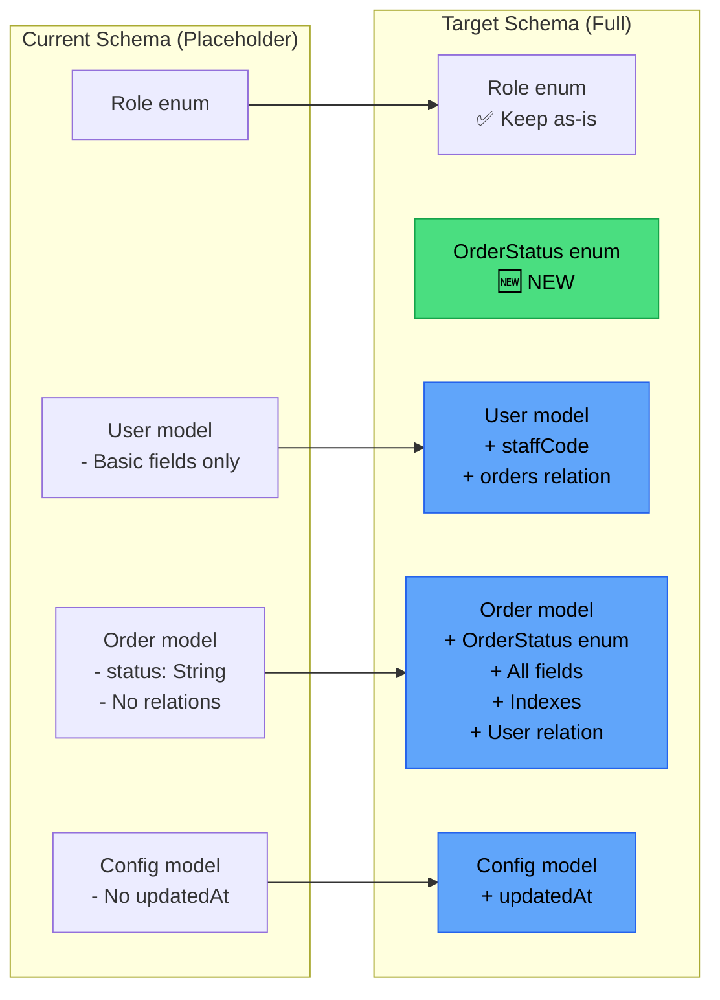
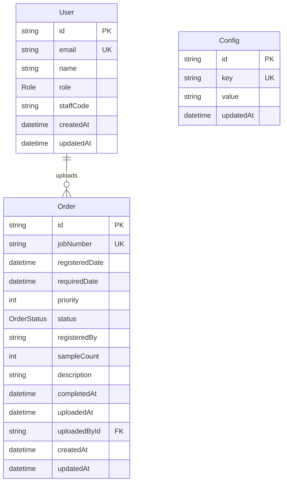
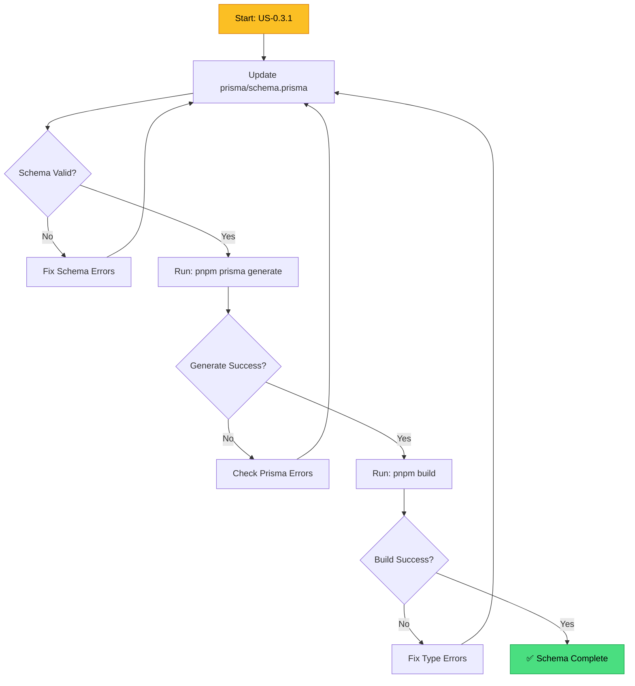

# Flow Overview — US-0.3.1 Create Core Database Schema
# Tổng quan Luồng — US-0.3.1 Tạo Schema Database Cốt lõi
<!-- Generated: 2026-02-05 -->

---

## Schema Change Overview / Tổng quan Thay đổi Schema



---

## Entity Relationship Diagram / Sơ đồ Quan hệ Thực thể



---

## Implementation Flow / Luồng Triển khai



---

## Changes Highlighted / Thay đổi Nổi bật

### Added / Thêm mới
- 🆕 `OrderStatus` enum (IN_PROGRESS, COMPLETED, OVERDUE)
- 🆕 `User.staffCode` field
- 🆕 `User.orders` relation
- 🆕 `Order.priority`, `registeredBy`, `sampleCount`, `description`, `completedAt`
- 🆕 `Order.uploadedAt`, `uploadedById`, `uploadedBy` (relation)
- 🆕 `Order` indexes (status, registeredDate, requiredDate)
- 🆕 `Config.updatedAt` field

### Modified / Sửa đổi
- 🔄 `Order.status`: `String` → `OrderStatus` enum

### Unchanged / Không đổi
- ✅ `Role` enum
- ✅ Generator config
- ✅ Datasource config

---

## Index Strategy / Chiến lược Index

```mermaid
flowchart LR
    subgraph Queries["Common Queries"]
        Q1[Filter by status]
        Q2[Sort by registeredDate]
        Q3[Sort by requiredDate]
        Q4[Find by jobNumber]
    end
    
    subgraph Indexes["Database Indexes"]
        I1[@@index status]
        I2[@@index registeredDate]
        I3[@@index requiredDate]
        I4[@unique jobNumber]
    end
    
    Q1 --> I1
    Q2 --> I2
    Q3 --> I3
    Q4 --> I4
    
    style I1 fill:#a78bfa,stroke:#7c3aed,color:#fff
    style I2 fill:#a78bfa,stroke:#7c3aed,color:#fff
    style I3 fill:#a78bfa,stroke:#7c3aed,color:#fff
    style I4 fill:#a78bfa,stroke:#7c3aed,color:#fff
```

