# Flow Overview — US-0.3.1 Create Core Database Schema
# Tổng quan Luồng — US-0.3.1 Tạo Schema Database Cốt lõi
<!-- Generated: 2026-02-05 -->

---

## Schema Change Overview / Tổng quan Thay đổi Schema

```mermaid
flowchart LR
    subgraph Current["Current Schema (Placeholder)"]
        C_Role[Role enum]
        C_User[User model<br/>- Basic fields only]
        C_Order[Order model<br/>- status: String<br/>- No relations]
        C_Config[Config model<br/>- No updatedAt]
    end
    
    subgraph Target["Target Schema (Full)"]
        T_Role[Role enum<br/>✅ Keep as-is]
        T_Status[OrderStatus enum<br/>🆕 NEW]
        T_User[User model<br/>+ staffCode<br/>+ orders relation]
        T_Order[Order model<br/>+ OrderStatus enum<br/>+ All fields<br/>+ Indexes<br/>+ User relation]
        T_Config[Config model<br/>+ updatedAt]
    end
    
    C_Role --> T_Role
    C_User --> T_User
    C_Order --> T_Order
    C_Config --> T_Config
    
    style T_Status fill:#4ade80,stroke:#16a34a,color:#000
    style T_User fill:#60a5fa,stroke:#2563eb,color:#000
    style T_Order fill:#60a5fa,stroke:#2563eb,color:#000
    style T_Config fill:#60a5fa,stroke:#2563eb,color:#000
```



---

## Entity Relationship Diagram / Sơ đồ Quan hệ Thực thể


---

## Implementation Flow / Luồng Triển khai

```mermaid
flowchart TD
    A[Start: US-0.3.1] --> B[Update prisma/schema.prisma]
    B --> C{Schema Valid?}
    C -->|No| D[Fix Schema Errors]
    D --> B
    C -->|Yes| E[Run: pnpm prisma generate]
    E --> F{Generate Success?}
    F -->|No| G[Check Prisma Errors]
    G --> B
    F -->|Yes| H[Run: pnpm build]
    H --> I{Build Success?}
    I -->|No| J[Fix Type Errors]
    J --> B
    I -->|Yes| K[✅ Schema Complete]
    
    style A fill:#fbbf24,stroke:#d97706,color:#000
    style K fill:#4ade80,stroke:#16a34a,color:#000
```



---

## Changes Highlighted / Thay đổi Nổi bật

### Added / Thêm mới
- 🆕 `OrderStatus` enum (IN_PROGRESS, COMPLETED, OVERDUE)
- 🆕 `User.staffCode` field
- 🆕 `User.orders` relation
- 🆕 `Order.priority`, `registeredBy`, `sampleCount`, `description`, `completedAt`
- 🆕 `Order.uploadedAt`, `uploadedById`, `uploadedBy` (relation)
- 🆕 `Order` indexes (status, registeredDate, requiredDate)
- 🆕 `Config.updatedAt` field

### Modified / Sửa đổi
- 🔄 `Order.status`: `String` → `OrderStatus` enum

### Unchanged / Không đổi
- ✅ `Role` enum
- ✅ Generator config
- ✅ Datasource config

---

## Index Strategy / Chiến lược Index

```mermaid
flowchart LR
    subgraph Queries["Common Queries"]
        Q1[Filter by status]
        Q2[Sort by registeredDate]
        Q3[Sort by requiredDate]
        Q4[Find by jobNumber]
    end
    
    subgraph Indexes["Database Indexes"]
        I1[@@index status]
        I2[@@index registeredDate]
        I3[@@index requiredDate]
        I4[@unique jobNumber]
    end
    
    Q1 --> I1
    Q2 --> I2
    Q3 --> I3
    Q4 --> I4
    
    style I1 fill:#a78bfa,stroke:#7c3aed,color:#fff
    style I2 fill:#a78bfa,stroke:#7c3aed,color:#fff
    style I3 fill:#a78bfa,stroke:#7c3aed,color:#fff
    style I4 fill:#a78bfa,stroke:#7c3aed,color:#fff
```

