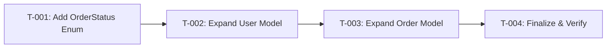

# Task Plan — US-0.3.1 Create Core Database Schema
<!-- Generated: 2026-02-05 | Contract: v1.0 -->
<!-- 🇻🇳 Vietnamese first, 🇬🇧 English follows — for easy scanning -->

---

## TL;DR

| Aspect | Value |
|--------|-------|
| Feature | Create Core Database Schema |
| Total Tasks | 4 |
| Estimated Effort | 1.5 hours |
| Affected Roots | sgs-cs-hepper |
| Spec Reference | [spec.md](../01_spec/spec.md) |
| Dev Mode | standard |

---

## 1. Goal

🇻🇳 Mở rộng schema Prisma placeholder thành schema production đầy đủ với User, Order, Config models và Role, OrderStatus enums. Sau khi hoàn thành, Prisma client sẽ có TypeScript types chính xác cho development.

🇬🇧 Expand the placeholder Prisma schema to full production schema with User, Order, Config models and Role, OrderStatus enums. After completion, Prisma client will have correct TypeScript types for development.

---

## 2. Task Overview

| ID | Title | Root | Type | Est. | Deps | Status |
|----|-------|------|------|------|------|--------|
| T-001 | Add OrderStatus Enum | sgs-cs-hepper | Modify | 15m | - | ⏳ |
| T-002 | Expand User Model | sgs-cs-hepper | Modify | 15m | T-001 | ⏳ |
| T-003 | Expand Order Model with Indexes | sgs-cs-hepper | Modify | 30m | T-002 | ⏳ |
| T-004 | Finalize & Verify Schema | sgs-cs-hepper | Modify | 30m | T-003 | ⏳ |

**Legend:**
- Type: `New` = Create new, `Modify` = Change existing, `Delete` = Remove
- Status: ⏳ Pending, 🔄 In Progress, ✅ Done, ❌ Blocked

---

## 3. Execution Flow



---

## 4. Task Details

### T-001 — Add OrderStatus Enum

| Aspect | Detail |
|--------|--------|
| Root | sgs-cs-hepper |
| Type | Modify |
| Estimated | 15 minutes |
| Dependencies | None |
| FR Covered | FR-005 |

#### Description

🇻🇳 Thêm OrderStatus enum vào schema với 3 giá trị: IN_PROGRESS, COMPLETED, OVERDUE. Enum này sẽ được sử dụng cho Order.status field thay vì String.

🇬🇧 Add OrderStatus enum to schema with 3 values: IN_PROGRESS, COMPLETED, OVERDUE. This enum will be used for Order.status field instead of String.

#### Files

| Action | Path |
|--------|------|
| Modify | `prisma/schema.prisma` |

#### Implementation

🇻🇳 Thêm enum block sau Role enum hiện tại. Đảm bảo format theo Prisma conventions.

🇬🇧 Add enum block after existing Role enum. Ensure format follows Prisma conventions.

```prisma
enum OrderStatus {
  IN_PROGRESS
  COMPLETED
  OVERDUE
}
```

#### Done Criteria

- [ ] OrderStatus enum exists in schema.prisma
- [ ] Contains exactly 3 values: IN_PROGRESS, COMPLETED, OVERDUE
- [ ] `pnpm prisma validate` passes

#### Verification

```bash
pnpm prisma validate
```

---

### T-002 — Expand User Model

| Aspect | Detail |
|--------|--------|
| Root | sgs-cs-hepper |
| Type | Modify |
| Estimated | 15 minutes |
| Dependencies | T-001 |
| FR Covered | FR-001, FR-007 |

#### Description

🇻🇳 Mở rộng User model với:
- `staffCode String?` — Optional field cho STAFF users login bằng mã chung
- `orders Order[]` — Relation đến các orders đã upload

🇬🇧 Expand User model with:
- `staffCode String?` — Optional field for STAFF users with shared code login
- `orders Order[]` — Relation to uploaded orders

#### Files

| Action | Path |
|--------|------|
| Modify | `prisma/schema.prisma` |

#### Implementation

🇻🇳 Thêm staffCode sau role field, và orders relation cuối model. Relation phải dùng tên "UploadedBy" để khớp với Order model.

🇬🇧 Add staffCode after role field, and orders relation at end of model. Relation must use name "UploadedBy" to match Order model.

```prisma
model User {
  id        String   @id @default(cuid())
  email     String?  @unique
  name      String?
  role      Role     @default(STAFF)
  createdAt DateTime @default(now())
  updatedAt DateTime @updatedAt
  
  // For STAFF with shared code
  staffCode String?
  
  // Relations
  orders    Order[]  @relation("UploadedBy")
}
```

#### Done Criteria

- [ ] User.staffCode field exists as optional String
- [ ] User.orders relation exists with @relation("UploadedBy")
- [ ] `pnpm prisma validate` passes

#### Verification

```bash
pnpm prisma validate
```

---

### T-003 — Expand Order Model with Indexes

| Aspect | Detail |
|--------|--------|
| Root | sgs-cs-hepper |
| Type | Modify |
| Estimated | 30 minutes |
| Dependencies | T-002 |
| FR Covered | FR-002, FR-006, FR-007 |

#### Description

🇻🇳 Thay thế Order model placeholder với full implementation bao gồm:
- Tất cả fields: priority, status (OrderStatus enum), registeredBy, sampleCount, description, completedAt, uploadedAt, uploadedById
- Relation đến User với @relation("UploadedBy")
- 3 indexes: status, registeredDate, requiredDate

🇬🇧 Replace Order model placeholder with full implementation including:
- All fields: priority, status (OrderStatus enum), registeredBy, sampleCount, description, completedAt, uploadedAt, uploadedById
- Relation to User with @relation("UploadedBy")
- 3 indexes: status, registeredDate, requiredDate

#### Files

| Action | Path |
|--------|------|
| Modify | `prisma/schema.prisma` |

#### Implementation

🇻🇳 Thay thế toàn bộ Order model. Đảm bảo:
- uploadedById là required (không có ?)
- status sử dụng OrderStatus enum với default IN_PROGRESS
- Có đủ 3 @@index declarations

🇬🇧 Replace entire Order model. Ensure:
- uploadedById is required (no ?)
- status uses OrderStatus enum with default IN_PROGRESS
- Has all 3 @@index declarations

```prisma
model Order {
  id              String      @id @default(cuid())
  jobNumber       String      @unique
  registeredDate  DateTime
  requiredDate    DateTime
  priority        Int         @default(0)
  status          OrderStatus @default(IN_PROGRESS)
  
  // Parsed data
  registeredBy    String?
  sampleCount     Int         @default(1)
  description     String?
  
  // Tracking
  completedAt     DateTime?
  uploadedAt      DateTime    @default(now())
  uploadedById    String
  uploadedBy      User        @relation("UploadedBy", fields: [uploadedById], references: [id])
  
  createdAt       DateTime    @default(now())
  updatedAt       DateTime    @updatedAt
  
  @@index([status])
  @@index([registeredDate])
  @@index([requiredDate])
}
```

#### Done Criteria

- [ ] Order.status uses OrderStatus enum (not String)
- [ ] Order.priority exists with default 0
- [ ] Order.registeredBy, sampleCount, description fields exist
- [ ] Order.completedAt, uploadedAt, uploadedById fields exist
- [ ] Order.uploadedBy relation exists with @relation("UploadedBy")
- [ ] @@index on status, registeredDate, requiredDate
- [ ] `pnpm prisma validate` passes

#### Verification

```bash
pnpm prisma validate
```

---

### T-004 — Finalize & Verify Schema

| Aspect | Detail |
|--------|--------|
| Root | sgs-cs-hepper |
| Type | Modify |
| Estimated | 30 minutes |
| Dependencies | T-003 |
| FR Covered | FR-003, NFR-001, NFR-002, NFR-003 |

#### Description

🇻🇳 Finalize schema:
- Thêm updatedAt vào Config model
- Chạy prisma generate để tạo client
- Verify build passes

🇬🇧 Finalize schema:
- Add updatedAt to Config model
- Run prisma generate to create client
- Verify build passes

#### Files

| Action | Path |
|--------|------|
| Modify | `prisma/schema.prisma` |
| Regenerate | `src/generated/prisma/` |

#### Implementation

🇻🇳 
1. Thêm `updatedAt DateTime @updatedAt` vào Config model
2. Chạy `pnpm prisma generate` để regenerate client
3. Chạy `pnpm build` để verify no type errors

🇬🇧
1. Add `updatedAt DateTime @updatedAt` to Config model
2. Run `pnpm prisma generate` to regenerate client
3. Run `pnpm build` to verify no type errors

```prisma
model Config {
  id        String   @id @default(cuid())
  key       String   @unique
  value     String
  updatedAt DateTime @updatedAt
}
```

#### Done Criteria

- [ ] Config.updatedAt field exists with @updatedAt
- [ ] `pnpm prisma validate` passes
- [ ] `pnpm prisma generate` completes successfully
- [ ] `pnpm build` passes with no type errors

#### Verification

```bash
pnpm prisma validate
pnpm prisma generate
pnpm build
```

---

## 5. Cross-Root Integration Tasks

🇻🇳 Không có. Đây là single-root work (sgs-cs-hepper only).

🇬🇧 None. This is single-root work (sgs-cs-hepper only).

---

## 6. Requirements Coverage

| Requirement | Tasks | Status |
|-------------|-------|--------|
| FR-001 (User Model) | T-002 | ⬜ |
| FR-002 (Order Model) | T-003 | ⬜ |
| FR-003 (Config Model) | T-004 | ⬜ |
| FR-004 (Role Enum) | - | ✅ Existing |
| FR-005 (OrderStatus Enum) | T-001 | ⬜ |
| FR-006 (Indexes) | T-003 | ⬜ |
| FR-007 (User-Order Relation) | T-002, T-003 | ⬜ |
| NFR-001 (Schema Validation) | T-001, T-002, T-003, T-004 | ⬜ |
| NFR-002 (Client Generation) | T-004 | ⬜ |
| NFR-003 (Build Compatibility) | T-004 | ⬜ |
| NFR-004 (Query Performance) | T-003 | ⬜ |

---

## 7. Test Plan
<!-- Standard mode: Test code written in Phase 4 -->

### 7.1 Test Strategy

🇻🇳 Do đây là schema-only work, testing chủ yếu là schema validation và build verification. Không có unit tests cho schema files - verification bằng Prisma CLI commands.

🇬🇧 Since this is schema-only work, testing is primarily schema validation and build verification. No unit tests for schema files - verification via Prisma CLI commands.

| Type | Scope | Coverage Target |
|------|-------|-----------------|
| Validation | Schema syntax | 100% (prisma validate) |
| Generation | Client types | 100% (prisma generate) |
| Build | Type compatibility | 100% (pnpm build) |

### 7.2 Test Cases by Task

| TC ID | Task | Test Description | Type | Expected Result |
|-------|------|------------------|------|-----------------|
| TC-001 | T-001 | OrderStatus enum exists | Validation | `pnpm prisma validate` passes |
| TC-002 | T-001 | OrderStatus has 3 values | Schema Inspection | IN_PROGRESS, COMPLETED, OVERDUE present |
| TC-003 | T-002 | User.staffCode field exists | Schema Inspection | Optional String field present |
| TC-004 | T-002 | User.orders relation exists | Validation | Named relation "UploadedBy" works |
| TC-005 | T-003 | Order.status uses enum | Schema Inspection | Type is OrderStatus, not String |
| TC-006 | T-003 | Order has all required fields | Schema Inspection | All 12 fields present |
| TC-007 | T-003 | Order has 3 indexes | Schema Inspection | @@index on status, registeredDate, requiredDate |
| TC-008 | T-003 | Order.uploadedBy relation works | Validation | FK to User validated |
| TC-009 | T-004 | Config.updatedAt exists | Schema Inspection | Field with @updatedAt present |
| TC-010 | T-004 | Prisma client generated | Generation | `src/generated/prisma/` updated |
| TC-011 | T-004 | Build passes | Build | `pnpm build` exits 0 |

### 7.3 Edge Cases & Error Scenarios

🇻🇳 Các edge cases đã được document trong spec (EC-001 đến EC-004).

🇬🇧 Edge cases already documented in spec (EC-001 to EC-004).

| TC ID | Scenario | Input | Expected Behavior |
|-------|----------|-------|-------------------|
| TC-E01 | Prisma 7.x adapter pattern | N/A | Schema has NO `url` in datasource (configured in prisma.config.ts) |
| TC-E02 | Optional email on User | null email | Schema allows null, no validation error |
| TC-E03 | Required uploadedById | Missing FK | Schema requires FK, validation catches |

### 7.4 Test Data Requirements

🇻🇳 Không cần test data cho schema validation. DB seeding sẽ là user story riêng (US-0.3.2).

🇬🇧 No test data needed for schema validation. DB seeding will be a separate user story (US-0.3.2).

---

## 8. Risk per Task

| Task | Risk | Mitigation |
|------|------|------------|
| T-001 | None | Simple enum addition |
| T-002 | Relation naming mismatch | Use exact name "UploadedBy" from spec |
| T-003 | Missing fields | Cross-check with spec data contracts |
| T-004 | Build failure | Fix any type errors before completing |

---

## 9. Rollback Plan

| Task | Rollback Action |
|------|-----------------|
| T-001 | `git checkout prisma/schema.prisma` |
| T-002 | `git checkout prisma/schema.prisma` |
| T-003 | `git checkout prisma/schema.prisma` |
| T-004 | `git checkout prisma/schema.prisma` + `pnpm prisma generate` |

---

## 10. Environment Requirements

🇻🇳 Không cần environment variables mới. Prisma 7.x đã được configure với `@prisma/adapter-pg` trong US-0.1.1.

🇬🇧 No new environment variables needed. Prisma 7.x already configured with `@prisma/adapter-pg` in US-0.1.1.

---

## 11. Open Questions

🇻🇳 Không có câu hỏi mở. Tất cả decisions đã được resolved trong Phase 0.

🇬🇧 No open questions. All decisions resolved in Phase 0.

---

## Approval

| Role | Name | Status | Date |
|------|------|--------|------|
| Author | Copilot | ✅ Done | 2026-02-05 |
| Reviewer | | ⏳ Pending | |

---

## Next Step

🇻🇳 Sau khi phê duyệt, tiến hành **Phase 3: Implementation** với task T-001.

🇬🇧 After approval, proceed to **Phase 3: Implementation** with task T-001.

Reply: `approved` or `revise: <feedback>`
