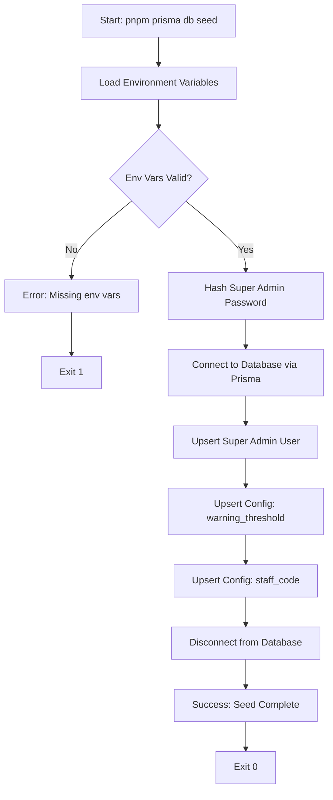
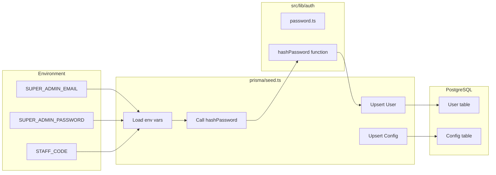
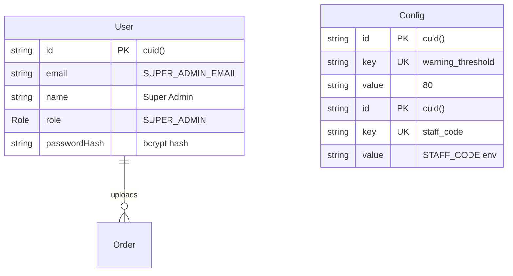
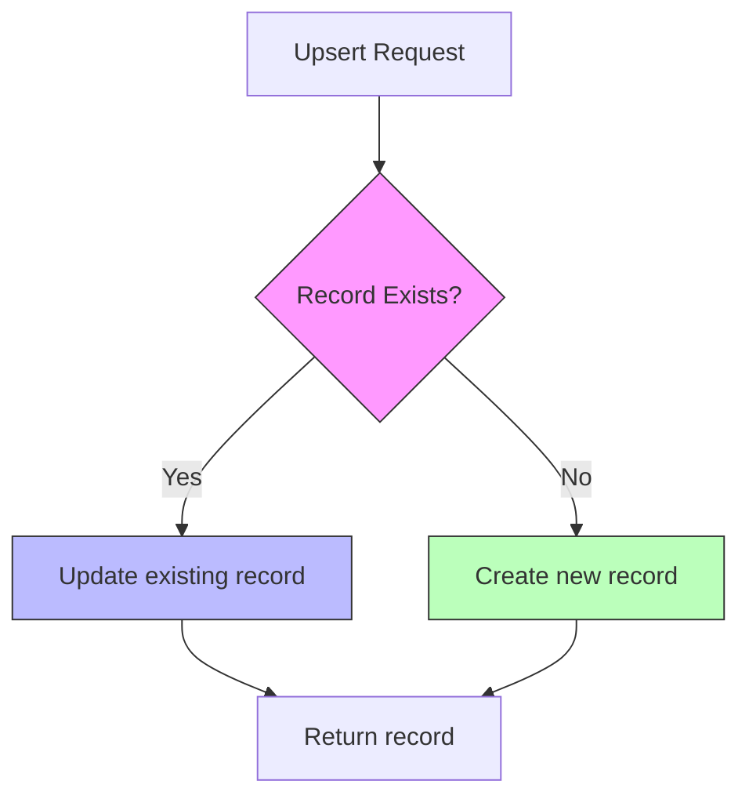

# Flow Overview — US-0.3.2 Seed Initial Data
<!-- Generated: 2026-02-05 -->

## Seed Execution Flow / Luồng Thực thi Seed

## Component Interaction / Tương tác Component

## Data Created / Dữ liệu Được Tạo

## Idempotency Pattern / Pattern Idempotent

## Notes / Ghi chú

1. **Upsert Pattern**: Uses Prisma's `upsert` with `where` clause on unique fields (email, key)
2. **Password Hashing**: bcrypt with cost factor 10 (default, ~100ms)
3. **Transaction**: Each upsert is atomic; no explicit transaction needed for seed
4. **Idempotent**: Running `pnpm prisma db seed` multiple times is safe
