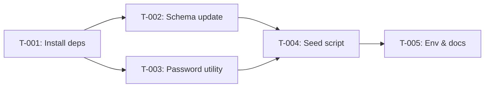

# Task Plan — US-0.3.2 Seed Initial Data
# Kế hoạch Task — US-0.3.2 Seed Dữ liệu Khởi tạo
<!-- Generated: 2026-02-06 | Branch: feature/sgs-cs-helper-us-0.3.2 -->

---

## TL;DR

| Aspect | Value |
|--------|-------|
| Feature | Seed Initial Data |
| Total Tasks | 5 |
| Estimated Effort | 2.5 hours |
| Affected Roots | sgs-cs-hepper |
| Dev Mode | standard |
| Spec Reference | [spec.md](../01_spec/spec.md) |

---

## 1. Goal / Mục tiêu

🇻🇳 Tạo seed script cho Prisma để khởi tạo Super Admin user và các config mặc định. Script phải idempotent và sử dụng bcrypt để hash password an toàn.

🇬🇧 Create Prisma seed script to initialize Super Admin user and default configs. Script must be idempotent and use bcrypt for secure password hashing.

---

## 2. Task Overview / Tổng quan Task

| ID | Title | Root | Type | Est. | Deps | Status |
|----|-------|------|------|------|------|--------|
| T-001 | Install dependencies & configure seed | sgs-cs-hepper | Modify | 30m | - | ⏳ |
| T-002 | Add passwordHash to User schema | sgs-cs-hepper | Modify | 20m | T-001 | ⏳ |
| T-003 | Create password hashing utility | sgs-cs-hepper | New | 30m | T-001 | ⏳ |
| T-004 | Create seed script | sgs-cs-hepper | New | 45m | T-002, T-003 | ⏳ |
| T-005 | Update .env.example & documentation | sgs-cs-hepper | Modify | 15m | T-004 | ⏳ |

**Legend:**
- Type: `New` = Create new, `Modify` = Change existing
- Status: ⏳ Pending, 🔄 In Progress, ✅ Done, ❌ Blocked

---

## 3. Execution Flow / Luồng Thực thi



---

## 3.5 Parallel Execution Notes / Ghi chú Thực thi Song song

### Parallel Groups / Nhóm Song song

🇻🇳 Các tasks trong cùng group có thể chạy song song (khác file, không depend lẫn nhau).

🇬🇧 Tasks in the same group can run in parallel (different files, no inter-dependencies).

| Group | Tasks | Reason |
|-------|-------|--------|
| A | T-002, T-003 | Same dependency (T-001), different files |

### Sequential Constraints / Ràng buộc Tuần tự

| Sequence | Reason |
|----------|--------|
| T-001 → T-002 | bcrypt types needed for TypeScript |
| T-002 → T-004 | Schema must have passwordHash before seed |
| T-003 → T-004 | Password utility needed by seed |

---

## 4. Task Details / Chi tiết Task

### T-001 — Install dependencies & configure seed

| Aspect | Detail |
|--------|--------|
| Root | `sgs-cs-hepper` |
| Type | Modify |
| Estimated | 30 min |
| Dependencies | None |
| FR Covered | FR-004 |

#### Description / Mô tả

🇻🇳 Cài đặt các package cần thiết (bcrypt, tsx) và cấu hình prisma.seed trong package.json.

🇬🇧 Install required packages (bcrypt, tsx) and configure prisma.seed in package.json.

#### Files / Files

| Action | Path |
|--------|------|
| Modify | `package.json` |

#### Implementation / Triển khai

🇻🇳 
- Thêm `bcrypt` vào dependencies
- Thêm `@types/bcrypt` và `tsx` vào devDependencies  
- Thêm config `prisma.seed` để chạy `tsx prisma/seed.ts`

🇬🇧
- Add `bcrypt` to dependencies
- Add `@types/bcrypt` and `tsx` to devDependencies
- Add `prisma.seed` config to run `tsx prisma/seed.ts`

```json
{
  "prisma": {
    "seed": "tsx prisma/seed.ts"
  }
}
```

#### Done Criteria / Tiêu chí Hoàn thành

- [ ] `pnpm add bcrypt` successful
- [ ] `pnpm add -D @types/bcrypt tsx` successful
- [ ] `package.json` has `prisma.seed` configuration
- [ ] No TypeScript errors

#### Verification / Kiểm tra

```bash
pnpm list bcrypt tsx
cat package.json | grep -A2 '"prisma"'
```

---

### T-002 — Add passwordHash to User schema

| Aspect | Detail |
|--------|--------|
| Root | `sgs-cs-hepper` |
| Type | Modify |
| Estimated | 20 min |
| Dependencies | T-001 |
| FR Covered | FR-005 |

#### Description / Mô tả

🇻🇳 Thêm field `passwordHash String?` vào User model và tạo migration.

🇬🇧 Add `passwordHash String?` field to User model and create migration.

#### Files / Files

| Action | Path |
|--------|------|
| Modify | `prisma/schema.prisma` |
| Generate | `prisma/migrations/*_add_password_hash/` |

#### Implementation / Triển khai

🇻🇳 
- Thêm `passwordHash String?` vào model User (sau `staffCode`)
- Chạy `pnpm prisma migrate dev --name add_password_hash`
- Prisma client sẽ tự động regenerate

🇬🇧
- Add `passwordHash String?` to User model (after `staffCode`)
- Run `pnpm prisma migrate dev --name add_password_hash`
- Prisma client will auto-regenerate

```prisma
model User {
  // ... existing fields
  staffCode    String?
  passwordHash String?  // NEW: For password-based auth
  
  // Relations
  orders    Order[]  @relation("UploadedBy")
}
```

#### Done Criteria / Tiêu chí Hoàn thành

- [ ] `passwordHash String?` added to User model
- [ ] Migration file generated in `prisma/migrations/`
- [ ] Migration applied successfully
- [ ] Prisma client regenerated with new field

#### Verification / Kiểm tra

```bash
pnpm prisma migrate status
grep -A5 "passwordHash" prisma/schema.prisma
```

---

### T-003 — Create password hashing utility

| Aspect | Detail |
|--------|--------|
| Root | `sgs-cs-hepper` |
| Type | New |
| Estimated | 30 min |
| Dependencies | T-001 |
| FR Covered | FR-002 |

#### Description / Mô tả

🇻🇳 Tạo utility `src/lib/auth/password.ts` với các hàm `hashPassword` và `verifyPassword` sử dụng bcrypt.

🇬🇧 Create utility `src/lib/auth/password.ts` with `hashPassword` and `verifyPassword` functions using bcrypt.

#### Files / Files

| Action | Path |
|--------|------|
| Create | `src/lib/auth/password.ts` |
| Create | `src/lib/auth/index.ts` |

#### Implementation / Triển khai

```typescript
// src/lib/auth/password.ts
import bcrypt from "bcrypt";

const SALT_ROUNDS = 10;

export async function hashPassword(password: string): Promise<string> {
  return bcrypt.hash(password, SALT_ROUNDS);
}

export async function verifyPassword(
  password: string,
  hash: string
): Promise<boolean> {
  return bcrypt.compare(password, hash);
}
```

```typescript
// src/lib/auth/index.ts
export { hashPassword, verifyPassword } from "./password";
```

#### Done Criteria / Tiêu chí Hoàn thành

- [ ] `hashPassword` function exists and works
- [ ] `verifyPassword` function exists and works
- [ ] Uses bcrypt with cost factor 10
- [ ] Barrel export at `src/lib/auth/index.ts`
- [ ] No TypeScript errors

#### Verification / Kiểm tra

```bash
pnpm tsc --noEmit
# Manual test: hash and verify a password
```

---

### T-004 — Create seed script

| Aspect | Detail |
|--------|--------|
| Root | `sgs-cs-hepper` |
| Type | New |
| Estimated | 45 min |
| Dependencies | T-002, T-003 |
| FR Covered | FR-001, FR-003, NFR-001, NFR-002, NFR-003 |

#### Description / Mô tả

🇻🇳 Tạo seed script `prisma/seed.ts` để:
1. Validate env vars
2. Tạo Super Admin user với password đã hash (upsert)
3. Tạo default configs (upsert)

🇬🇧 Create seed script `prisma/seed.ts` to:
1. Validate env vars
2. Create Super Admin user with hashed password (upsert)
3. Create default configs (upsert)

#### Files / Files

| Action | Path |
|--------|------|
| Create | `prisma/seed.ts` |

#### Implementation / Triển khai

🇻🇳 
- Load env vars với dotenv
- Validate `SUPER_ADMIN_EMAIL`, `SUPER_ADMIN_PASSWORD` (required)
- Validate password length (>= 8 chars)
- Hash password với utility từ T-003
- Upsert User by email
- Upsert Config by key (warning_threshold, staff_code)
- Log success/error

🇬🇧
- Load env vars with dotenv
- Validate `SUPER_ADMIN_EMAIL`, `SUPER_ADMIN_PASSWORD` (required)
- Validate password length (>= 8 chars)
- Hash password with utility from T-003
- Upsert User by email
- Upsert Config by key (warning_threshold, staff_code)
- Log success/error

```typescript
// prisma/seed.ts - Key structure
import "dotenv/config";
import { PrismaClient } from "../src/generated/prisma";
import { hashPassword } from "../src/lib/auth/password";

const prisma = new PrismaClient();

async function main() {
  // 1. Validate env vars
  const email = process.env.SUPER_ADMIN_EMAIL;
  const password = process.env.SUPER_ADMIN_PASSWORD;
  
  if (!email) throw new Error("SUPER_ADMIN_EMAIL is required");
  if (!password) throw new Error("SUPER_ADMIN_PASSWORD is required");
  if (password.length < 8) throw new Error("Password must be at least 8 characters");
  
  // 2. Hash password
  const passwordHash = await hashPassword(password);
  
  // 3. Upsert Super Admin
  const user = await prisma.user.upsert({
    where: { email },
    update: { passwordHash, name: "Super Admin", role: "SUPER_ADMIN" },
    create: { email, passwordHash, name: "Super Admin", role: "SUPER_ADMIN" },
  });
  
  // 4. Upsert configs
  await prisma.config.upsert({
    where: { key: "warning_threshold" },
    update: { value: "80" },
    create: { key: "warning_threshold", value: "80" },
  });
  
  const staffCode = process.env.STAFF_CODE || "SGS2026";
  await prisma.config.upsert({
    where: { key: "staff_code" },
    update: { value: staffCode },
    create: { key: "staff_code", value: staffCode },
  });
  
  console.log("✅ Seed completed:", { user: user.email, configs: 2 });
}

main()
  .catch((e) => { console.error(e); process.exit(1); })
  .finally(() => prisma.$disconnect());
```

#### Done Criteria / Tiêu chí Hoàn thành

- [ ] Script validates required env vars
- [ ] Script validates password length
- [ ] Super Admin created with role SUPER_ADMIN
- [ ] Password is hashed (not plain text)
- [ ] Configs created (warning_threshold, staff_code)
- [ ] Idempotent: running twice works without errors
- [ ] Clear error messages for missing env vars

#### Verification / Kiểm tra

```bash
# Set env vars first
export SUPER_ADMIN_EMAIL="admin@example.com"
export SUPER_ADMIN_PASSWORD="securepassword123"
export STAFF_CODE="SGS2026"

# Run seed
pnpm prisma db seed

# Run again to verify idempotency
pnpm prisma db seed

# Check database
pnpm prisma studio
```

---

### T-005 — Update .env.example & documentation

| Aspect | Detail |
|--------|--------|
| Root | `sgs-cs-hepper` |
| Type | Modify |
| Estimated | 15 min |
| Dependencies | T-004 |
| FR Covered | FR-001, FR-003 |

#### Description / Mô tả

🇻🇳 Cập nhật `.env.example` với các biến môi trường mới cho seed script.

🇬🇧 Update `.env.example` with new environment variables for seed script.

#### Files / Files

| Action | Path |
|--------|------|
| Modify | `.env.example` |

#### Implementation / Triển khai

```env
# Seed Script Configuration
SUPER_ADMIN_EMAIL=admin@example.com
SUPER_ADMIN_PASSWORD=changeme123
STAFF_CODE=SGS2026
```

#### Done Criteria / Tiêu chí Hoàn thành

- [ ] `.env.example` has `SUPER_ADMIN_EMAIL`
- [ ] `.env.example` has `SUPER_ADMIN_PASSWORD`
- [ ] `.env.example` has `STAFF_CODE`
- [ ] Comments explain each variable

#### Verification / Kiểm tra

```bash
cat .env.example | grep -E "SUPER_ADMIN|STAFF_CODE"
```

---

## 5. Cross-Root Integration Tasks / Task Tích hợp Đa Root

N/A — Single root project (sgs-cs-hepper only)

---

## 6. Requirements Coverage / Độ phủ Yêu cầu

| Requirement | Tasks | Status |
|-------------|-------|--------|
| FR-001: Super Admin User Seeding | T-004 | ⬜ |
| FR-002: Password Hashing Utility | T-003 | ⬜ |
| FR-003: Default Config Values | T-004 | ⬜ |
| FR-004: Seed Script Configuration | T-001 | ⬜ |
| FR-005: User Schema Update | T-002 | ⬜ |
| NFR-001: Security (bcrypt) | T-003, T-004 | ⬜ |
| NFR-002: Idempotency | T-004 | ⬜ |
| NFR-003: Error Handling | T-004 | ⬜ |

All requirements covered ✅

---

## 7. Test Plan / Kế hoạch Test

### 7.1 Test Strategy / Chiến lược Test

🇻🇳 Focus vào unit tests cho password utility và manual verification cho seed script.

🇬🇧 Focus on unit tests for password utility and manual verification for seed script.

| Type | Scope | Coverage Target |
|------|-------|-----------------|
| Unit | Password utility (hashPassword, verifyPassword) | 100% |
| Integration | Seed script execution | Manual verification |
| Manual | Database state after seed | Visual check in Prisma Studio |

### 7.2 Test Cases by Task / Test Cases theo Task

| TC ID | Task | Test Description | Type | Expected Result |
|-------|------|------------------|------|-----------------|
| TC-001 | T-003 | hashPassword returns hash string | Unit | Non-empty string, different from input |
| TC-002 | T-003 | verifyPassword returns true for correct password | Unit | `true` |
| TC-003 | T-003 | verifyPassword returns false for wrong password | Unit | `false` |
| TC-004 | T-004 | Seed creates Super Admin user | Integration | User exists with role SUPER_ADMIN |
| TC-005 | T-004 | Seed creates warning_threshold config | Integration | Config with key "warning_threshold" exists |
| TC-006 | T-004 | Seed creates staff_code config | Integration | Config with key "staff_code" exists |
| TC-007 | T-004 | Running seed twice is idempotent | Integration | No errors, same data |
| TC-008 | T-004 | Missing SUPER_ADMIN_EMAIL throws error | Integration | Error message includes "SUPER_ADMIN_EMAIL is required" |

### 7.3 Edge Cases & Error Scenarios / Trường hợp Biên

| TC ID | Scenario | Input | Expected Behavior |
|-------|----------|-------|-------------------|
| TC-E01 | Missing SUPER_ADMIN_EMAIL | env var not set | Exit with error message |
| TC-E02 | Missing SUPER_ADMIN_PASSWORD | env var not set | Exit with error message |
| TC-E03 | Password too short | "abc123" (7 chars) | Exit with "Password must be at least 8 characters" |
| TC-E04 | Missing STAFF_CODE | env var not set | Use default "SGS2026" |
| TC-E05 | Database connection fails | Invalid DATABASE_URL | Prisma error, exit 1 |

### 7.4 Test Data Requirements / Dữ liệu Test

```typescript
// Test fixtures for password utility
const testPassword = "securepassword123";
const wrongPassword = "wrongpassword";

// Test env vars for seed
process.env.SUPER_ADMIN_EMAIL = "admin@test.com";
process.env.SUPER_ADMIN_PASSWORD = "testpass123";
process.env.STAFF_CODE = "TEST2026";
```

---

## 8. Risk Assessment / Đánh giá Rủi ro

| Task | Risk | Mitigation |
|------|------|------------|
| T-001 | bcrypt native build fails on some systems | Use bcryptjs as fallback if needed |
| T-002 | Migration conflicts with existing data | Optional field (String?), safe for existing rows |
| T-004 | Seed runs in production accidentally | Add NODE_ENV warning log |

---

## Approval / Phê duyệt

| Role | Status | Date |
|------|--------|------|
| Task Planner | ✅ Done | 2026-02-06 |
| Reviewer | ⏳ Pending | |
