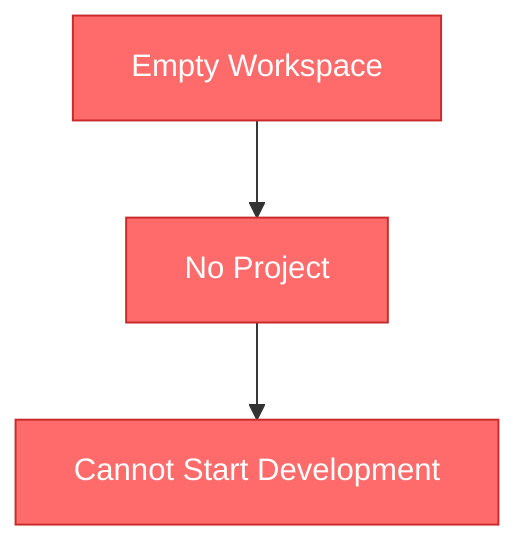
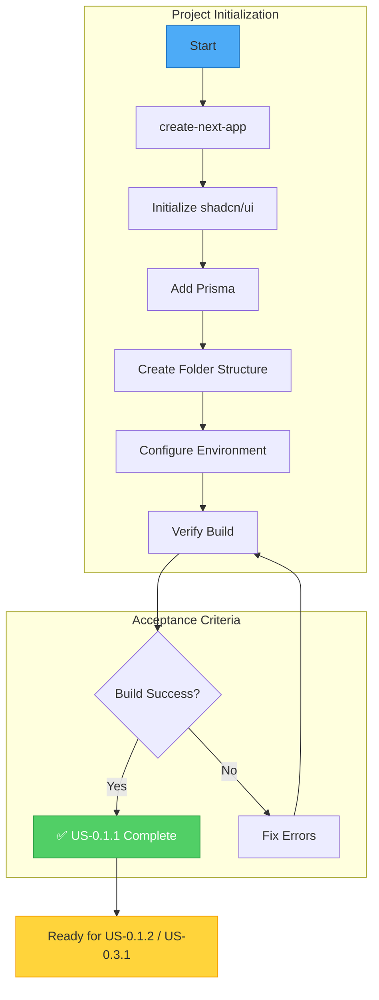
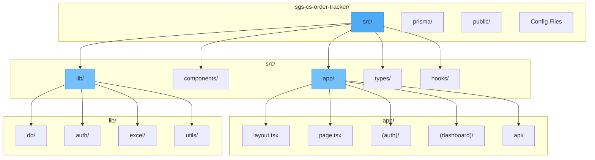
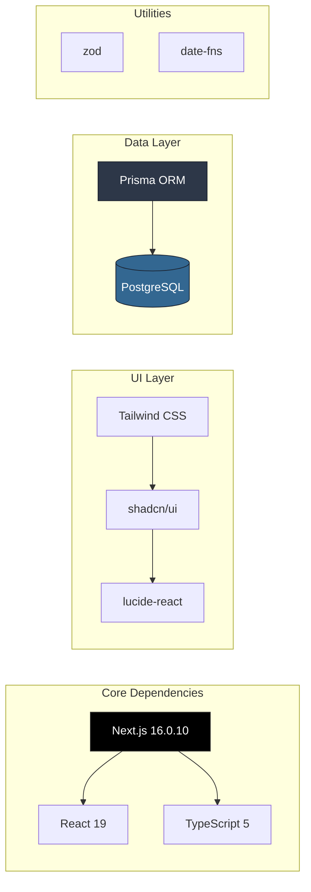
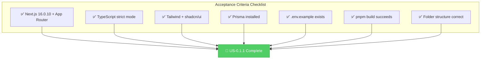

# Flow Overview — US-0.1.1 Initialize Project Structure
<!-- Generated: 2026-02-05 -->

---

## Current State / Trạng thái Hiện tại

**EN:** Currently, the workspace has no Next.js project. Development cannot begin.

**VI:** Hiện tại, workspace không có dự án Next.js. Không thể bắt đầu phát triển.

---

## Proposed Flow / Luồng Đề xuất

---

## Detailed Steps / Các bước Chi tiết

```mermaid
flowchart LR
    subgraph Step1["1. Scaffold"]
        A1[pnpm create next-app]
    end
    
    subgraph Step2["2. UI Library"]
        A2[shadcn-ui init]
        A2a[Add button, card, input, toast]
    end
    
    subgraph Step3["3. Database"]
        A3[pnpm add prisma]
        A3a[prisma init]
        A3b[Define schema]
    end
    
    subgraph Step4["4. Structure"]
        A4[Create src/lib/*]
        A4a[Create src/components/*]
        A4b[Create src/types/*]
    end
    
    subgraph Step5["5. Config"]
        A5[.env.example]
        A5a[Prisma client singleton]
    end
    
    subgraph Step6["6. Verify"]
        A6[pnpm build]
        A6a[Check for errors]
    end
    
    Step1 --> Step2 --> Step3 --> Step4 --> Step5 --> Step6
```

---

## Folder Structure Visualization / Cấu trúc Thư mục

---

## Dependencies Flow / Luồng Dependencies

---

## Changes Highlighted / Thay đổi Nổi bật

| Change Type | Details EN | Details VI |
|-------------|------------|------------|
| ➕ Added | Complete Next.js 16.0.10 project | Toàn bộ dự án Next.js 16.0.10 |
| ➕ Added | Prisma schema with models | Prisma schema với models |
| ➕ Added | shadcn/ui component library | Thư viện shadcn/ui |
| ➕ Added | Environment template | Template biến môi trường |
| ➕ Added | Folder structure per tech stack | Cấu trúc thư mục theo tech stack |

---

## Success Criteria / Tiêu chí Thành công

